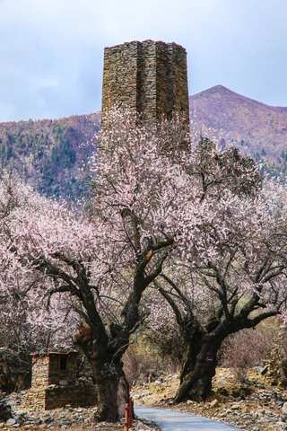
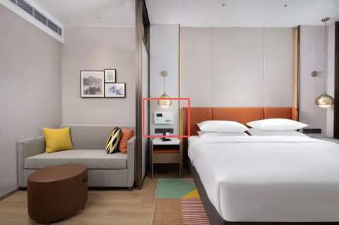
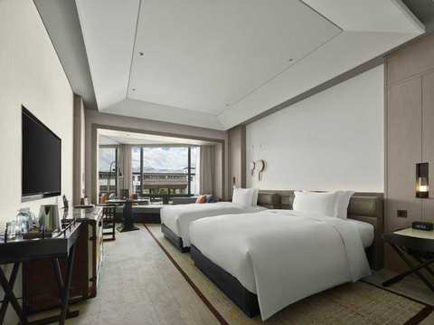
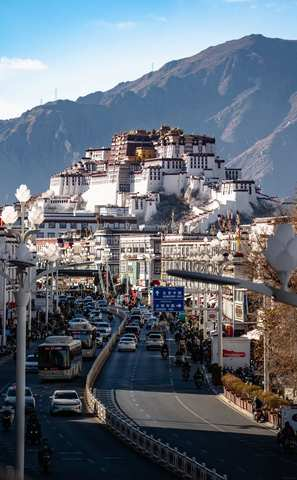
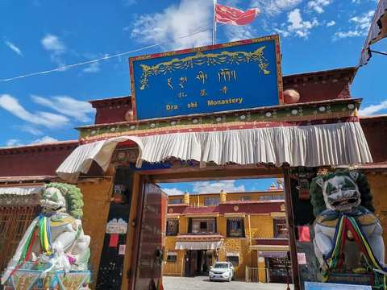

1

桃花＋珠峰 11日

Q．預計幾位一起去？

自己一人／2-3人／4-6人／6人以上

觸發關鍵字：文字中含「桃花節」「林芝桃花」「賞花」「春天」都直接觸發此分支
預計會設定的廣告名稱：限定三~四月小團4-6人「桃花節上珠峰11日」／小團4-6人「桃花節上珠峰11日」／西藏桃花節上珠峰+秘境11日

介紹模式腳本（14則圖文）

判斷邏輯

依人數答案分流：自己一人→文01-2／2-3人→文01-3／4-6人或6人以上→文01-1／逾1分鐘無回應或系統未能判斷 → 直接播放文01

文 01（僅限1分鐘無回應或系統未判斷出人數答案時，跳轉至此）

您好~我是China2Go國旅環球，先給您看一下我們的行程

文 01-1・僅人數＝4-6人／6人以上

我們公司是全西藏精緻中小團資源最多的！我們的拚團都是4-6人一團~
你們可以考慮自己一團出發喔~
不過先讓我先介紹一下行程

文 01-2・僅人數＝自己一人

您好~我們很多自己一人的旅客，非常歡迎您！，先給您看一下我們的行程

文 01-3・僅人數＝2-3人

歡迎，我是China2Go國旅環球，我們的拚團都是4-6人小團，最適合像您們人數少前往的，比較自在！先給您介紹一下行程

說明

所有分支播完後接續下方圖02

圖 02・11日行程總覽

文 03

這是我們精選11日的行程！從林芝低海拔入藏，循序漸進的海拔可以給身體時間適應高原～
而行程完整涵蓋【林芝+波密＋拉薩+山南+日喀則以及珠峰大本營】等最重要的旅遊景點！

文 03-1・僅11日分支

而您選的是我們限量上珠峰的桃花節行程．這是獨有＂升級＂在珠峰絨布旅館的住宿！不過因為房間數較少，人數也是有限定的喔！

圖 03-02・絨布旅館・僅11日分支

文 03-03・僅11日分支

這是絨布旅館的住宿環境，有獨立廁所以及供氧，不過真的是限量喔！！！！

文 04

這個行程除了必去的兩大桃花景點－嘎拉桃花村與波密桃花溝外，還有加碼去到以雪山湖泊、王宮遺址、千年古堡、以及最重要的拉薩秘境寺廟的特殊桃花行程

文 04-1

讓桃花能加入更深的西藏色彩，讓你不是只有賞桃花而已，而是真正的擁有了西藏獨有的桃花特色

圖 05・帕邦喀寺

圖 05-1・秀巴古堡

文 06

以及除了地區條件有限以外，我們全面升級都住國際品牌希爾頓飯店哦！希爾頓是西藏最穩定且是12小時提供85-90%濃度的氧氣呦！而含氧量在西藏這樣的高原地區是很重要的！另外我們整體也是全酒店都有供氧氣的～

圖 07・希爾頓客房

圖 07-1・希爾頓製氧機

文 08

因為桃花節不加價升級6小團！車型則是2025年最新車，用VIP航空母車，每個人都有自己的大座位，並且有自帶製氧機，讓您舒適又安心～💕

圖 09・車輛照片

文 10

然後~這台車除了前面有緊急醫療氧氣鋼瓶！還特別裝了大家都可以吸的彌散式氧氣，簡單說就是～只要一開車，車子內部就在一個【移動氧艙】

圖 11・車輛製氧機

文 12

在西藏這樣的高原環境，住宿與車配備好！真的很重要

圖 13・住宿（第二張）

文 14

還有一點，我們是唯一敢把無購物寫在合約上的旅行社，有任何購物行為賠償5000！

依人數答案分流

選「自己一人」

問時間「這路線是3月尾-4月出，每周4個出團日。請問您計劃什麼時候來呢？好安排顧問給您詳細介紹~❤️」

問時間後等待只要客人沒回答，進入「沉默半天模式」——半天內不追問、不強推下一步，等客人主動回覆

文後回1「給您介紹一下裡面的行程．除了桃花秘境之外，我們也安排了經典的布達拉宮與大昭寺八廓街～」

圖後回2・布達拉宮

圖後回3・八廓街

文後回4「以及我們家因為走的是純玩小團之深度行程，所以是親自帶大家去財神廟-扎基寺參觀！」

圖後回5・扎基寺財神廟

文後回6「這裡是西藏最靈驗，香火非常鼎盛的廟喔！」

文後回7「上面給您的行程表您有看了嗎?」

文後回7等待邏輯半天內客人沒回 → 若已讀則視同繼續下一步；若未讀無回 → 等1天後再繼續

文後回8・回答「有」才觸發「感謝您認真幫我看>”<！您有沒有微信或是Line的QR code，我安排顧問傳更詳細資料給您介紹」

若仍無回應轉為公版每日一則「洗單子」（提醒/催單訊息），內容依時期常更換，不在此腳本固定，由行銷端另外維護更新

選「2-3／4-6／6人以上」

Q1・先問（共通）「請問您是跟家人還是朋友一起來呢?」

等待回覆規則（共通，Q1、Q2、Q3皆適用）等5分鐘（有回→繼續）→無回再等30分鐘→30分鐘後已讀則繼續／未讀最多再等1小時→仍無回應則等1天後再繼續發送介紹內容（不強制往下推進）

Q2・回答「家人」「好的，同行的家人中是否有65歲以上長輩或是孩童」

Q2・回答「朋友」「收到，同行的朋友中是否有65歲以上長輩或是孩童」

Q3觸發（家人／朋友路徑皆可能觸發）若Q2只回答「有」、未說明對象：「好的~我們公司不玩套路！所以只要符合景區當下政策我們都會退優惠門票喔！另外想請問是長輩嗎？」（釐清是長輩還是孩童）

Q3＝長輩 → 追問實際年齡先回覆：「是這樣的～目前用台胞證進入西藏的旅客，65歲以上都是要辦理健康證明，不過放心～我到時候幫您備註下～健康證明的格式還有申請規定，我再發給您！也都會依照時間提醒您辦理」；若年齡≥75歲，加註：「目前75歲以上長輩申請入藏函是申請不下來的」（優先轉真人特殊處理）

Q3＝孩童 → 追問實際年齡若年齡<5歲，回覆：「我們通常是建議孩子5歲以上，能準確表達自己的身體狀況才會建議前往喔！」

問聯絡方式前置條件（共通）需Q1、Q2、Q3三題皆已回答，且介紹模式（Step 1.6，14則圖文）已全部發送完畢，才可進入下一步問時間

問時間（共通）「這路線是3月尾-4月出，每周4個出團日。請問您計劃什麼時候來呢？好安排顧問給您詳細介紹~❤️」

問時間後等待只要客人沒回答，進入「沉默半天模式」——半天內不追問、不強推下一步，等客人主動回覆

文後回1「給您介紹一下裡面的行程．除了桃花秘境之外，我們也安排了經典的布達拉宮與大昭寺八廓街～」

圖後回2・布達拉宮

圖後回3・八廓街

文後回4「以及我們家因為走的是純玩小團之深度行程，所以是親自帶大家去財神廟-扎基寺參觀！」

圖後回5・扎基寺財神廟

文後回6「這裡是西藏最靈驗，香火非常鼎盛的廟喔！」

文後回7「上面給您的行程表您有看了嗎?」

文後回7等待邏輯半天內客人沒回 → 若已讀則視同繼續下一步；若未讀無回 → 等1天後再繼續

文後回8・回答「有」才觸發「感謝您認真幫我看>”<！您有沒有微信或是Line的QR code，我安排顧問傳更詳細資料給您介紹」

若仍無回應轉為公版每日一則「洗單子」（提醒/催單訊息），內容依時期常更換，不在此腳本固定，由行銷端另外維護更新

家人分支
朋友分支
家人／朋友皆可觸發
長輩分支
孩童分支

💰 客人問價格・桃花＋珠峰11日（分支4-3-4月「可以」、分支3-3-4月「可以」皆共用此價格內容）

觸發問

價格．多少錢．一人多少．優惠．價錢．團費．行程費用等等（比照全域「客人中途問價格」機制：圖13・住宿第二張之前不可先報價，先用暫緩話術，介紹完後30分鐘再回覆並附上QR code詢問）

【西藏桃花節11日遊】

出發時間：3/20-4/10（每週五、六、日、一發團）
十人小團優惠價：¥11,480/人（客人為2人1標間拼住價格，如需單休須補單房差¥3,200）
★限量升級4-6人小團 價格不變
包含：入藏函，車，導遊，司機，保險，住宿，酒店早餐，門票
不含：機票、正餐、小費