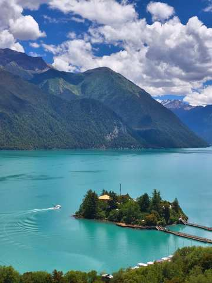
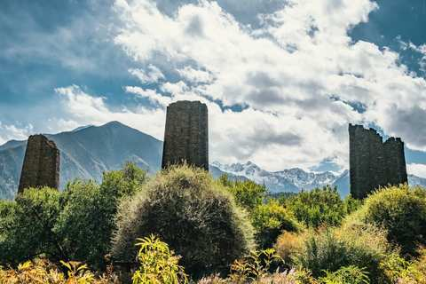
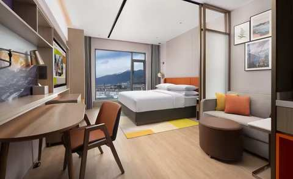
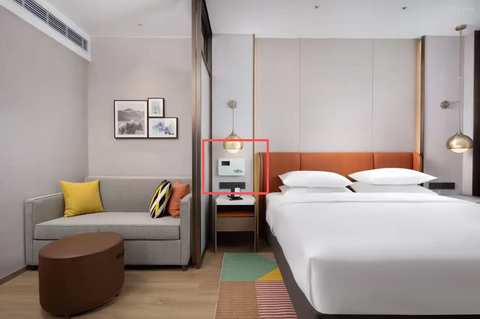
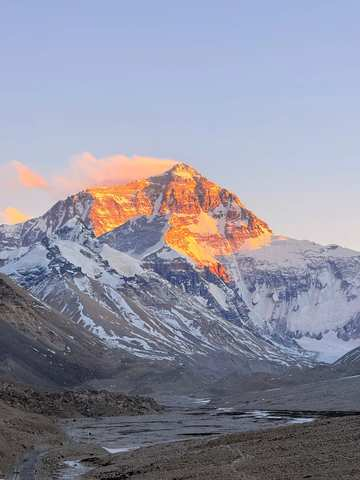
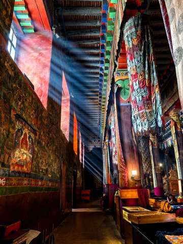
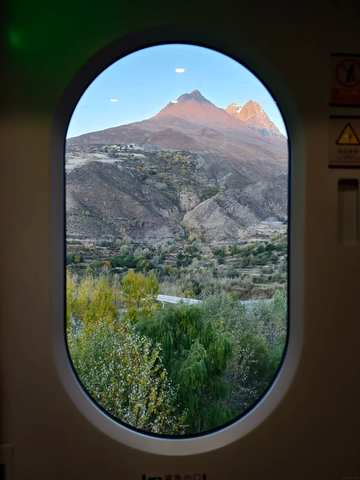

3

西藏全覽-10天林芝+拉薩+珠峰

Q1．大概想幾月出發？

12-2月／3-4月／5-6月／7-8月／9-11月

月份選定後接著問Q2．預計幾位一起去？自己一人／2-3人／4-6人／6人以上

判斷邏輯：Q1（月份）1分鐘內沒有選擇 → 自動接著問Q2（人數）；Q2（人數）1分鐘內仍沒有回答 → 自動開始播放「文00・公版」→「統文回1」介紹流程（此時月份、人數皆視為未收集，流程結束後另外補問，見下方「5-6月／7-8月／9-11月」展開區塊尾端說明）

12-2月：跳轉至分支4「其他時間・上珠峰」的「12-2月・冬遊西藏介紹（25則圖文）」完整腳本，內容完全沿用，此處不重複列出

3-4月：跳轉至分支4「其他時間・上珠峰」的「上珠峰桃花回文01」桃花時間判斷 → 若AI判斷「可以」（時間落在3月底-4月10區間），比照分支4邏輯接續進入分支1「桃花＋珠峰11日」腳本；若AI判斷「不可以」（4/10之後）→ 與分支4不同：不接續分支4的「西藏8日精華」，改為跳回本分支（分支3）下方「5-6月／7-8月／9-11月・完整介紹腳本（西藏全覽10日）」的「統文回1」開始播放

5-6月／7-8月／9-11月・完整介紹腳本（西藏全覽10日）

判斷邏輯

人數（Q2）通常已於上方收集：依人數答案進入對應文案（自己一人→文00-2／2-3人→文00-3／4-6人或6人以上→文00-1／人數未知（Q1、Q2皆逾時未答，被自動觸發進入本流程）→文00公版）

文00・公版（無選項或回答不確定）

您好~我是China2Go國旅環球，先給您看一下我們的行程

文00-2・僅人數＝自己一人

您好~我們很多自己一人的旅客，非常歡迎您！我是China2Go國旅環球，先給您看一下我們的行程

文00-3・僅人數＝2-3人

歡迎，我是China2Go國旅環球，我們的拚團都是4-6人小團，最適合像您們人數少前往的，比較自在！先給您介紹一下行程

文00-1・僅人數＝4-6人／6人以上

我們公司是全西藏精緻中小團資源最多的！我們的拚團都是4-6人一團~
你們可以考慮自己一團出發喔~
不過先讓我先介紹一下行程

統文回1

我給您介紹我們的10日行程，這是從低海拔林芝進入西藏，可以有效預防高反最適合的行程
之中包含了拉薩+山南+日喀則+珠峰大本營
是一個非常完整可以把西藏前後藏以及林芝都玩到的行程

統回圖-2・10天林芝希爾頓行程

統回文-3

因為我們是從林芝進西藏，2900上下的海拔加上綠植充沛，整個含氧量很足夠，像是經典的巴松錯，現場看宛如綠寶石呢！

統回圖-4・巴松錯

統回文-5

我們目前無加價全面升級小團，一位導遊服務4-6人，所以我們行程安排的更深度，加入了千年歷史的秀巴古堡，也可以遠眺尼羊河，並且感受碉堡與雪山的結合

統回圖6・千年古堡

統回文7

剛說到我們導遊服務比是1:6，也要特別強調一下，我們是真正的純玩無套路小團～有包含布達拉宮與八廓街等行程，更特別增加財神廟扎基寺求財！與色拉寺看辯經，會更深度的去了解西藏！

統回圖8・布達拉宮真美

統回圖9・財神廟扎基寺

統回圖10・色拉寺

統回文11

另外在西藏，住宿以及車是非常重要的！我們除了珠峰大本營外，全面升級住國際品牌希爾頓

統回圖12・希爾頓1

統回文13

希爾頓品牌的酒店是【西藏最穩定且是12小時提供85-90%濃度的氧氣呦】！而含氧量在西藏這樣的高原地區是很重要的！

統回圖14・希爾頓2

統回文15

目前不加價升級6小團！車型則是2025年最新車，用VIP航空保姆車，每個人都有自己的大座位，並且有自帶製氧機，讓您舒適又安心～💕

統回圖16・車車照

統回文17

這台車除了前面有緊急醫療氧氣鋼瓶！還特別裝了【大家都可以吸】的彌散式氧氣，簡單說就是～只要一開車，車子內部就在一個【移動氧艙】

統回圖17・車子製氧機

統回文18

在西藏這樣的高原環境，住宿與車配備好！真的很重要

統回圖19・日照金山

統回文20

我們行程本身是有上到珠峰大本營，你看！這是之前團友幸運拍下的日落金山～

統回文21

我們CITS國旅環球-China2Go是專門接待港澳台以及全球外賓的！總公司是有70年歷史的品牌喔！是絕對純玩小團～

統回圖22・客人魯朗林海照

統回文23

我們是唯一敢把無購物寫在合約上的旅行社，有任何購物行為賠償5000！

說明

介紹完後直接依已收集的人數答案分流（不重複詢問）

依人數答案分流・自己一人

自己1・沒回答月份分流問A1「您目前有沒有確定想要幾月來呢?」

自己2・有回答月份分流問A2依照選的月份代入話術：「想詢問下，剛剛看您選＠選項＠　請問是這段時間的團期都可以？還是有比較喜歡的時間？」

自己3・等問時間後等待，只要客人沒回答，進入「沉默半天模式」——半天內不追問、不強推下一步，等客人主動回覆

自己・回答後「請問您有沒有微信或是LINE？可以給我QR code，我安排專業的顧問依照您的需求與團期給您更詳細介紹~❤️」

依人數答案分流・2-3／4-6／6人以上

多人 Q1（共通）「請問您是跟家人還是朋友一起來呢?」

等待回覆規則（共通）等5分鐘（有回→繼續）→無回再等30分鐘→30分鐘後已讀則繼續／未讀最多再等1小時→仍無回應則等1天後再繼續發送介紹內容（不強制往下推進）

Q2・回答「家人」「好的，同行的家人中是否有65歲以上長輩或是孩童」

Q2・回答「朋友」「收到，同行的朋友中是否有65歲以上長輩或是孩童」

Q3觸發（家人／朋友路徑皆可能觸發）若Q2只回答「有」，未說明對象也算在這裡面：「好的~我們公司不玩套路！所以只要符合景區當下政策我們都會退優惠門票喔！另外想請問是長輩嗎？」（釐清是長輩還是孩童）

Q3＝長輩 → 追問實際年齡先回覆：「是這樣的～目前用台胞證進入西藏的旅客，65歲以上都是要辦理健康證明，不過放心～我到時候幫您備註下～健康證明的格式還有申請規定，我再發給您！也都會依照時間提醒您辦理」；若年齡≥75歲，加註：「目前75歲以上長輩申請入藏函是申請不下來的」（優先轉真人特殊處理）

Q3＝孩童 → 追問實際年齡若年齡<5歲，回覆：「我們通常是建議孩子5歲以上，能準確表達自己的身體狀況才會建議前往喔！」

問聯絡方式前置條件（共通）需Q1、Q2、Q3三題皆已回答（回不確定也算已回答），且介紹模式（完整一輪）已全部發送完畢，才可進入下一步；不然則進入洗單子循環。等待只要客人沒回答，進入「沉默半天模式」——半天內不追問、不強推下一步文後回1，等客人主動回覆

判斷邏輯（資料補齊檢查，家人/朋友分流結束後）

若月份（Q1）、人數（Q2）皆已收集 → 直接繼續下方「全覽文後回1」（不重複詢問）；若人數已收集但月份未收集（自己一人路徑已於上方A1/A2單獨補問，此處主要處理多人路徑）→ 補問：「請問您大概想幾月出發呢？」12-2月／3-4月／5-6月／7-8月／9-11月 → 選12-2月／3-4月則比照分支3上方跳轉邏輯；選5-6月／7-8月／9-11月則留在本段，繼續下方「全覽文後回1」

全覽文後回1

給您介紹一下裡面的行程．除了經典行程之外，我們也安排珠峰下山後去到薩迦寺～他的震撼度宛如西藏的敦煌

全覽圖後回2・薩迦寺

全覽文後回2

另外，我們家因為是純玩小團，所以特別安排最後回到”拉薩搭乘拉日鐵路”，這是青藏火車的延伸段，除了是最特別並且離天宮最近的高鐵之一外，也可以大大減少舟車勞累喔！

全覽圖後回3・拉日鐵路

全覽文後回4

上面介紹的行程，您有大概看一下嗎？

全覽文回5等待邏輯

半天內客人沒回 → 若已讀則視同繼續下一步；若未讀無回 → 等1天後再繼續

全覽文回6・回答「有」或其他看起來有需要的訊息才觸發

「感謝您認真幫我看>”<！您有沒有微信或是Line的QR code，我安排顧問傳更詳細資料給您介紹」

若仍無回應

轉為公版每日一則「洗單子」（提醒/催單訊息），內容依時期常更換，不在此腳本固定，由行銷端另外維護更新

💰 客人問價格・西藏全覽10天（分支3專用，依出團日期分5段報價）

觸發問

價格．多少錢．一人多少．優惠．價錢．團費．行程費用等等（比照全域機制）

先確認客人時間

因為西藏有淡旺季之分，可能差5天價格就會有點不同，想跟您確定一下大概的出團日期～我先給您最初步報價

客人選📅 10/1－2/28 (以出發日計算)

【林芝希爾頓全覽十日遊】
出發時間：10/8-2/28（每週二發團，除10/1~10/8區間）
十人小團優惠價：¥8,680起/人（2人1標間拼住，單休補房差¥1,900）
★限量升級4-6人小團 價格不變
包含：入藏文件，車，司機，導遊，保險，住宿，門票，酒店早餐
不含：機票、正餐、小費

**⚠ 長假區間判斷（10/1-10/7）：**不可以先報價，先問：「這是大陸的長假期間，價格會有點變化，請問您目前只有這個時間段嗎？」
→ 客人回「肯定」（感覺只有這個時間的假期）→ 直接轉真人客服處理
→ 客人回「可以換」或判斷有動搖想換時間 → 推薦我們10月的其他團期，或依照他的新時間再報價

客人選📅 3/25－4/30（非桃花節） (以出發日計算)

【林芝希爾頓全覽十日遊】
出發時間：3/25-4/30（每週二發團）
十人小團優惠價：¥10,680起/人（2人1標間拼住，單休補房差¥2,800）
★限量升級4-6人小團 價格不變
包含：入藏文件，車，司機，導遊，保險，住宿，門票，酒店早餐
不含：機票、正餐、小費

**⚠ 長假區間判斷（4/25-4/30）：**不可以先報價，先問：「這是大陸長假期間的前夕，價格會有點變化，請問您目前只有這個時間段嗎？」
→ 客人回「肯定」（感覺只有這個時間的假期）→ 直接轉真人客服處理
→ 客人回「可以換」或判斷有動搖想換時間 → 推薦我們4月15號後的其他團期，或依照他的新時間再報價

客人選📅 5/1－6/30 (以出發日計算)

【林芝希爾頓全覽十日遊】
出發時間：5/5-6/30（每週二發團，避開五一）
十人小團優惠價：¥9,980起/人（2人1標間拼住，單休補房差¥2,400）
★限量升級4-6人小團 價格不變
包含：入藏文件，車，司機，導遊，保險，住宿，門票，酒店早餐
不含：機票、正餐、小費

**⚠ 長假區間判斷（5/1-5/5）：**不可以先報價，先問：「這是大陸的”五一勞動長假”期間，價格會有點變化，請問您目前只有這個時間段嗎？」
→ 客人回「肯定」（感覺只有這個時間的假期）→ 直接轉真人客服處理
→ 客人回「可以換」或判斷有動搖想換時間 → 推薦我們5月的其他團期，或依照他的新時間再報價

客人選📅 7/1－9/30 (以出發日計算)

【林芝希爾頓全覽十日遊】
出發時間：7/1-9/24（每週二發團）
十人小團優惠價：¥11,780起/人（2人1標間拼住，單休補房差¥3,300）
★限量升級4-6人小團 價格不變
包含：入藏文件，車，司機，導遊，保險，住宿，門票，酒店早餐
不含：機票、正餐、小費

**⚠ 長假區間判斷（9/25-9/30）：**不可以先報價，先問：「這是大陸的長假期間，價格會有點變化，請問您目前只有這個時間段嗎？」
→ 客人回「肯定」（感覺只有這個時間的假期）→ 直接轉真人客服處理
→ 客人回「可以換」或判斷有動搖想換時間 → 推薦我們9月的其他團期，或依照他的新時間再報價