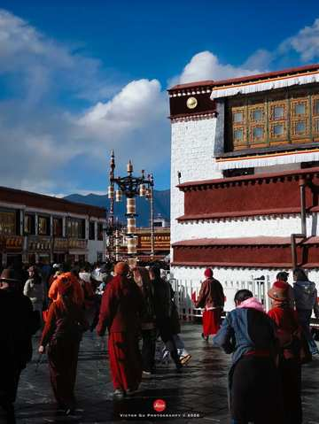
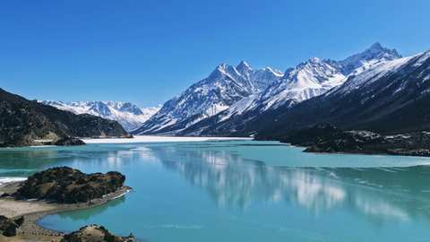
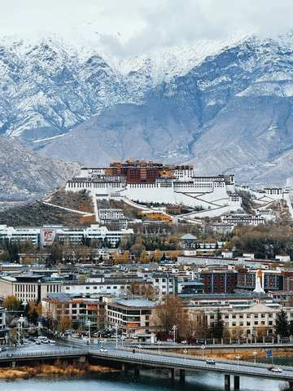
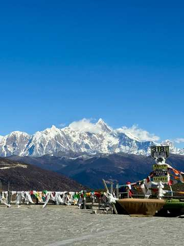
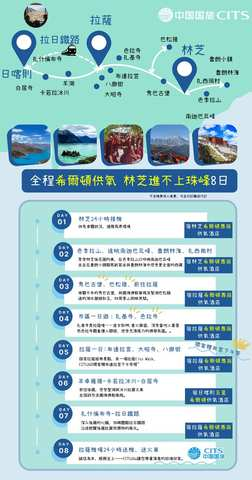
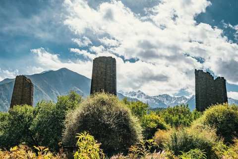
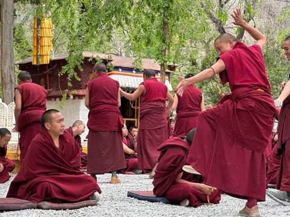
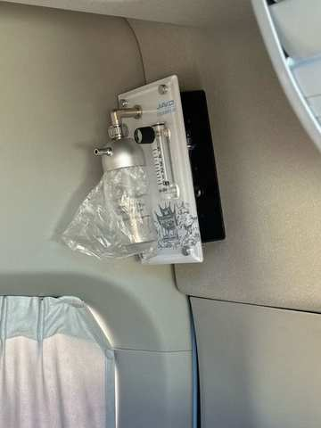
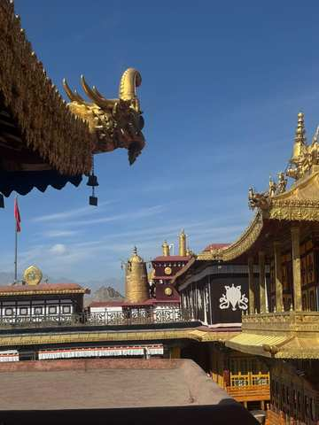
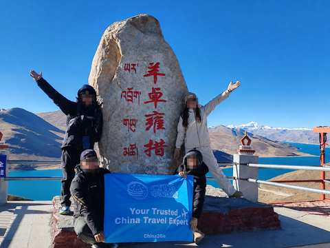

5

其他時間・不上珠峰

Q1．大概想幾月出發？

12-2月／3-4月／5-6月／7-8月／9-11月

Q2．預計幾位一起去？自己一人／2-3人／4-6人／6人以上

判斷邏輯：Q1（月份）1分鐘內沒有選擇 → 自動接著問Q2（人數）；Q2（人數）1分鐘內仍沒有回答 → 自動開始播放「文00・公版」→「文回1」（8日精華通用開場，見下方「逾時預設開場」展開區塊）

全流程結尾（進入詢問微信/Line QR code前）務必檢查：月份、人數是否都已收集。任一項缺漏 → 比照分支3的作法補問一次（缺月份則問Q1選項，答案落在12-2月／3-4月則依下方對應展開區塊接續；缺人數則問Q2選項），補齊後才進入收聯絡方式

逾時預設開場・文00＋文回1（月份、人數皆逾時未答時觸發）

文00・公版（無選項或回答不確定）

您好~我是China2Go國旅環球，先給您看一下我們的行程

文回1

我先給您介紹我們的8日行程，之中包含了拉薩+山南+日喀則+珠峰大本營
您先看看～如果想加從林芝進10天的行程．再給我說．我給您介紹

說明

以下接續播放與「5-6月／7-8月／9-11月」展開區塊相同的介紹圖文（不重複詢問已進行的開場），介紹完畢後依上方時效性規則補問月份、人數

3-4月・桃花節時段判斷

此展開內容僅在客人選「3-4月」時觸發（桃花節時段判斷）

先問（共通）

Q．預計幾位一起去？　自己一人／2-3人／4-6人／6人以上

桃花回文01

您好~我是China2Go國旅環球，這時間我很推薦桃花節耶！通常是3月底~4月10出發的團，您這段時間可以嗎?

依AI判斷客人時間是否落在3月底-4月10前分流

回01-1・不可以（AI判斷為4/10之後）

接續本分支下方「5-6月／7-8月／9-11月・林芝8日介紹」（尚未提供，待補），流程與話術通用

回01-2・可以（AI判斷時間落在區間內）

「好的！給您看下我們家獨家的桃花節秘境+經典9天不上珠峰行程」

接續進入「桃花9日」（分支2）完整腳本，從圖02・9日行程總覽開始

分支2原本14則圖文介紹結束後，本流程做了調整：因3-4月分流路徑一開始已問過人數，介紹完後不再重複詢問，改為下列補充提問

補問1「請問您是跟家人還是朋友一起來呢? 還是自己前往?」

等待回覆規則（共通，Q1、Q2、Q3皆適用）等5分鐘（有回→繼續）→無回再等30分鐘→30分鐘後已讀則繼續／未讀最多再等1小時→仍無回應則等1天後再繼續發送介紹內容（不強制往下推進）

依補問1答案分流

回「家人」

「好的，同行的家人中是否有65歲以上長輩或是孩童」

回「朋友」

「收到，同行的朋友中是否有65歲以上長輩或是孩童」

若Q2只回答「有」（未說明對象，家人／朋友路徑皆可能觸發）「好的~我們公司不玩套路！所以只要符合景區當下政策我們都會退優惠門票喔！另外想請問是長輩嗎？」（釐清是長輩還是孩童）

＝長輩 → 追問實際年齡先回覆：「是這樣的～目前用台胞證進入西藏的旅客，65歲以上都是要辦理健康證明，不過放心～我到時候幫您備註下～健康證明的格式還有申請規定，我再發給您！也都會依照時間提醒您辦理」；若年齡≥75歲，加註：「目前75歲以上長輩申請入藏函是申請不下來的」（優先轉真人特殊處理）

＝孩童 → 追問實際年齡若年齡<5歲，回覆：「我們通常是建議孩子5歲以上，能準確表達自己的身體狀況才會建議前往喔！」

問聯絡方式前置條件（共通）需補問1、Q2、Q3三題皆已回答，且介紹模式（分支2，14則圖文）已全部發送完畢，才可進入下一步

補問1回答「自己前往」（跳過長輩孩童審查）「非常歡迎獨旅的旅客！因為我們是小團～所以導遊更能照顧的到，不會有那種不融入的尷尬感～也不需要做太過多的社交，請問您有沒有微信或是LINE的QR Code? 我安排專業顧問給您做詳細介紹」

等待只要客人沒回答，進入「沉默半天模式」——半天內不追問、不強推下一步，等客人主動回覆

文後回1

「給您介紹一下裡面的行程．除了桃花秘境之外，我們也安排了經典的布達拉宮與大昭寺八廓街～」

圖後回2・布達拉宮

圖後回3・八廓街

文後回4

「以及我們家因為走的是純玩小團之深度行程，所以是親自帶大家去財神廟-扎基寺參觀！」

圖後回5・扎基寺財神廟

文後回6

「這裡是西藏最靈驗，香火非常鼎盛的廟喔！」

文後回7

「上面給您的行程表您有看了嗎?」

文後回7等待邏輯

半天內客人沒回 → 若已讀則視同繼續下一步；若未讀無回 → 等1天後再繼續

文後回8・回答「有」才觸發

「感謝您認真幫我看>”<！您有沒有微信或是Line的QR code，我安排顧問傳更詳細資料給您介紹」

若仍無回應

轉為公版每日一則「洗單子」（提醒/催單訊息），內容依時期常更換，不在此腳本固定，由行銷端另外維護更新

此路徑不另外詢問出發時間——3-4月已於回01-2判斷確認，前面已篩選過，不重複發問

家人分支
朋友分支
家人／朋友皆可觸發
長輩分支
孩童分支

12-2月・冬遊西藏介紹（25則圖文）

此展開內容僅在客人選「12-2月」時觸發（冬季藍冰＋冰湖秘境限定行程）；選其他月份則直接接續下方一般流程（問人數→收聯絡方式，內容待補）

月份選12-2月後，立即問Q．預計幾位一起去？　自己一人／2-3人／4-6人／6人以上

判斷邏輯對方有選 → 依人數答案進入對應文案（自己一人→文00-2／2-3人→文00-3／4-6人或6人以上→文00-1／答案不明確→文00公版）；對方經過30秒沒選 → 略過以上所有問候文案，直接進入下方文回1介紹模式

文00・公版（無選項或回答不確定）

您好~我是China2Go國旅環球，先給您看一下我們的行程

文00-2・僅人數＝自己一人

您好~我們很多自己一人的旅客，非常歡迎您！我是China2Go國旅環球，先給您看一下我們的行程

文00-3・僅人數＝2-3人

歡迎，我是China2Go國旅環球，我們的拚團都是4-6人小團，最適合像您們人數少前往的，比較自在！先給您介紹一下行程

文00-1・僅人數＝4-6人／6人以上

我們公司是全西藏精緻中小團資源最多的！我們的拚團都是4-6人一團~
你們可以考慮自己一團出發喔~
不過先讓我先介紹一下行程

文回1

這個時間珠峰大本營不能住，但12月15日~2月20日是西藏的冰湖藍冰時期!我給您看看我們獨家的「冬遊西藏拼團行程! 」

圖回1-1・冬遊西藏地圖

文回1-2

行程從林芝低海拔出發，讓身體有時間適應高反

圖回1-2・占堆拿旗子照

文回1-3

我們會特別去到G318中重要的然烏湖，這算是很深度的行程．然烏湖一年四季算是冬天最透徹，普通川藏線行程到的時間很難看到那麼美的湖面

圖回1-3・然烏湖無人

文回1-4

這時間是西藏的藍冰+冰湖時期，會去到兩大奇觀【來古+恰央措】

文回1-4

來古冰川的藍冰是非常壯觀的，這幾年政策也一直在變！持入藏函進去的旅客會越來越難看到…

圖回1-5・來古藍冰

文回1-5

而恰央措是我們獨家加入的，因為都是自己團隊，所擁有的資源都是比較深度的喔！

圖回1-6・恰央措

圖回1-7・旅客上恰央措

圖回1-8・旅客上恰央措躺著

文回1-8

去年我們就開始深度帶大家上恰央措冰湖了！

文回1-9

我們升級不加價，都是採4-6人小團！車子則是2025年最新車，用VIP保姆車，每個人都有自己的充電孔跟大座位哦！

圖回1-10・大VIP車

文回1-10

車上還配備了緊急醫療氧氣鋼瓶跟葡萄糖，都是免費提供的喔！

圖回1-11・車上的彌散氧氣瓶

文回1-12

針對我們【China2Go】的貴賓．我們特別免費增加這個車內彌散式氧氣！等於讓我們車子變成＂移動氧氣艙＂這是對身體適應高原反應非常有效的配備喔

文回1-13

除了特殊地區與珠峰等等外，我們的團全面升級都住國際品牌希爾頓飯店哦！

圖回1-14・希爾頓1（圖片已調整）

圖回1-15・希爾頓2（圖片已調整）

文回1-15

希爾頓是西藏最穩定且是12小時提供85-90%濃度的氧氣呦！

文回1-16

在西藏這樣的高原環境，住宿與車配備好！真的很重要

文回1-17

～～～還有一點，我們是唯一敢把無購物寫在合約上的旅行社，有任何購物行為賠償5000

介紹完後直接依「月份選定後」已收集的人數答案分流（不重複詢問）；若當時30秒未選、視同「自己一人／2-3人」路徑處理

依人數答案分流

選「自己一人」

問自己1・問時間「這路線是12月15日-2月20日，每周四出發。請問您計劃什麼時候來呢？好安排顧問給您詳細介紹~❤️」

問自己2・等待只要客人沒回答，進入「沉默半天模式」——半天內不追問、不強推下一步，等客人主動回覆；等到半天不回，進入下方「問後回」模式

文問後回1「給您介紹一下裡面的行程．除了藍冰秘境之外，我們也安排了經典的布達拉宮與大昭寺八廓街～還有冬天能見度最高的南迦巴瓦峰」

圖後回2・冬-布達拉宮

圖後回3・冬-八廓街

圖後回4・冬-南迦巴瓦峰

文後回4西藏是高原地區，冬天時的陽光剛剛好，會比其他季節冷，但絕對沒有你想像中的冷

文後回5不會是濕冷的不舒適感，空氣冷冷的，太陽大大熱熱的！而運氣好還可能會遇到雪，看到雪白的布達拉宮喔

文後回6「上面給您的行程表您有看了嗎?」

等待邏輯半天內客人沒回 → 若已讀則視同繼續下一步；若未讀無回 → 等1天後再繼續

文後回8・回答「有」才觸發「感謝您認真幫我看>”<！您有沒有微信或是Line的QR code，我安排顧問傳更詳細資料給您介紹」

若仍無回應轉為公版每日一則「洗單子」（提醒/催單訊息），內容依時期常更換，不在此腳本固定，由行銷端另外維護更新

選「2-3／4-6／6人以上」

Q1・先問（共通）「請問您是跟家人還是朋友一起來呢?」

等待回覆規則（共通，Q1、Q2、Q3皆適用）等5分鐘（有回→繼續）→無回再等30分鐘→30分鐘後已讀則繼續／未讀最多再等1小時→仍無回應則等1天後再繼續發送介紹內容（不強制往下推進）

Q2・回答「家人」「好的，同行的家人中是否有65歲以上長輩或是孩童」

Q2・回答「朋友」「收到，同行的朋友中是否有65歲以上長輩或是孩童」

Q3觸發（家人／朋友路徑皆可能觸發）若Q2只回答「有」、未說明對象：「好的~我們公司不玩套路！所以只要符合景區當下政策我們都會退優惠門票喔！另外想請問是長輩嗎？」（釐清是長輩還是孩童）

Q3＝長輩 → 追問實際年齡先回覆：「是這樣的～目前用台胞證進入西藏的旅客，65歲以上都是要辦理健康證明，不過放心～我到時候幫您備註下～健康證明的格式還有申請規定，我再發給您！也都會依照時間提醒您辦理」；若年齡≥75歲，加註：「目前75歲以上長輩申請入藏函是申請不下來的，您會考慮去雲南或是川西嗎？可以給您推薦一樣深度有藏區以及壯麗風景特色的景點」（優先轉真人特殊處理）

Q3＝孩童 → 追問實際年齡若年齡<5歲，回覆：「我們通常是建議孩子5歲以上，能準確表達自己的身體狀況才會建議前往喔！」

問聯絡方式前置條件（共通）需Q1、Q2、Q3三題皆已回答，且冬遊西藏介紹（25則圖文）已全部發送完畢，才可進入下一步問時間

問時間（共通）「這冬遊西藏路線是12月15日-2月20日，每周四出團。請問您計劃什麼時候來呢？好安排顧問給您詳細介紹~❤️」

問時間後等待只要客人沒回答，進入「沉默半天模式」——半天內不追問、不強推下一步，等客人主動回覆；等到半天不回，進入下方「問後回」模式

文問後回1「給您介紹一下裡面的行程．除了藍冰秘境之外，我們也安排了經典的布達拉宮與大昭寺八廓街～還有冬天能見度最高的南迦巴瓦峰」

圖後回2・冬-布達拉宮

圖後回3・冬-八廓街

圖後回4・冬-南迦巴瓦峰

文後回4西藏是高原地區，冬天時的陽光剛剛好，會比其他季節冷，但絕對沒有你想像中的冷

文後回5不會是濕冷的不舒適感，空氣冷冷的，太陽大大熱熱的！而運氣好還可能會遇到雪，看到雪白的布達拉宮喔

文後回6「上面給您的行程表您有看了嗎?」

等待邏輯半天內客人沒回 → 若已讀則視同繼續下一步；若未讀無回 → 等1天後再繼續

文後回8・回答「有」才觸發「感謝您認真幫我看>”<！您有沒有微信或是Line的QR code，我安排顧問傳更詳細資料給您介紹」

若仍無回應轉為公版每日一則「洗單子」（提醒/催單訊息），內容依時期常更換，不在此腳本固定，由行銷端另外維護更新

家人分支
朋友分支
家人／朋友皆可觸發
長輩分支
孩童分支

💰 客人問價格・12-2月・冬遊西藏（25則圖文）

觸發問

價格．多少錢．一人多少．優惠．價錢．團費．行程費用等等（比照全域「客人中途問價格」機制）

客人選📅 2/15-2/28 (以出發日計算)

【西藏冰川精華八日遊】
出發時間：12/15-2/28（每週四發團）
十人小團優惠價：¥9,280起/人（2人1標間拼住，單休補房差¥1,500）
★限量升級4-6人小團 價格不變
包含：入藏文件，車，司機，導遊，保險，住宿，門票，酒店早餐
不含：機票、正餐、小費

**⚠ 春節區間判斷（2/1-2/16，任一天有包含到都算）：**不可以先報價，先問：「這是春節期間，價格會有點變化，請問您目前只有這個時間段嗎？」
→ 客人回「肯定」（感覺只有這個時間的假期）→ 直接轉真人客服處理
→ 客人回「可以換」或判斷有動搖想換時間 → 「您會想要1月尾或是2月中後的時間嗎? 我幫您查一下團期與價格」

5-6月／7-8月／9-11月・不上珠峰林芝8日介紹

此展開內容僅在客人選「5-6月／7-8月／9-11月」時觸發（不上珠峰・低海拔林芝進藏路線：林芝＋拉薩＋山南＋日喀則）

月份選定後，立即問Q．預計幾位一起去？　自己一人／2-3人／4-6人／6人以上

判斷邏輯對方有選 → 依人數答案進入對應文案（自己一人→文00-2／2-3人→文00-3／4-6人或6人以上→文00-1／答案不明確→文00公版）；對方經過30秒沒選 → 略過以上所有問候文案，直接進入下方文回文1介紹模式

文00・公版（無選項或回答不確定）

您好~我是China2Go國旅環球，先給您看一下我們的行程

文00-2・僅人數＝自己一人

您好~我們很多自己一人的旅客，非常歡迎您！我是China2Go國旅環球，先給您看一下我們的行程

文00-3・僅人數＝2-3人

歡迎，我是China2Go國旅環球，我們的拚團都是4-6人小團，最適合像您們人數少前往的，比較自在！先給您介紹一下行程

文00-1・僅人數＝4-6人／6人以上

我們公司是全西藏精緻中小團資源最多的！我們的拚團都是4-6人一團~
你們可以考慮自己一團出發喔~
不過先讓我先介紹一下行程

文回文1

我先給您介紹我們的不上珠峰的西藏林芝8日行程，之中包含了林芝+拉薩+山南+日喀則

圖回1-1・林芝8天地圖

文回1-2

這是我們【不上珠峰林芝8日】的行程圖～
主要是從低海拔林芝進西藏，更好能適應高原
行程涵蓋了林芝＋拉薩＋山南以及日喀則
非常的完整

圖回1-2・布達拉宮天氣好

文回2-1

因為我們是從林芝進西藏，2900上下的海拔加上綠植充沛，整個含氧量很足夠，像是經典的巴松錯，現場看宛如綠寶石

圖回2-2・林芝巴松錯

文回3-1

由於我們目前無加價全面升級小團，一位導遊服務4-6人，所以我們行程安排的更深度，加入了千年歷史的秀巴古堡，也可以遠眺尼羊河，並且感受碉堡與雪山的結合

圖回3-2・千年古堡

文回3-3

剛說到我們導遊服務比是1:6，也要特別強調一下，我們是真正的純玩無套路小團～除了布達拉宮與八廓街等行程，特別增加財神廟扎基寺求財！與色拉寺看辯經，會更深度的去了解西藏！

圖回4-1・財神廟扎基寺

圖回4-2・色拉寺辯經

文回4-3

另外擔心高原反應的除了景點外，住宿以及車是非常重要的

圖回5-1・希爾頓1

文回5-2

希爾頓是西藏最穩定且是12小時提供85-90%濃度的氧氣呦！而含氧量在西藏這樣的高原地區是很重要的！

圖回5-3・希爾頓2

文回6-1

目前不加價升級6小團！車型則是2025年最新車，用VIP航空保姆車，每個人都有自己的大座位，並且有自帶製氧機，讓您舒適又安心～💕

圖回6-2・車車照

文回6-3

然後~這台車除了前面有緊急醫療氧氣鋼瓶！還特別裝了大家都可以吸的彌散式氧氣，簡單說就是～只要一開車，車子內部就在一個【移動氧艙】

圖回6-4・車子製氧機

文回6-5

在西藏這樣的高原環境，住宿與車配備好！真的很重要

圖回7・我們的客人+牌子

文回8

我們CITS國旅環球-China2Go是專門接待港澳台以及全球外賓的！總公司是有70年歷史的品牌喔！是絕對純玩小團～

文回9（同文14）

還有一點，我們是唯一敢把無購物寫在合約上的旅行社，有任何購物行為賠償5000！

介紹模式結束後直接依「月份選定後」已收集的人數答案分流，不重複詢問人數，增加「自己一人」路徑

依人數答案分流（新增「自己一人」路徑）

選「自己一人」但有回答月份

分流問A2依照選的月份代入話術：「想詢問下，剛剛看您選＠選項＠　請問是這段時間的團期都可以？還是有比較喜歡的時間？」

選「自己一人」但沒有回答月份

分流問A1「您目前有沒有確定想要幾月來呢?」

問時間後等待只要客人沒回答，進入「沉默半天模式」——半天內不追問、不強推下一步，等客人主動回覆

有回答後「請問您有沒有微信或是LINE？可以給我QR code，我安排專業的顧問依照您的需求與團期給您更詳細介紹~❤️」

以下為「2-3／4-6／6人以上」路徑（不上珠峰林芝8日精華）

Q1（共通）「請問您是跟家人還是朋友一起來呢?」

等待回覆規則（共通，Q1、Q2、Q3皆適用）等5分鐘（有回→繼續）→無回再等30分鐘→30分鐘後已讀則繼續／未讀最多再等1小時→仍無回應則等1天後再繼續發送介紹內容（不強制往下推進）

依Q1答案分流

Q2・回答「家人」

「好的，同行的家人中是否有65歲以上長輩或是孩童」

Q2・回答「朋友」

「收到，同行的朋友中是否有65歲以上長輩或是孩童」

Q3觸發（家人／朋友路徑皆可能觸發）若Q2只回答「有」，未說明對象「好的~我們公司不玩套路！所以只要符合景區當下政策我們都會退優惠門票喔！另外想請問是長輩嗎？」（釐清是長輩還是孩童）

Q3＝長輩 → 追問實際年齡先回覆：「是這樣的～目前用台胞證進入西藏的旅客，65歲以上都是要辦理健康證明，不過放心～我到時候幫您備註下～健康證明的格式還有申請規定，我再發給您！也都會依照時間提醒您辦理」；若年齡≥75歲，加註：「目前75歲以上長輩申請入藏函是申請不下來的」（優先轉真人特殊處理）

Q3＝孩童 → 追問實際年齡若年齡<5歲，回覆：「我們通常是建議孩子5歲以上，能準確表達自己的身體狀況才會建議前往喔！」

問聯絡方式前置條件（共通）需Q1、Q2、Q3三題皆已回答，且介紹模式（完整一輪）已全部發送完畢，才可進入下一步；不然則進入洗單子循環

等待只要客人沒回答，進入「沉默半天模式」——半天內不追問、不強推下一步文後回1，等客人主動回覆

文後回1

給您介紹一下裡面的行程．我們因為是小團，所以是非常深度，拉薩中的行程像是布達拉宮、八廓街與大昭寺都是跟著導遊參觀，跟低價團會把你放生是不同的喔~

圖後回2・大昭寺

文後回3

另外，你們雖然沒有上到珠峰大本營，但還是會安排日喀則，畢竟要去一趟後藏的心臟-扎什倫布寺以及山南的羊湖，才值得！

圖後回4・羊湖客人照

文後回5

最後回程也特別安排回到拉薩搭乘”拉日鐵路”，這是最特別並且離天宮最近的鐵路之一，沿途可以看到拉薩河以及高原風景，並且可以減少最後回拉薩那段”又長又無聊”的路

圖後回6・拉日鐵路

文後回7

上面介紹的行程，您有大概看一下嗎？

文後回8等待邏輯

半天內客人沒回 → 若已讀則視同繼續下一步；若未讀無回 → 等1天後再繼續

文後回9・回答「有」才觸發

「感謝您認真幫我看>”<！您有沒有微信或是Line的QR code，我安排顧問傳更詳細資料給您介紹」

若仍無回應

轉為公版每日一則「洗單子」（提醒/催單訊息），內容依時期常更換，不在此腳本固定，由行銷端另外維護更新

家人分支
朋友分支
家人／朋友皆可觸發
長輩分支
孩童分支

💰 客人問價格・5-6月／7-8月／9-11月・不上珠峰林芝8日介紹

觸發問

價格．多少錢．一人多少．優惠．價錢．團費．行程費用等等（比照全域機制）

客人選📅 10/1－2/28 (以出發日計算)

【林芝希爾頓八日遊】
出發時間：10/8-2/28（每週二發團）
十人小團優惠價：¥7,980起/人（2人1標間拼住，單休補房差¥1,700）
★限量升級4-6人小團 價格不變
包含：入藏文件，車，司機，導遊，保險，住宿，門票，酒店早餐
不含：機票、正餐、小費

**⚠ 長假區間判斷（10/1-10/7）：**不可以先報價，先問：「這是大陸的長假期間，價格會有點變化，請問您目前只有這個時間段嗎？」
→ 客人回「肯定」（感覺只有這個時間的假期）→ 直接轉真人客服處理
→ 客人回「可以換」或判斷有動搖想換時間 → 推薦我們10月的其他團期，或依照他的新時間再報價

客人選📅 3/25－4/30（非桃花節） (以出發日計算)

【林芝希爾頓八日遊】
出發時間：3/25-4/24（每週二發團）
十人小團優惠價：¥9,480起/人（2人1標間拼住，單休補房差¥2,200）
★限量升級4-6人小團 價格不變
包含：入藏文件，車，司機，導遊，保險，住宿，門票，酒店早餐
不含：機票、正餐、小費

**⚠ 長假區間判斷（4/25-4/30）：**不可以先報價，先問：「這是大陸長假期間的前夕，價格會有點變化，請問您目前只有這個時間段嗎？」
→ 客人回「肯定」（感覺只有這個時間的假期）→ 直接轉真人客服處理
→ 客人回「可以換」或判斷有動搖想換時間 → 推薦我們4月15號後的其他團期，或依照他的新時間再報價

客人選📅 5/1－6/30 (以出發日計算)

【林芝希爾頓八日遊】
出發時間：5/5-6/30（每週二發團）
十人小團優惠價：¥8,980起/人（2人1標間拼住，單休補房差¥2,000）
★限量升級4-6人小團 價格不變
包含：入藏文件，車，司機，導遊，保險，住宿，門票，酒店早餐
不含：機票、正餐、小費

**⚠ 長假區間判斷（5/1-5/5）：**不可以先報價，先問：「這是大陸的”五一勞動長假”期間，價格會有點變化，請問您目前只有這個時間段嗎？」
→ 客人回「肯定」（感覺只有這個時間的假期）→ 直接轉真人客服處理
→ 客人回「可以換」或判斷有動搖想換時間 → 推薦我們5月的其他團期，或依照他的新時間再報價

客人選📅 7/1－9/30 (以出發日計算)

【林芝希爾頓八日遊】
出發時間：7/1-9/24（每週二發團）
十人小團優惠價：¥9,980起/人（2人1標間拼住，單休補房差¥2,800）
★限量升級4-6人小團 價格不變
包含：入藏文件，車，司機，導遊，保險，住宿，門票，酒店早餐
不含：機票、正餐、小費

**⚠ 長假區間判斷（9/25-9/30）：**不可以先報價，先問：「這是大陸的長假期間，價格會有點變化，請問您目前只有這個時間段嗎？」
→ 客人回「肯定」（感覺只有這個時間的假期）→ 直接轉真人客服處理
→ 客人回「可以換」或判斷有動搖想換時間 → 推薦我們9月的其他團期，或依照他的新時間再報價