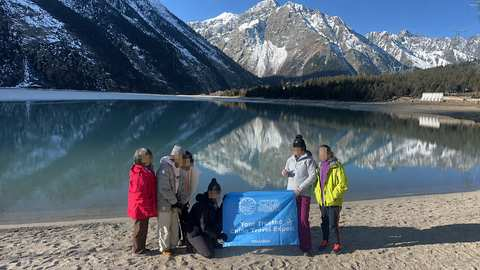

6

自己包團或其他地點

Q．你想要西藏包團嗎?還是其他地區的行程？

西藏／色達／雲南／北京／上蘇杭／其他

下一題預計幾位一起去？（自己一人／2-3人／4-6人／6人以上）

若選「色達」且廣告來源市場非港澳台 → 客戶卡自動備註提醒顧問確認證件資格，AI不直接詢問

選「西藏」且人數＝自己一人／2-3人／不確定 → 意象模糊客戶處理腳本

判斷邏輯

選西藏，但人數為自己一人／2-3人，或回答不確定 → 判斷為意象模糊客戶，走以下腳本

回-1

西藏因為比較特殊，台灣以及其他地區旅客需要導遊陪同，所以包團人數較少費用會比較高喔！

回-2

請問您目前是有比較特殊的需求或是想去的特別景點嗎? 如果沒有~我給您推薦我們西藏10天拚團行程可以嗎?
因為我們一團也就4-6人，其實體驗感跟自己包團不會差別太大～

判斷邏輯

若回「好」或判斷起來是有興趣的 → 進入下方「10天林芝希爾頓行程」介紹模式

\n

分支回圖-3・10天林芝希爾頓行程

分支回文-3-1

這是從低海拔林芝進西藏，最完整玩林芝+拉薩+山南+日喀則+珠峰大本營的10天行程

分支回圖3-2・林芝巴松錯

分支回文3-3

因為我們是從林芝進西藏，2900上下的海拔加上綠植充沛，整個含氧量很足夠，像是經典的巴松錯，現場看宛如綠寶石呢！

分支回文3-3

由於我們目前無加價全面升級小團，一位導遊服務4-6人，所以我們行程安排的更深度，加入了千年歷史的秀巴古堡，也可以遠眺尼羊河，並且感受碉堡與雪山的結合

分支回圖3-4・千年古堡

分支回文回3-5

剛說到我們導遊服務比是1:6，也要特別強調一下，我們是真正的純玩無套路小團～有包含布達拉宮與八廓街等行程，更特別增加財神廟扎基寺求財！與色拉寺看辯經，會更深度的去了解西藏！

分支回圖3-6・布達拉宮真美

分支回圖3-7・財神廟扎基寺

分支回圖3-8・色拉寺辯經

分支回文3-9

另外在西藏，住宿以及車是非常重要的！我們除了珠峰大本營外，全面升級住國際品牌希爾頓

分支回圖4-0・希爾頓1

分支回文4-1

希爾頓是西藏最穩定且是12小時提供85-90%濃度的氧氣呦！而含氧量在西藏這樣的高原地區是很重要的！

分支回圖4-2・希爾頓2

分支回文5-1

目前不加價升級6小團！車型則是2025年最新車，用VIP航空保姆車，每個人都有自己的大座位，並且有自帶製氧機，讓您舒適又安心～💕

分支回圖5-2・車車照

分支回文5-3

這台車除了前面有緊急醫療氧氣鋼瓶！還特別裝了【大家都可以吸】的彌散式氧氣，簡單說就是～只要一開車，車子內部就在一個【移動氧艙】

分支回圖5-4・車子製氧機

分支文回6-5

在西藏這樣的高原環境，住宿與車配備好！真的很重要

分支圖回7・我們的客人+牌子

分支文回8

我們CITS國旅環球-China2Go是專門接待港澳台以及全球外賓的！總公司是有70年歷史的品牌喔！是絕對純玩小團～

分支文回9

還有一點，我們是唯一敢把無購物寫在合約上的旅行社，有任何購物行為賠償5000！

說明

因為前面沒有月份，這裡開始蒐集

分支回文回10・問

請問您預計幾月來西藏呢?

判斷邏輯

客人回答有明確月份 → 若為12.1.2月，進入下方「冬遊西藏」介紹模式

冬回問文1

這個時間珠峰大本營不能住，但12月15日~2月20日是西藏的冰湖藍冰時期!我給您看看我們獨家的「冬遊西藏拼團行程! 」

冬回問文2・地圖冬遊

冬季回問文3・冰湖

冬回問文4

是冰湖X藍冰雙饗宴

冬季回問文5・藍冰

冬季回問文6・躺著的客人

冬季回問文7

這是去年我們客人在秘境冰湖-恰央措上躺著拍的照片~

冬季回問文8

用車以及用的住宿跟上面跟您說的一樣，以”高原能休息的好”為我們最高宗旨

冬季回問文9（選項除了選自己一人外才出現）

您是跟家人還是朋友一起玩呢?

依答案分流

等待回文等5分鐘（有回→繼續）→無回再等30分鐘→30分鐘後已讀則繼續／未讀最多再等1小時→仍無回應則等1天後再繼續發送介紹內容（不強制往下推進）

Q2・回答「家人」「好的，同行的家人中是否有65歲以上長輩或是孩童」

Q2・回答「朋友」「收到，同行的朋友中是否有65歲以上長輩或是孩童」

Q3觸發（家人／朋友路徑皆可能觸發）若Q2只回答「有」，未說明對象：「好的~我們公司不玩套路！所以只要符合景區當下政策我們都會退優惠門票喔！另外想請問是長輩嗎？」（釐清是長輩還是孩童）

Q3＝長輩 → 追問實際年齡先回覆：「是這樣的～目前用台胞證進入西藏的旅客，65歲以上都是要辦理健康證明，不過放心～我到時候幫您備註下～健康證明的格式還有申請規定，我再發給您！也都會依照時間提醒您辦理」；若年齡≥75歲，加註：「目前75歲以上長輩申請入藏函是申請不下來的」（優先轉真人特殊處理）

Q3＝孩童 → 追問實際年齡若年齡<5歲，回覆：「我們通常是建議孩子5歲以上，能準確表達自己的身體狀況才會建議前往喔！」

問聯絡方式前置條件（共通）需三題皆已回答，且介紹模式（完整一輪）已全部發送完畢，才可進入下一步；不然則進入洗單子循環。等待只要客人沒回答，進入「沉默半天模式」——半天內不追問、不強推下一步文後回1，等客人主動回覆

文後回1給您分享一下我們的客人照～

文後回圖2・客人照片1

文後回圖3・客人照片2

文後回2上面介紹的行程，您有大概看一下嗎？

文後回3等待邏輯半天內客人沒回 → 若已讀則視同繼續下一步；若未讀無回 → 等1天後再繼續

文後回4・回答「有」才觸發「感謝您認真幫我看>”<！您有沒有微信或是Line的QR code，我安排顧問傳更詳細資料給您介紹」

若仍無回應轉為公版每日一則「洗單子」（提醒/催單訊息），內容依時期常更換，不在此腳本固定，由行銷端另外維護更新

選「西藏」且人數＝4-6人／6人以上 → 意向明確客戶處理腳本

判斷邏輯

選西藏，且人數判斷是多的，或是感覺有很多需求的 → 判斷為意向明確客戶，走以下腳本

回-1

歡迎！我們CITS國旅環球-China2Go公司在全中國大陸都有分公司，且西藏有自己辦公室，我們都是做精品團的，非常了解各路線與需求

回-2

想詢問您們大概想幾月來西藏呢?

判斷邏輯

等客人回覆蒐集到訊息後，判斷有資訊了 → 回覆下一步

回-3

好的，因為包團行程會有很多細節需要與您討論，我安排我們專業的顧問給您介紹
請問您有沒有微信或是Line的QR code，我請他加入您

判斷邏輯

客人沒回 → 進入第一個模式（分享客人照＋詢問聯絡方式）

文後回1

給您分享一下我們的客人照～

文後回圖2・客人照片1

文後回圖3・客人照片2

文後回文4

另外，有看到可以給我一下您的微信或是LINE ID~~除了討論行程方便外，一些景點的安排行程表以及景點照傳送會更方便喔，不然這裡有時候會吃訊息

收聯絡方式微信／WhatsApp／Line

客戶卡打包 → 轉交真人顧問

行程分支・人數・月份・地區(廣告來源自動標記)・聯絡方式・備註

按鈕式提問
介紹模式圖文腳本
轉真人顧問節點
報價・10/1-2/28
報價・3/25-4/30
報價・5/1-6/30
報價・7/1-9/30