China2Go AI客服對話流程・西藏桃花節線

China2Go・AI 客服對話邏輯

# 林芝桃花節廣告線 → AI 對話決策樹

客人點擊廣告進站後，AI 依序分流、收集資訊，最後打包客戶卡轉交真人顧問。以下為完整對話路徑示意，分支1、2可展開查看完整介紹模式腳本。

廣告點擊進站

歡迎訊息＋6個行程分支按鈕

⚠ 全域機制・客人中途問價格（適用所有分支的圖文介紹過程中）

**觸發問句：**價格／多少錢／一人多少／優惠／價錢／團費／行程費用 等等
**機制：**這屬於「客人回答的東西不是常規回答」的中間插嘴情境。若客人在AI還沒發完行程圖、或還沒介紹到「圖13・住宿（第二張）」之前就問價格 → **請勿直接給價格**
**回覆話術：**「好的~我等等介紹完後給您價格跟配套，這樣會直觀有畫面一點！」
**邏輯：**回答完這句後，一律暫緩要聯繫方式的動作，等30分鐘後再回覆：「這個價格跟配套因為是純玩小團，我們很多給的保障還有附加價值可以透過檔案更清楚，您有沒有微信或是Line的QR code，我安排顧問傳更詳細資料給您介紹」

⚠ 全域機制・加價日期區間判斷（適用所有分支，無論哪個行程）

**比對原則：**下方各分支報價表中的「長假區間判斷」只要客人的出發日期與該區間有**任何重疊**就算命中，不是只有完全落在區間內才算。例如客人說 10/6~10/20，雖然大部分不在區間內，但頭幾天與「9/25-10/7」有重疊 → 一樣要觸發長假問句問清楚客人確切日期，不可以直接跳過

**目前三段會加價的日期區間（供AI主動告知客人）：**4/25-5/5、9/25-10/7、2/1-2/16
**提醒問句（客人詢問這些區間附近日期時可主動告知）：**「跟您提醒一下，4/25-5/5、9/25-10/7、2/1-2/16 這幾段時間因為是大陸的長假期間，費用會比平常高一些喔」

⚠ 全域機制・過年區間（2/1-2/16）判斷（不管是哪裡行程，一律適用）

**觸發：**只要客人提到的出發日期落在 2/1~2/16 之間（任一天，非2028年（含）以後 → 系統自動判定都是2027年過年），不管客人原本問的是哪個分支、哪個行程
**1. 一律先問：**「這段時間是過年時間，費用會比平常較高，您目前比較能出遊會是這日期嗎?」
**2. 判斷客人是否為只能過年時間：**
　→ 不是（客人還有彈性）→ 引導他說出實際可出發日期，再依該日期回到對應分支的一般報價流程
　→ 確定只能這段時間 → 直接轉真人客服處理

1

桃花＋珠峰 11日

Q．預計幾位一起去？

自己一人／2-3人／4-6人／6人以上

觸發關鍵字：文字中含「桃花節」「林芝桃花」「賞花」「春天」都直接觸發此分支
預計會設定的廣告名稱：限定三~四月小團4-6人「桃花節上珠峰11日」／小團4-6人「桃花節上珠峰11日」／西藏桃花節上珠峰+秘境11日

介紹模式腳本（14則圖文）

判斷邏輯

依人數答案分流：自己一人→文01-2／2-3人→文01-3／4-6人或6人以上→文01-1／逾1分鐘無回應或系統未能判斷 → 直接播放文01

文 01（僅限1分鐘無回應或系統未判斷出人數答案時，跳轉至此）

您好~我是China2Go國旅環球，先給您看一下我們的行程

文 01-1・僅人數＝4-6人／6人以上

我們公司是全西藏精緻中小團資源最多的！我們的拚團都是4-6人一團~
你們可以考慮自己一團出發喔~
不過先讓我先介紹一下行程

文 01-2・僅人數＝自己一人

您好~我們很多自己一人的旅客，非常歡迎您！，先給您看一下我們的行程

文 01-3・僅人數＝2-3人

歡迎，我是China2Go國旅環球，我們的拚團都是4-6人小團，最適合像您們人數少前往的，比較自在！先給您介紹一下行程

說明

所有分支播完後接續下方圖02

圖 02・11日行程總覽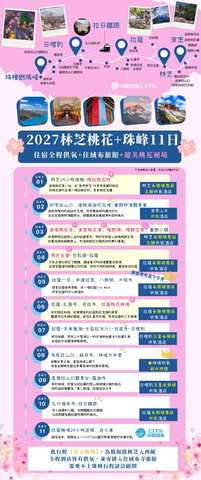

文 03

這是我們精選11日的行程！從林芝低海拔入藏，循序漸進的海拔可以給身體時間適應高原～
而行程完整涵蓋【林芝+波密＋拉薩+山南+日喀則以及珠峰大本營】等最重要的旅遊景點！

文 03-1・僅11日分支

而您選的是我們限量上珠峰的桃花節行程．這是獨有＂升級＂在珠峰絨布旅館的住宿！不過因為房間數較少，人數也是有限定的喔！

圖 03-02・絨布旅館・僅11日分支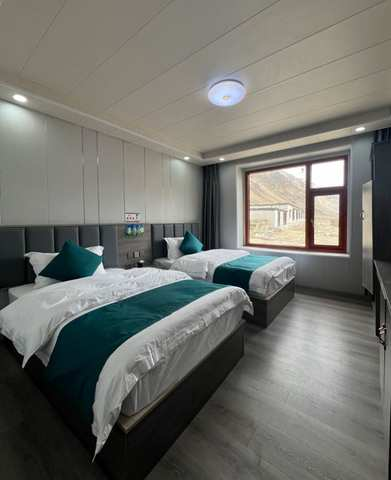

文 03-03・僅11日分支

這是絨布旅館的住宿環境，有獨立廁所以及供氧，不過真的是限量喔！！！！

文 04

這個行程除了必去的兩大桃花景點－嘎拉桃花村與波密桃花溝外，還有加碼去到以雪山湖泊、王宮遺址、千年古堡、以及最重要的拉薩秘境寺廟的特殊桃花行程

文 04-1

讓桃花能加入更深的西藏色彩，讓你不是只有賞桃花而已，而是真正的擁有了西藏獨有的桃花特色

圖 05・帕邦喀寺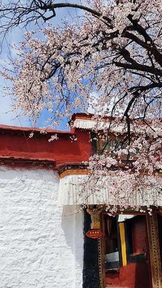

圖 05-1・秀巴古堡

文 06

以及除了地區條件有限以外，我們全面升級都住國際品牌希爾頓飯店哦！希爾頓是西藏最穩定且是12小時提供85-90%濃度的氧氣呦！而含氧量在西藏這樣的高原地區是很重要的！另外我們整體也是全酒店都有供氧氣的～

圖 07・希爾頓客房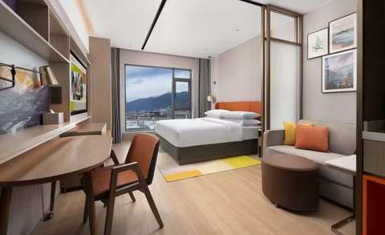

圖 07-1・希爾頓製氧機

文 08

因為桃花節不加價升級6小團！車型則是2025年最新車，用VIP航空母車，每個人都有自己的大座位，並且有自帶製氧機，讓您舒適又安心～💕

圖 09・車輛照片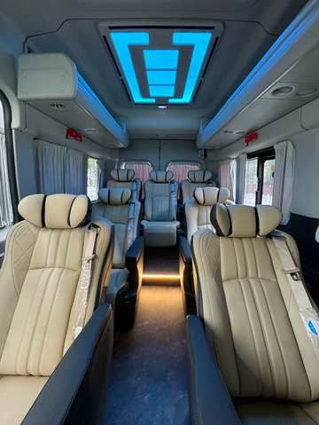

文 10

然後~這台車除了前面有緊急醫療氧氣鋼瓶！還特別裝了大家都可以吸的彌散式氧氣，簡單說就是～只要一開車，車子內部就在一個【移動氧艙】

圖 11・車輛製氧機

文 12

在西藏這樣的高原環境，住宿與車配備好！真的很重要

圖 13・住宿（第二張）

文 14

還有一點，我們是唯一敢把無購物寫在合約上的旅行社，有任何購物行為賠償5000！

依人數答案分流

選「自己一人」

問時間「這路線是3月尾-4月出，每周4個出團日。請問您計劃什麼時候來呢？好安排顧問給您詳細介紹~❤️」

問時間後等待只要客人沒回答，進入「沉默半天模式」——半天內不追問、不強推下一步，等客人主動回覆

文後回1「給您介紹一下裡面的行程．除了桃花秘境之外，我們也安排了經典的布達拉宮與大昭寺八廓街～」

圖後回2・布達拉宮

圖後回3・八廓街

文後回4「以及我們家因為走的是純玩小團之深度行程，所以是親自帶大家去財神廟-扎基寺參觀！」

圖後回5・扎基寺財神廟

文後回6「這裡是西藏最靈驗，香火非常鼎盛的廟喔！」

文後回7「上面給您的行程表您有看了嗎?」

文後回7等待邏輯半天內客人沒回 → 若已讀則視同繼續下一步；若未讀無回 → 等1天後再繼續

文後回8・回答「有」才觸發「感謝您認真幫我看>”<！您有沒有微信或是Line的QR code，我安排顧問傳更詳細資料給您介紹」

若仍無回應轉為公版每日一則「洗單子」（提醒/催單訊息），內容依時期常更換，不在此腳本固定，由行銷端另外維護更新

選「2-3／4-6／6人以上」

Q1・先問（共通）「請問您是跟家人還是朋友一起來呢?」

等待回覆規則（共通，Q1、Q2、Q3皆適用）等5分鐘（有回→繼續）→無回再等30分鐘→30分鐘後已讀則繼續／未讀最多再等1小時→仍無回應則等1天後再繼續發送介紹內容（不強制往下推進）

Q2・回答「家人」「好的，同行的家人中是否有65歲以上長輩或是孩童」

Q2・回答「朋友」「收到，同行的朋友中是否有65歲以上長輩或是孩童」

Q3觸發（家人／朋友路徑皆可能觸發）若Q2只回答「有」、未說明對象：「好的~我們公司不玩套路！所以只要符合景區當下政策我們都會退優惠門票喔！另外想請問是長輩嗎？」（釐清是長輩還是孩童）

Q3＝長輩 → 追問實際年齡先回覆：「是這樣的～目前用台胞證進入西藏的旅客，65歲以上都是要辦理健康證明，不過放心～我到時候幫您備註下～健康證明的格式還有申請規定，我再發給您！也都會依照時間提醒您辦理」；若年齡≥75歲，加註：「目前75歲以上長輩申請入藏函是申請不下來的」（優先轉真人特殊處理）

Q3＝孩童 → 追問實際年齡若年齡<5歲，回覆：「我們通常是建議孩子5歲以上，能準確表達自己的身體狀況才會建議前往喔！」

問聯絡方式前置條件（共通）需Q1、Q2、Q3三題皆已回答，且介紹模式（Step 1.6，14則圖文）已全部發送完畢，才可進入下一步問時間

問時間（共通）「這路線是3月尾-4月出，每周4個出團日。請問您計劃什麼時候來呢？好安排顧問給您詳細介紹~❤️」

問時間後等待只要客人沒回答，進入「沉默半天模式」——半天內不追問、不強推下一步，等客人主動回覆

文後回1「給您介紹一下裡面的行程．除了桃花秘境之外，我們也安排了經典的布達拉宮與大昭寺八廓街～」

圖後回2・布達拉宮

圖後回3・八廓街

文後回4「以及我們家因為走的是純玩小團之深度行程，所以是親自帶大家去財神廟-扎基寺參觀！」

圖後回5・扎基寺財神廟

文後回6「這裡是西藏最靈驗，香火非常鼎盛的廟喔！」

文後回7「上面給您的行程表您有看了嗎?」

文後回7等待邏輯半天內客人沒回 → 若已讀則視同繼續下一步；若未讀無回 → 等1天後再繼續

文後回8・回答「有」才觸發「感謝您認真幫我看>”<！您有沒有微信或是Line的QR code，我安排顧問傳更詳細資料給您介紹」

若仍無回應轉為公版每日一則「洗單子」（提醒/催單訊息），內容依時期常更換，不在此腳本固定，由行銷端另外維護更新

家人分支
朋友分支
家人／朋友皆可觸發
長輩分支
孩童分支

💰 客人問價格・桃花＋珠峰11日（分支4-3-4月「可以」、分支3-3-4月「可以」皆共用此價格內容）

觸發問

價格．多少錢．一人多少．優惠．價錢．團費．行程費用等等（比照全域「客人中途問價格」機制：圖13・住宿第二張之前不可先報價，先用暫緩話術，介紹完後30分鐘再回覆並附上QR code詢問）

【西藏桃花節11日遊】

出發時間：3/20-4/10（每週五、六、日、一發團）
十人小團優惠價：¥11,480/人（客人為2人1標間拼住價格，如需單休須補單房差¥3,200）
★限量升級4-6人小團 價格不變
包含：入藏函，車，導遊，司機，保險，住宿，酒店早餐，門票
不含：機票、正餐、小費

2

桃花 9日

Q．預計幾位一起去？

自己一人／2-3人／4-6人／6人以上

預計會設定的廣告名稱：限定三~四月小團4-6人「桃花節上不要珠峰9日」／小團4-6人「桃花節不要上珠峰9日」／西藏桃花節+秘境9日

介紹模式腳本（14則圖文）

判斷邏輯

依人數答案分流：自己一人→文01-2／2-3人→文01-3／4-6人或6人以上→文01-1／逾1分鐘無回應或系統未能判斷 → 直接播放文01

文 01（僅限1分鐘無回應或系統未判斷出人數答案時，跳轉至此）

您好~我是China2Go國旅環球，先給您看一下我們的行程

文 01-1・僅人數＝4-6人／6人以上

我們公司是全西藏精緻中小團資源最多的！我們的拚團都是4-6人一團~
你們可以考慮自己一團出發喔~
不過先讓我先介紹一下行程

文 01-2・僅人數＝自己一人

您好~我們很多自己一人的旅客，非常歡迎您！，先給您看一下我們的行程

文 01-3・僅人數＝2-3人

歡迎，我是China2Go國旅環球，我們的拚團都是4-6人小團，最適合像您們人數少前往的，比較自在！先給您介紹一下行程

說明

所有分支播完後接續下方圖02

圖 02・9日行程總覽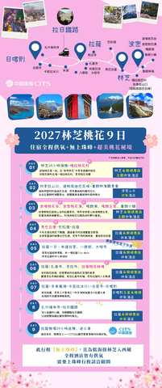

文 03

這是我們精選9日的桃花節行程！從林芝低海拔入藏，循序漸進的海拔可以給身體時間適應高原～
而行程完整涵蓋【林芝+波密＋拉薩+山南+日喀則】等最重要的旅遊景點！

文 04

這個行程除了必去的兩大桃花景點－嘎拉桃花村與波密桃花溝外，還有加碼去到以雪山湖泊、王宮遺址、千年古堡、以及最重要的拉薩秘境寺廟的特殊桃花行程

圖 05・帕邦喀寺

圖 05-1・秀巴古堡

文 06

以及除了地區條件有限以外，我們全面升級都住國際品牌希爾頓飯店哦！希爾頓是西藏最穩定且是12小時提供85-90%濃度的氧氣呦！而含氧量在西藏這樣的高原地區是很重要的！

圖 07・希爾頓客房

圖 07-1・希爾頓製氧機

文 08

因為桃花節不加價升級6小團！車型則是2025年最新車，用VIP航空母車，每個人都有自己的大座位，並且有自帶製氧機，讓您舒適又安心～💕

圖 09・車輛照片

文 10

然後~這台車除了前面有緊急醫療氧氣鋼瓶！還特別裝了大家都可以吸的彌散式氧氣，簡單說就是～只要一開車，車子內部就在一個【移動氧艙】

圖 11・車輛製氧機

文 12

在西藏這樣的高原環境，住宿與車配備好！真的很重要

圖 13・住宿（第二張）

文 14

還有一點，我們是唯一敢把無購物寫在合約上的旅行社，有任何購物行為賠償5000！

依人數答案分流

選「自己一人」

問時間「這路線是3月尾-4月出，每周4個出團日。請問您計劃什麼時候來呢？好安排顧問給您詳細介紹~❤️」

問時間後等待只要客人沒回答，進入「沉默半天模式」——半天內不追問、不強推下一步，等客人主動回覆

文後回1「給您介紹一下裡面的行程．除了桃花秘境之外，我們也安排了經典的布達拉宮與大昭寺八廓街～」

圖後回2・布達拉宮

圖後回3・八廓街

文後回4「以及我們家因為走的是純玩小團之深度行程，所以是親自帶大家去財神廟-扎基寺參觀！」

圖後回5・扎基寺財神廟

文後回6「這裡是西藏最靈驗，香火非常鼎盛的廟喔！」

文後回7「上面給您的行程表您有看了嗎?」

文後回7等待邏輯半天內客人沒回 → 若已讀則視同繼續下一步；若未讀無回 → 等1天後再繼續

文後回8・回答「有」才觸發「感謝您認真幫我看>”<！您有沒有微信或是Line的QR code，我安排顧問傳更詳細資料給您介紹」

若仍無回應轉為公版每日一則「洗單子」（提醒/催單訊息），內容依時期常更換，不在此腳本固定，由行銷端另外維護更新

選「2-3／4-6／6人以上」

Q1・先問（共通）「請問您是跟家人還是朋友一起來呢?」

等待回覆規則（共通，Q1、Q2、Q3皆適用）等5分鐘（有回→繼續）→無回再等30分鐘→30分鐘後已讀則繼續／未讀最多再等1小時→仍無回應則等1天後再繼續發送介紹內容（不強制往下推進）

Q2・回答「家人」「好的，同行的家人中是否有65歲以上長輩或是孩童」

Q2・回答「朋友」「收到，同行的朋友中是否有65歲以上長輩或是孩童」

Q3觸發（家人／朋友路徑皆可能觸發）若Q2只回答「有」、未說明對象：「好的~我們公司不玩套路！所以只要符合景區當下政策我們都會退優惠門票喔！另外想請問是長輩嗎？」（釐清是長輩還是孩童）

Q3＝長輩 → 追問實際年齡先回覆：「是這樣的～目前用台胞證進入西藏的旅客，65歲以上都是要辦理健康證明，不過放心～我到時候幫您備註下～健康證明的格式還有申請規定，我再發給您！也都會依照時間提醒您辦理」；若年齡≥75歲，加註：「目前75歲以上長輩申請入藏函是申請不下來的」（優先轉真人特殊處理）

Q3＝孩童 → 追問實際年齡若年齡<5歲，回覆：「我們通常是建議孩子5歲以上，能準確表達自己的身體狀況才會建議前往喔！」

問聯絡方式前置條件（共通）需Q1、Q2、Q3三題皆已回答，且介紹模式（Step 1.6，14則圖文）已全部發送完畢，才可進入下一步問時間

問時間（共通）「這路線是3月尾-4月出，每周4個出團日。請問您計劃什麼時候來呢？好安排顧問給您詳細介紹~❤️」

問時間後等待只要客人沒回答，進入「沉默半天模式」——半天內不追問、不強推下一步，等客人主動回覆

文後回1「給您介紹一下裡面的行程．除了桃花秘境之外，我們也安排了經典的布達拉宮與大昭寺八廓街～」

圖後回2・布達拉宮

圖後回3・八廓街

文後回4「以及我們家因為走的是純玩小團之深度行程，所以是親自帶大家去財神廟-扎基寺參觀！」

圖後回5・扎基寺財神廟

文後回6「這裡是西藏最靈驗，香火非常鼎盛的廟喔！」

文後回7「上面給您的行程表您有看了嗎?」

文後回7等待邏輯半天內客人沒回 → 若已讀則視同繼續下一步；若未讀無回 → 等1天後再繼續

文後回8・回答「有」才觸發「感謝您認真幫我看>”<！您有沒有微信或是Line的QR code，我安排顧問傳更詳細資料給您介紹」

若仍無回應轉為公版每日一則「洗單子」（提醒/催單訊息），內容依時期常更換，不在此腳本固定，由行銷端另外維護更新

家人分支
朋友分支
家人／朋友皆可觸發
長輩分支
孩童分支

💰 客人問價格・桃花9日（分支5-3-4月「可以」共用此價格內容）

觸發問

價格．多少錢．一人多少．優惠．價錢．團費．行程費用等等（比照全域「客人中途問價格」機制）

【西藏桃花節9日遊（不上珠峰）】

出發時間：3/20-4/10（每週五、六、日、一發團）
十人小團優惠價：¥9,980/人（客人為2人1標間拼住價格，如需單休須補單房差¥2,600）
★限量升級4-6人小團 價格不變
包含：入藏函，車，導遊，司機，保險，住宿，酒店早餐，門票
不含：機票、正餐、小費

3

西藏全覽-10天林芝+拉薩+珠峰

Q1．大概想幾月出發？

12-2月／3-4月／5-6月／7-8月／9-11月

月份選定後接著問Q2．預計幾位一起去？自己一人／2-3人／4-6人／6人以上

判斷邏輯：Q1（月份）1分鐘內沒有選擇 → 自動接著問Q2（人數）；Q2（人數）1分鐘內仍沒有回答 → 自動開始播放「文00・公版」→「統文回1」介紹流程（此時月份、人數皆視為未收集，流程結束後另外補問，見下方「5-6月／7-8月／9-11月」展開區塊尾端說明）

12-2月：跳轉至分支4「其他時間・上珠峰」的「12-2月・冬遊西藏介紹（25則圖文）」完整腳本，內容完全沿用，此處不重複列出

3-4月：跳轉至分支4「其他時間・上珠峰」的「上珠峰桃花回文01」桃花時間判斷 → 若AI判斷「可以」（時間落在3月底-4月10區間），比照分支4邏輯接續進入分支1「桃花＋珠峰11日」腳本；若AI判斷「不可以」（4/10之後）→ 與分支4不同：不接續分支4的「西藏8日精華」，改為跳回本分支（分支3）下方「5-6月／7-8月／9-11月・完整介紹腳本（西藏全覽10日）」的「統文回1」開始播放

5-6月／7-8月／9-11月・完整介紹腳本（西藏全覽10日）

判斷邏輯

人數（Q2）通常已於上方收集：依人數答案進入對應文案（自己一人→文00-2／2-3人→文00-3／4-6人或6人以上→文00-1／人數未知（Q1、Q2皆逾時未答，被自動觸發進入本流程）→文00公版）

文00・公版（無選項或回答不確定）

您好~我是China2Go國旅環球，先給您看一下我們的行程

文00-2・僅人數＝自己一人

您好~我們很多自己一人的旅客，非常歡迎您！我是China2Go國旅環球，先給您看一下我們的行程

文00-3・僅人數＝2-3人

歡迎，我是China2Go國旅環球，我們的拚團都是4-6人小團，最適合像您們人數少前往的，比較自在！先給您介紹一下行程

文00-1・僅人數＝4-6人／6人以上

我們公司是全西藏精緻中小團資源最多的！我們的拚團都是4-6人一團~
你們可以考慮自己一團出發喔~
不過先讓我先介紹一下行程

統文回1

我給您介紹我們的10日行程，這是從低海拔林芝進入西藏，可以有效預防高反最適合的行程
之中包含了拉薩+山南+日喀則+珠峰大本營
是一個非常完整可以把西藏前後藏以及林芝都玩到的行程

統回圖-2・10天林芝希爾頓行程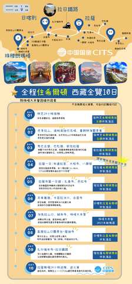

統回文-3

因為我們是從林芝進西藏，2900上下的海拔加上綠植充沛，整個含氧量很足夠，像是經典的巴松錯，現場看宛如綠寶石呢！

統回圖-4・巴松錯

統回文-5

我們目前無加價全面升級小團，一位導遊服務4-6人，所以我們行程安排的更深度，加入了千年歷史的秀巴古堡，也可以遠眺尼羊河，並且感受碉堡與雪山的結合

統回圖6・千年古堡

統回文7

剛說到我們導遊服務比是1:6，也要特別強調一下，我們是真正的純玩無套路小團～有包含布達拉宮與八廓街等行程，更特別增加財神廟扎基寺求財！與色拉寺看辯經，會更深度的去了解西藏！

統回圖8・布達拉宮真美

統回圖9・財神廟扎基寺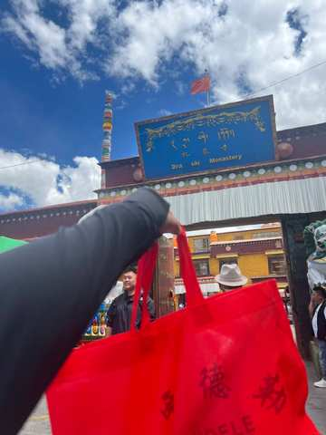

統回圖10・色拉寺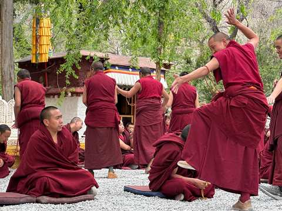

統回文11

另外在西藏，住宿以及車是非常重要的！我們除了珠峰大本營外，全面升級住國際品牌希爾頓

統回圖12・希爾頓1

統回文13

希爾頓品牌的酒店是【西藏最穩定且是12小時提供85-90%濃度的氧氣呦】！而含氧量在西藏這樣的高原地區是很重要的！

統回圖14・希爾頓2

統回文15

目前不加價升級6小團！車型則是2025年最新車，用VIP航空保姆車，每個人都有自己的大座位，並且有自帶製氧機，讓您舒適又安心～💕

統回圖16・車車照

統回文17

這台車除了前面有緊急醫療氧氣鋼瓶！還特別裝了【大家都可以吸】的彌散式氧氣，簡單說就是～只要一開車，車子內部就在一個【移動氧艙】

統回圖17・車子製氧機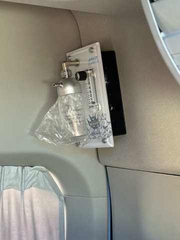

統回文18

在西藏這樣的高原環境，住宿與車配備好！真的很重要

統回圖19・日照金山

統回文20

我們行程本身是有上到珠峰大本營，你看！這是之前團友幸運拍下的日落金山～

統回文21

我們CITS國旅環球-China2Go是專門接待港澳台以及全球外賓的！總公司是有70年歷史的品牌喔！是絕對純玩小團～

統回圖22・客人魯朗林海照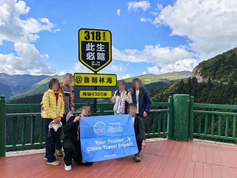

統回文23

我們是唯一敢把無購物寫在合約上的旅行社，有任何購物行為賠償5000！

說明

介紹完後直接依已收集的人數答案分流（不重複詢問）

依人數答案分流・自己一人

自己1・沒回答月份分流問A1「您目前有沒有確定想要幾月來呢?」

自己2・有回答月份分流問A2依照選的月份代入話術：「想詢問下，剛剛看您選＠選項＠　請問是這段時間的團期都可以？還是有比較喜歡的時間？」

自己3・等問時間後等待，只要客人沒回答，進入「沉默半天模式」——半天內不追問、不強推下一步，等客人主動回覆

自己・回答後「請問您有沒有微信或是LINE？可以給我QR code，我安排專業的顧問依照您的需求與團期給您更詳細介紹~❤️」

依人數答案分流・2-3／4-6／6人以上

多人 Q1（共通）「請問您是跟家人還是朋友一起來呢?」

等待回覆規則（共通）等5分鐘（有回→繼續）→無回再等30分鐘→30分鐘後已讀則繼續／未讀最多再等1小時→仍無回應則等1天後再繼續發送介紹內容（不強制往下推進）

Q2・回答「家人」「好的，同行的家人中是否有65歲以上長輩或是孩童」

Q2・回答「朋友」「收到，同行的朋友中是否有65歲以上長輩或是孩童」

Q3觸發（家人／朋友路徑皆可能觸發）若Q2只回答「有」，未說明對象也算在這裡面：「好的~我們公司不玩套路！所以只要符合景區當下政策我們都會退優惠門票喔！另外想請問是長輩嗎？」（釐清是長輩還是孩童）

Q3＝長輩 → 追問實際年齡先回覆：「是這樣的～目前用台胞證進入西藏的旅客，65歲以上都是要辦理健康證明，不過放心～我到時候幫您備註下～健康證明的格式還有申請規定，我再發給您！也都會依照時間提醒您辦理」；若年齡≥75歲，加註：「目前75歲以上長輩申請入藏函是申請不下來的」（優先轉真人特殊處理）

Q3＝孩童 → 追問實際年齡若年齡<5歲，回覆：「我們通常是建議孩子5歲以上，能準確表達自己的身體狀況才會建議前往喔！」

問聯絡方式前置條件（共通）需Q1、Q2、Q3三題皆已回答（回不確定也算已回答），且介紹模式（完整一輪）已全部發送完畢，才可進入下一步；不然則進入洗單子循環。等待只要客人沒回答，進入「沉默半天模式」——半天內不追問、不強推下一步文後回1，等客人主動回覆

判斷邏輯（資料補齊檢查，家人/朋友分流結束後）

若月份（Q1）、人數（Q2）皆已收集 → 直接繼續下方「全覽文後回1」（不重複詢問）；若人數已收集但月份未收集（自己一人路徑已於上方A1/A2單獨補問，此處主要處理多人路徑）→ 補問：「請問您大概想幾月出發呢？」12-2月／3-4月／5-6月／7-8月／9-11月 → 選12-2月／3-4月則比照分支3上方跳轉邏輯；選5-6月／7-8月／9-11月則留在本段，繼續下方「全覽文後回1」

全覽文後回1

給您介紹一下裡面的行程．除了經典行程之外，我們也安排珠峰下山後去到薩迦寺～他的震撼度宛如西藏的敦煌

全覽圖後回2・薩迦寺

全覽文後回2

另外，我們家因為是純玩小團，所以特別安排最後回到”拉薩搭乘拉日鐵路”，這是青藏火車的延伸段，除了是最特別並且離天宮最近的高鐵之一外，也可以大大減少舟車勞累喔！

全覽圖後回3・拉日鐵路

全覽文後回4

上面介紹的行程，您有大概看一下嗎？

全覽文回5等待邏輯

半天內客人沒回 → 若已讀則視同繼續下一步；若未讀無回 → 等1天後再繼續

全覽文回6・回答「有」或其他看起來有需要的訊息才觸發

「感謝您認真幫我看>”<！您有沒有微信或是Line的QR code，我安排顧問傳更詳細資料給您介紹」

若仍無回應

轉為公版每日一則「洗單子」（提醒/催單訊息），內容依時期常更換，不在此腳本固定，由行銷端另外維護更新

💰 客人問價格・西藏全覽10天（分支3專用，依出團日期分5段報價）

觸發問

價格．多少錢．一人多少．優惠．價錢．團費．行程費用等等（比照全域機制）

先確認客人時間

因為西藏有淡旺季之分，可能差5天價格就會有點不同，想跟您確定一下大概的出團日期～我先給您最初步報價

客人選📅 10/1－2/28 (以出發日計算)

【林芝希爾頓全覽十日遊】
出發時間：10/8-2/28（每週二發團，除10/1~10/8區間）
十人小團優惠價：¥8,680起/人（2人1標間拼住，單休補房差¥1,900）
★限量升級4-6人小團 價格不變
包含：入藏文件，車，司機，導遊，保險，住宿，門票，酒店早餐
不含：機票、正餐、小費

**⚠ 長假區間判斷（10/1-10/7）：**不可以先報價，先問：「這是大陸的長假期間，價格會有點變化，請問您目前只有這個時間段嗎？」
→ 客人回「肯定」（感覺只有這個時間的假期）→ 直接轉真人客服處理
→ 客人回「可以換」或判斷有動搖想換時間 → 推薦我們10月的其他團期，或依照他的新時間再報價

客人選📅 3/25－4/30（非桃花節） (以出發日計算)

【林芝希爾頓全覽十日遊】
出發時間：3/25-4/30（每週二發團）
十人小團優惠價：¥10,680起/人（2人1標間拼住，單休補房差¥2,800）
★限量升級4-6人小團 價格不變
包含：入藏文件，車，司機，導遊，保險，住宿，門票，酒店早餐
不含：機票、正餐、小費

**⚠ 長假區間判斷（4/25-4/30）：**不可以先報價，先問：「這是大陸長假期間的前夕，價格會有點變化，請問您目前只有這個時間段嗎？」
→ 客人回「肯定」（感覺只有這個時間的假期）→ 直接轉真人客服處理
→ 客人回「可以換」或判斷有動搖想換時間 → 推薦我們4月15號後的其他團期，或依照他的新時間再報價

客人選📅 5/1－6/30 (以出發日計算)

【林芝希爾頓全覽十日遊】
出發時間：5/5-6/30（每週二發團，避開五一）
十人小團優惠價：¥9,980起/人（2人1標間拼住，單休補房差¥2,400）
★限量升級4-6人小團 價格不變
包含：入藏文件，車，司機，導遊，保險，住宿，門票，酒店早餐
不含：機票、正餐、小費

**⚠ 長假區間判斷（5/1-5/5）：**不可以先報價，先問：「這是大陸的”五一勞動長假”期間，價格會有點變化，請問您目前只有這個時間段嗎？」
→ 客人回「肯定」（感覺只有這個時間的假期）→ 直接轉真人客服處理
→ 客人回「可以換」或判斷有動搖想換時間 → 推薦我們5月的其他團期，或依照他的新時間再報價

客人選📅 7/1－9/30 (以出發日計算)

【林芝希爾頓全覽十日遊】
出發時間：7/1-9/24（每週二發團）
十人小團優惠價：¥11,780起/人（2人1標間拼住，單休補房差¥3,300）
★限量升級4-6人小團 價格不變
包含：入藏文件，車，司機，導遊，保險，住宿，門票，酒店早餐
不含：機票、正餐、小費

**⚠ 長假區間判斷（9/25-9/30）：**不可以先報價，先問：「這是大陸的長假期間，價格會有點變化，請問您目前只有這個時間段嗎？」
→ 客人回「肯定」（感覺只有這個時間的假期）→ 直接轉真人客服處理
→ 客人回「可以換」或判斷有動搖想換時間 → 推薦我們9月的其他團期，或依照他的新時間再報價

4

其他時間・上珠峰

Q1．大概想幾月出發？

12-2月／3-4月／5-6月／7-8月／9-11月

Q2．預計幾位一起去？自己一人／2-3人／4-6人／6人以上

判斷邏輯：Q1（月份）1分鐘內沒有選擇 → 自動接著問Q2（人數）；Q2（人數）1分鐘內仍沒有回答 → 自動開始播放「文00・公版」→「文回1」（8日精華通用開場，見下方「逾時預設開場」展開區塊）

全流程結尾（進入詢問微信/Line QR code前）務必檢查：月份、人數是否都已收集。任一項缺漏 → 比照分支3的作法補問一次（缺月份則問Q1選項，答案落在12-2月／3-4月則依下方對應展開區塊接續；缺人數則問Q2選項），補齊後才進入收聯絡方式

逾時預設開場・文00＋文回1（月份、人數皆逾時未答時觸發）

文00・公版（無選項或回答不確定）

您好~我是China2Go國旅環球，先給您看一下我們的行程

文回1

我先給您介紹我們的8日行程，之中包含了拉薩+山南+日喀則+珠峰大本營
您先看看～如果想加從林芝進10天的行程．再給我說．我給您介紹

說明

以下接續播放與「5-6月／7-8月／9-11月」展開區塊相同的介紹圖文（不重複詢問已進行的開場），介紹完畢後依上方時效性規則補問月份、人數

12-2月・冬遊西藏介紹（25則圖文）

此展開內容僅在客人選「12-2月」時觸發（冬季藍冰＋冰湖秘境限定行程）；選其他月份則直接接續下方一般流程（問人數→收聯絡方式，內容待補）

月份選12-2月後，立即問Q．預計幾位一起去？　自己一人／2-3人／4-6人／6人以上

判斷邏輯對方有選 → 依人數答案進入對應文案（自己一人→文00-2／2-3人→文00-3／4-6人或6人以上→文00-1／答案不明確→文00公版）；對方經過30秒沒選 → 略過以上所有問候文案，直接進入下方文回1介紹模式

文00・公版（無選項或回答不確定）

您好~我是China2Go國旅環球，先給您看一下我們的行程

文00-2・僅人數＝自己一人

您好~我們很多自己一人的旅客，非常歡迎您！我是China2Go國旅環球，先給您看一下我們的行程

文00-3・僅人數＝2-3人

歡迎，我是China2Go國旅環球，我們的拚團都是4-6人小團，最適合像您們人數少前往的，比較自在！先給您介紹一下行程

文00-1・僅人數＝4-6人／6人以上

我們公司是全西藏精緻中小團資源最多的！我們的拚團都是4-6人一團~
你們可以考慮自己一團出發喔~
不過先讓我先介紹一下行程

文回1

這個時間珠峰大本營不能住，但12月15日~2月20日是西藏的冰湖藍冰時期!我給您看看我們獨家的「冬遊西藏拼團行程! 」

圖回1-1・冬遊西藏地圖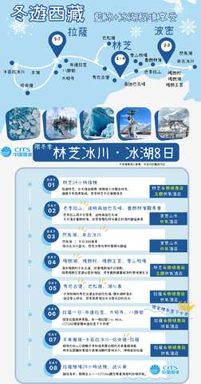

文回1-2

行程從林芝低海拔出發，讓身體有時間適應高反

圖回1-2・占堆拿旗子照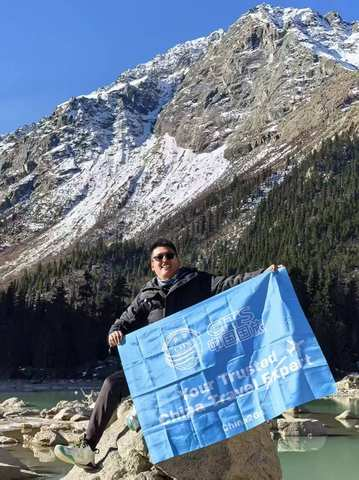

文回1-3

我們會特別去到G318中重要的然烏湖，這算是很深度的行程．然烏湖一年四季算是冬天最透徹，普通川藏線行程到的時間很難看到那麼美的湖面

圖回1-3・然烏湖無人

文回1-4

這時間是西藏的藍冰+冰湖時期，會去到兩大奇觀【來古+恰央措】

文回1-4

來古冰川的藍冰是非常壯觀的，這幾年政策也一直在變！持入藏函進去的旅客會越來越難看到…

圖回1-5・來古藍冰

文回1-5

而恰央措是我們獨家加入的，因為都是自己團隊，所擁有的資源都是比較深度的喔！

圖回1-6・恰央措

圖回1-7・旅客上恰央措

圖回1-8・旅客上恰央措躺著

文回1-8

去年我們就開始深度帶大家上恰央措冰湖了！

文回1-9

我們升級不加價，都是採4-6人小團！車子則是2025年最新車，用VIP保姆車，每個人都有自己的充電孔跟大座位哦！

圖回1-10・大VIP車

文回1-10

車上還配備了緊急醫療氧氣鋼瓶跟葡萄糖，都是免費提供的喔！

圖回1-11・車上的彌散氧氣瓶

文回1-12

針對我們【China2Go】的貴賓．我們特別免費增加這個車內彌散式氧氣！等於讓我們車子變成＂移動氧氣艙＂這是對身體適應高原反應非常有效的配備喔

文回1-13

除了特殊地區與珠峰等等外，我們的團全面升級都住國際品牌希爾頓飯店哦！

圖回1-14・希爾頓1（圖片已調整）

圖回1-15・希爾頓2（圖片已調整）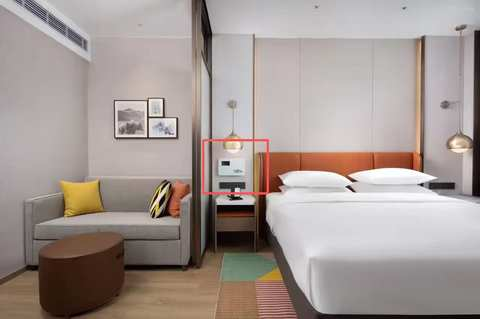

文回1-15

希爾頓是西藏最穩定且是12小時提供85-90%濃度的氧氣呦！

文回1-16

在西藏這樣的高原環境，住宿與車配備好！真的很重要

文回1-17

～～～還有一點，我們是唯一敢把無購物寫在合約上的旅行社，有任何購物行為賠償5000

介紹完後直接依「月份選定後」已收集的人數答案分流（不重複詢問）；若當時30秒未選、視同「自己一人／2-3人」路徑處理

依人數答案分流

選「自己一人」

問自己1・問時間「這路線是12月15日-2月20日，每周四出發。請問您計劃什麼時候來呢？好安排顧問給您詳細介紹~❤️」

問自己2・等待只要客人沒回答，進入「沉默半天模式」——半天內不追問、不強推下一步，等客人主動回覆；等到半天不回，進入下方「問後回」模式

文問後回1「給您介紹一下裡面的行程．除了藍冰秘境之外，我們也安排了經典的布達拉宮與大昭寺八廓街～還有冬天能見度最高的南迦巴瓦峰」

圖後回2・冬-布達拉宮

圖後回3・冬-八廓街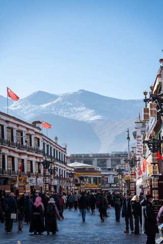

圖後回4・冬-南迦巴瓦峰

文後回4西藏是高原地區，冬天時的陽光剛剛好，會比其他季節冷，但絕對沒有你想像中的冷

文後回5不會是濕冷的不舒適感，空氣冷冷的，太陽大大熱熱的！而運氣好還可能會遇到雪，看到雪白的布達拉宮喔

文後回6「上面給您的行程表您有看了嗎?」

等待邏輯半天內客人沒回 → 若已讀則視同繼續下一步；若未讀無回 → 等1天後再繼續

文後回8・回答「有」才觸發「感謝您認真幫我看>”<！您有沒有微信或是Line的QR code，我安排顧問傳更詳細資料給您介紹」

若仍無回應轉為公版每日一則「洗單子」（提醒/催單訊息），內容依時期常更換，不在此腳本固定，由行銷端另外維護更新

選「2-3／4-6／6人以上」

Q1・先問（共通）「請問您是跟家人還是朋友一起來呢?」

等待回覆規則（共通，Q1、Q2、Q3皆適用）等5分鐘（有回→繼續）→無回再等30分鐘→30分鐘後已讀則繼續／未讀最多再等1小時→仍無回應則等1天後再繼續發送介紹內容（不強制往下推進）

Q2・回答「家人」「好的，同行的家人中是否有65歲以上長輩或是孩童」

Q2・回答「朋友」「收到，同行的朋友中是否有65歲以上長輩或是孩童」

Q3觸發（家人／朋友路徑皆可能觸發）若Q2只回答「有」、未說明對象：「好的~我們公司不玩套路！所以只要符合景區當下政策我們都會退優惠門票喔！另外想請問是長輩嗎？」（釐清是長輩還是孩童）

Q3＝長輩 → 追問實際年齡先回覆：「是這樣的～目前用台胞證進入西藏的旅客，65歲以上都是要辦理健康證明，不過放心～我到時候幫您備註下～健康證明的格式還有申請規定，我再發給您！也都會依照時間提醒您辦理」；若年齡≥75歲，加註：「目前75歲以上長輩申請入藏函是申請不下來的，您會考慮去雲南或是川西嗎？可以給您推薦一樣深度有藏區以及壯麗風景特色的景點」（優先轉真人特殊處理）

Q3＝孩童 → 追問實際年齡若年齡<5歲，回覆：「我們通常是建議孩子5歲以上，能準確表達自己的身體狀況才會建議前往喔！」

問聯絡方式前置條件（共通）需Q1、Q2、Q3三題皆已回答，且冬遊西藏介紹（25則圖文）已全部發送完畢，才可進入下一步問時間

問時間（共通）「這冬遊西藏路線是12月15日-2月20日，每周四出團。請問您計劃什麼時候來呢？好安排顧問給您詳細介紹~❤️」

問時間後等待只要客人沒回答，進入「沉默半天模式」——半天內不追問、不強推下一步，等客人主動回覆；等到半天不回，進入下方「問後回」模式

文問後回1「給您介紹一下裡面的行程．除了藍冰秘境之外，我們也安排了經典的布達拉宮與大昭寺八廓街～還有冬天能見度最高的南迦巴瓦峰」

圖後回2・冬-布達拉宮

圖後回3・冬-八廓街

圖後回4・冬-南迦巴瓦峰

文後回4西藏是高原地區，冬天時的陽光剛剛好，會比其他季節冷，但絕對沒有你想像中的冷

文後回5不會是濕冷的不舒適感，空氣冷冷的，太陽大大熱熱的！而運氣好還可能會遇到雪，看到雪白的布達拉宮喔

文後回6「上面給您的行程表您有看了嗎?」

等待邏輯半天內客人沒回 → 若已讀則視同繼續下一步；若未讀無回 → 等1天後再繼續

文後回8・回答「有」才觸發「感謝您認真幫我看>”<！您有沒有微信或是Line的QR code，我安排顧問傳更詳細資料給您介紹」

若仍無回應轉為公版每日一則「洗單子」（提醒/催單訊息），內容依時期常更換，不在此腳本固定，由行銷端另外維護更新

家人分支
朋友分支
家人／朋友皆可觸發
長輩分支
孩童分支

💰 客人問價格・12-2月・冬遊西藏（25則圖文）

觸發問

價格．多少錢．一人多少．優惠．價錢．團費．行程費用等等（比照全域「客人中途問價格」機制）

客人選📅 2/15-2/28 (以出發日計算)

【西藏冰川精華八日遊】
出發時間：12/15-2/28（每週四發團）
十人小團優惠價：¥9,280起/人（2人1標間拼住，單休補房差¥1,500）
★限量升級4-6人小團 價格不變
包含：入藏文件，車，司機，導遊，保險，住宿，門票，酒店早餐
不含：機票、正餐、小費

**⚠ 春節區間判斷（2/1-2/16，任一天有包含到都算）：**不可以先報價，先問：「這是春節期間，價格會有點變化，請問您目前只有這個時間段嗎？」
→ 客人回「肯定」（感覺只有這個時間的假期）→ 直接轉真人客服處理
→ 客人回「可以換」或判斷有動搖想換時間 → 「您會想要1月尾或是2月中後的時間嗎? 我幫您查一下團期與價格」

3-4月・桃花節時段判斷

此展開內容僅在客人選「3-4月」時觸發（桃花節時段判斷）

先問（共通）

Q．預計幾位一起去？　自己一人／2-3人／4-6人／6人以上

上珠峰桃花回文01

您好~我是China2Go國旅環球，這時間我很推薦桃花節耶！通常是3月底~4月10出發的團，您這段時間可以嗎?

依AI判斷客人時間是否落在3月底-4月10前分流

回01-1・不可以（AI判斷為4/10之後）

此時可接續本分支下方「5-6月／7-8月／9-11月・西藏8日精華介紹」展開區塊的內容（拉薩+山南+日喀則+珠峰大本營，全程希爾頓，非桃花節版本），流程與話術通用

回01-2・可以（AI判斷時間落在區間內）

「好的！給您看下我們家獨家的桃花節秘境+經典11天上珠峰行程」

接續進入「桃花＋珠峰11日」（分支1）完整腳本，從圖02・11日行程總覽開始，後面內容與分支1完全相同（含介紹模式14則圖文、人數分流、長輩孩童審查、問時間、收聯絡方式），請參照分支1展開區塊，此處不重複列出

💰 客人問價格・桃花＋珠峰11日

觸發問

價格．多少錢．一人多少．優惠．價錢．團費．行程費用等等（比照全域「客人中途問價格」機制：圖13・住宿第二張之前不可先報價，先用暫緩話術，介紹完後30分鐘再回覆並附上QR code詢問）

【西藏桃花節11日遊】

出發時間：3/20-4/10（每週五、六、日、一發團）
十人小團優惠價：¥11,480/人（客人為2人1標間拼住價格，如需單休須補單房差¥3,200）
★限量升級4-6人小團 價格不變
包含：入藏函，車，導遊，司機，保險，住宿，酒店早餐，門票
不含：機票、正餐、小費

5-6月／7-8月／9-11月・西藏8日精華介紹

此展開內容僅在客人選「5-6月／7-8月／9-11月」任一項時觸發（一般希爾頓／非桃花節・非冬季路線）

月份選定後，立即問Q．預計幾位一起去？　自己一人／2-3人／4-6人／6人以上

判斷邏輯對方有選 → 依人數答案進入對應文案（自己一人→文00-2／2-3人→文00-3／4-6人或6人以上→文00-1／答案不明確→文00公版）；對方經過30秒沒選 → 略過以上所有問候文案，直接進入下方文回1介紹模式

文00・公版（無選項或回答不確定）

您好~我是China2Go國旅環球，先給您看一下我們的行程

文00-2・僅人數＝自己一人

您好~我們很多自己一人的旅客，非常歡迎您！我是China2Go國旅環球，先給您看一下我們的行程

文00-3・僅人數＝2-3人

歡迎，我是China2Go國旅環球，我們的拚團都是4-6人小團，最適合像您們人數少前往的，比較自在！先給您介紹一下行程

文00-1・僅人數＝4-6人／6人以上

我們公司是全西藏精緻中小團資源最多的！我們的拚團都是4-6人一團~
你們可以考慮自己一團出發喔~
不過先讓我先介紹一下行程

文回1

我先給您介紹我們的8日行程，之中包含了拉薩+山南+日喀則+珠峰大本營

您先看看～如果想加從林芝進10天的行程．再給我說．我給您介紹

圖回1-1・西藏8天精華地圖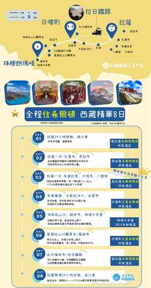

文回1-2

這是我們西藏8日的行程圖～會去到布達拉宮，羊湖，大昭寺，珠峰等西藏重要景點～

圖回2-1・布達拉宮天氣好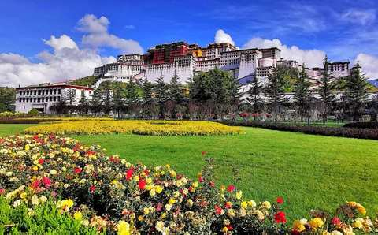

圖回2-2・八廓街天氣好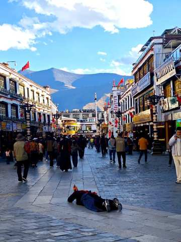

文回3-1

因為我們是真正的純玩無購物小團，所以特別增加財神廟扎基寺求財！與色拉寺看辯經，會更深度的去了解西藏！

圖回3-3・財神廟扎基寺

圖回4-1・色拉寺辯經

文回4-2

當然最重要的珠峰大本營是我們重頭戲，你看！這是之前團友幸運拍下的日落金山～

圖回4-3・珠峰大本營日落金山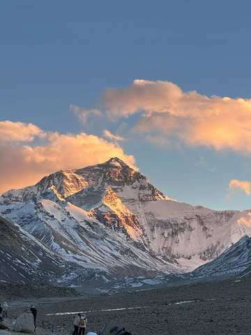

文回5-1

除了珠峰大本營以外，我們全面升級都住國際品牌希爾頓飯店哦！希爾頓是西藏最穩定且是12小時提供85-90%濃度的氧氣呦！而含氧量在西藏這樣的高原地區是很重要的！另外我們整體除了珠峰外也是全酒店都有供氧氣的～

圖回5-2・希爾頓1

圖回5-3・希爾頓2

文回6-1

目前不加價升級6小團！車型則是2025年最新車，用VIP航空保姆車，每個人都有自己的大座位，並且有自帶製氧機，讓您舒適又安心～💕

圖回6-2・車車照

文回6-3

然後~這台車除了前面有緊急醫療氧氣鋼瓶！還特別裝了大家都可以吸的彌散式氧氣，簡單說就是～只要一開車，車子內部就在一個【移動氧艙】

圖回6-4・車子製氧機

文回6-5

在西藏這樣的高原環境，住宿與車配備好！真的很重要

圖回7・我們的客人+牌子

文回8

我們CITS國旅環球-China2Go是專門接待港澳台以及全球外賓的！總公司是有70年歷史的品牌喔！是絕對純玩小團～

文回9（同文14）

還有一點，我們是唯一敢把無購物寫在合約上的旅行社，有任何購物行為賠償5000！

介紹完後直接依「月份選定後」已收集的人數答案分流（不重複詢問）

依人數答案分流（目前僅補「自己一人」）

選「自己一人」但沒有回答月份

分流問A1「您目前有沒有確定想要幾月來呢?」

選「自己一人」但有回答月份

分流問A2依照選的月份代入話術：「想詢問下，剛剛看您選＠選項＠　請問是這段時間的團期都可以？還是有比較喜歡的時間？」

問時間後等待只要客人沒回答，進入「沉默半天模式」——半天內不追問、不強推下一步，等客人主動回覆

回答後「請問您有沒有微信或是LINE？可以給我QR code，我安排專業的顧問依照您的需求與團期給您更詳細介紹~❤️」

以下為「2-3／4-6／6人以上」路徑（西藏8日精華，上珠峰）

Q1（共通）「請問您是跟家人還是朋友一起來呢?」

等待回覆規則（共通，Q1、Q2、Q3皆適用）等5分鐘（有回→繼續）→無回再等30分鐘→30分鐘後已讀則繼續／未讀最多再等1小時→仍無回應則等1天後再繼續發送介紹內容（不強制往下推進）

依Q1答案分流

Q2・回答「家人」

「好的，同行的家人中是否有65歲以上長輩或是孩童」

Q2・回答「朋友」

「收到，同行的朋友中是否有65歲以上長輩或是孩童」

Q3觸發（家人／朋友路徑皆可能觸發）若Q2只回答「有」，未說明對象「好的~我們公司不玩套路！所以只要符合景區當下政策我們都會退優惠門票喔！另外想請問是長輩嗎？」（釐清是長輩還是孩童）

Q3＝長輩 → 追問實際年齡先回覆：「是這樣的～目前用台胞證進入西藏的旅客，65歲以上都是要辦理健康證明，不過放心～我到時候幫您備註下～健康證明的格式還有申請規定，我再發給您！也都會依照時間提醒您辦理」；若年齡≥75歲，加註：「目前75歲以上長輩申請入藏函是申請不下來的」（優先轉真人特殊處理）

Q3＝孩童 → 追問實際年齡若年齡<5歲，回覆：「我們通常是建議孩子5歲以上，能準確表達自己的身體狀況才會建議前往喔！」

問聯絡方式前置條件（共通）需Q1、Q2、Q3三題皆已回答，且介紹模式（完整一輪）已全部發送完畢，才可進入下一步；不然則進入洗單子循環

等待只要客人沒回答，進入「沉默半天模式」——半天內不追問、不強推下一步文後回1，等客人主動回覆

文後回1

給您介紹一下裡面的行程．除了經典行程之外，我們也安排了珠峰旁的薩迦寺～他的震撼度宛如西藏的敦煌

圖後回2・薩迦寺

文後回3

另外，我們家因為是純玩小團，所以特別安排最後回到拉薩搭乘拉日鐵路，除了是最特別並且離天宮最近的高鐵之一外，大大減少舟車勞累

圖後回3・拉日鐵路

文後回4

上面介紹的行程，您有大概看一下嗎？

文後回6等待邏輯

半天內客人沒回 → 若已讀則視同繼續下一步；若未讀無回 → 等1天後再繼續

文後回7・回答「有」才觸發

「感謝您認真幫我看>”<！您有沒有微信或是Line的QR code，我安排顧問傳更詳細資料給您介紹」

若仍無回應

轉為公版每日一則「洗單子」（提醒/催單訊息），內容依時期常更換，不在此腳本固定，由行銷端另外維護更新

家人分支
朋友分支
家人／朋友皆可觸發
長輩分支
孩童分支

💰 客人問價格・西藏8日精華（分支4「5-6/7-8/9-11月」專用，依出團日期分4段報價）

觸發問

價格．多少錢．一人多少．優惠．價錢．團費．行程費用等等（比照全域機制）

先確認客人時間

因為西藏有淡旺季之分，可能差5天價格就會有點不同，想跟您確定一下大概的出團日期～我先給您最初步報價

客人選📅 10/1－2/28 (以出發日計算)

【希爾頓精華八日遊】
出發時間：10/8-2/28（每週四發團）
十人小團優惠價：¥7,980起/人（2人1標間拼住，單休補房差¥1,700）
★限量升級4-6人小團 價格不變
包含：入藏文件，車，司機，導遊，保險，住宿，門票，酒店早餐
不含：機票、正餐、小費

**⚠ 長假區間判斷（10/1-10/7）：**不可以先報價，先問：「這是大陸的長假期間，價格會有點變化，請問您目前只有這個時間段嗎？」
→ 客人回「肯定」（感覺只有這個時間的假期）→ 直接轉真人客服處理
→ 客人回「可以換」或判斷有動搖想換時間 → 推薦我們10月的其他團期，或依照他的新時間再報價

客人選📅 3/25－4/30（非桃花節） (以出發日計算)

【希爾頓精華八日遊】
出發時間：3/25-4/24（每週四發團）
十人小團優惠價：¥9,480起/人（2人1標間拼住，單休補房差¥2,200）
★限量升級4-6人小團 價格不變
包含：入藏文件，車，司機，導遊，保險，住宿，門票，酒店早餐
不含：機票、正餐、小費

**⚠ 長假區間判斷（4/25-4/30）：**不可以先報價，先問：「這是大陸長假期間的前夕，價格會有點變化，請問您目前只有這個時間段嗎？」
→ 客人回「肯定」（感覺只有這個時間的假期）→ 直接轉真人客服處理
→ 客人回「可以換」或判斷有動搖想換時間 → 推薦我們4月15號後的其他團期，或依照他的新時間再報價

客人選📅 5/1－6/30 (以出發日計算)

【希爾頓精華八日遊】
出發時間：5/6-6/30（每週四發團）
十人小團優惠價：¥8,980起/人（2人1標間拼住，單休補房差¥2,000）
★限量升級4-6人小團 價格不變
包含：入藏文件，車，司機，導遊，保險，住宿，門票，酒店早餐
不含：機票、正餐、小費

**⚠ 長假區間判斷（5/1-5/5）：**不可以先報價，先問：「這是大陸的”五一勞動長假”期間，價格會有點變化，請問您目前只有這個時間段嗎？」
→ 客人回「肯定」（感覺只有這個時間的假期）→ 直接轉真人客服處理
→ 客人回「可以換」或判斷有動搖想換時間 → 推薦我們5月的其他團期，或依照他的新時間再報價

客人選📅 7/1－9/30 (以出發日計算)

【希爾頓精華八日遊】
出發時間：7/1-9/30（每週四發團）
十人小團優惠價：¥9,980起/人（2人1標間拼住，單休補房差¥2,800）
★限量升級4-6人小團 價格不變
包含：入藏文件，車，司機，導遊，保險，住宿，門票，酒店早餐
不含：機票、正餐、小費

**⚠ 長假區間判斷（9/25-9/30）：**不可以先報價，先問：「這是大陸的長假期間，價格會有點變化，請問您目前只有這個時間段嗎？」
→ 客人回「肯定」（感覺只有這個時間的假期）→ 直接轉真人客服處理
→ 客人回「可以換」或判斷有動搖想換時間 → 推薦我們9月的其他團期，或依照他的新時間再報價

5

其他時間・不上珠峰

Q1．大概想幾月出發？

12-2月／3-4月／5-6月／7-8月／9-11月

Q2．預計幾位一起去？自己一人／2-3人／4-6人／6人以上

判斷邏輯：Q1（月份）1分鐘內沒有選擇 → 自動接著問Q2（人數）；Q2（人數）1分鐘內仍沒有回答 → 自動開始播放「文00・公版」→「文回1」（8日精華通用開場，見下方「逾時預設開場」展開區塊）

全流程結尾（進入詢問微信/Line QR code前）務必檢查：月份、人數是否都已收集。任一項缺漏 → 比照分支3的作法補問一次（缺月份則問Q1選項，答案落在12-2月／3-4月則依下方對應展開區塊接續；缺人數則問Q2選項），補齊後才進入收聯絡方式

逾時預設開場・文00＋文回1（月份、人數皆逾時未答時觸發）

文00・公版（無選項或回答不確定）

您好~我是China2Go國旅環球，先給您看一下我們的行程

文回1

我先給您介紹我們的8日行程，之中包含了拉薩+山南+日喀則+珠峰大本營
您先看看～如果想加從林芝進10天的行程．再給我說．我給您介紹

說明

以下接續播放與「5-6月／7-8月／9-11月」展開區塊相同的介紹圖文（不重複詢問已進行的開場），介紹完畢後依上方時效性規則補問月份、人數

3-4月・桃花節時段判斷

此展開內容僅在客人選「3-4月」時觸發（桃花節時段判斷）

先問（共通）

Q．預計幾位一起去？　自己一人／2-3人／4-6人／6人以上

桃花回文01

您好~我是China2Go國旅環球，這時間我很推薦桃花節耶！通常是3月底~4月10出發的團，您這段時間可以嗎?

依AI判斷客人時間是否落在3月底-4月10前分流

回01-1・不可以（AI判斷為4/10之後）

接續本分支下方「5-6月／7-8月／9-11月・林芝8日介紹」（尚未提供，待補），流程與話術通用

回01-2・可以（AI判斷時間落在區間內）

「好的！給您看下我們家獨家的桃花節秘境+經典9天不上珠峰行程」

接續進入「桃花9日」（分支2）完整腳本，從圖02・9日行程總覽開始

分支2原本14則圖文介紹結束後，本流程做了調整：因3-4月分流路徑一開始已問過人數，介紹完後不再重複詢問，改為下列補充提問

補問1「請問您是跟家人還是朋友一起來呢? 還是自己前往?」

等待回覆規則（共通，Q1、Q2、Q3皆適用）等5分鐘（有回→繼續）→無回再等30分鐘→30分鐘後已讀則繼續／未讀最多再等1小時→仍無回應則等1天後再繼續發送介紹內容（不強制往下推進）

依補問1答案分流

回「家人」

「好的，同行的家人中是否有65歲以上長輩或是孩童」

回「朋友」

「收到，同行的朋友中是否有65歲以上長輩或是孩童」

若Q2只回答「有」（未說明對象，家人／朋友路徑皆可能觸發）「好的~我們公司不玩套路！所以只要符合景區當下政策我們都會退優惠門票喔！另外想請問是長輩嗎？」（釐清是長輩還是孩童）

＝長輩 → 追問實際年齡先回覆：「是這樣的～目前用台胞證進入西藏的旅客，65歲以上都是要辦理健康證明，不過放心～我到時候幫您備註下～健康證明的格式還有申請規定，我再發給您！也都會依照時間提醒您辦理」；若年齡≥75歲，加註：「目前75歲以上長輩申請入藏函是申請不下來的」（優先轉真人特殊處理）

＝孩童 → 追問實際年齡若年齡<5歲，回覆：「我們通常是建議孩子5歲以上，能準確表達自己的身體狀況才會建議前往喔！」

問聯絡方式前置條件（共通）需補問1、Q2、Q3三題皆已回答，且介紹模式（分支2，14則圖文）已全部發送完畢，才可進入下一步

補問1回答「自己前往」（跳過長輩孩童審查）「非常歡迎獨旅的旅客！因為我們是小團～所以導遊更能照顧的到，不會有那種不融入的尷尬感～也不需要做太過多的社交，請問您有沒有微信或是LINE的QR Code? 我安排專業顧問給您做詳細介紹」

等待只要客人沒回答，進入「沉默半天模式」——半天內不追問、不強推下一步，等客人主動回覆

文後回1

「給您介紹一下裡面的行程．除了桃花秘境之外，我們也安排了經典的布達拉宮與大昭寺八廓街～」

圖後回2・布達拉宮

圖後回3・八廓街

文後回4

「以及我們家因為走的是純玩小團之深度行程，所以是親自帶大家去財神廟-扎基寺參觀！」

圖後回5・扎基寺財神廟

文後回6

「這裡是西藏最靈驗，香火非常鼎盛的廟喔！」

文後回7

「上面給您的行程表您有看了嗎?」

文後回7等待邏輯

半天內客人沒回 → 若已讀則視同繼續下一步；若未讀無回 → 等1天後再繼續

文後回8・回答「有」才觸發

「感謝您認真幫我看>”<！您有沒有微信或是Line的QR code，我安排顧問傳更詳細資料給您介紹」

若仍無回應

轉為公版每日一則「洗單子」（提醒/催單訊息），內容依時期常更換，不在此腳本固定，由行銷端另外維護更新

此路徑不另外詢問出發時間——3-4月已於回01-2判斷確認，前面已篩選過，不重複發問

家人分支
朋友分支
家人／朋友皆可觸發
長輩分支
孩童分支

12-2月・冬遊西藏介紹（25則圖文）

此展開內容僅在客人選「12-2月」時觸發（冬季藍冰＋冰湖秘境限定行程）；選其他月份則直接接續下方一般流程（問人數→收聯絡方式，內容待補）

月份選12-2月後，立即問Q．預計幾位一起去？　自己一人／2-3人／4-6人／6人以上

判斷邏輯對方有選 → 依人數答案進入對應文案（自己一人→文00-2／2-3人→文00-3／4-6人或6人以上→文00-1／答案不明確→文00公版）；對方經過30秒沒選 → 略過以上所有問候文案，直接進入下方文回1介紹模式

文00・公版（無選項或回答不確定）

您好~我是China2Go國旅環球，先給您看一下我們的行程

文00-2・僅人數＝自己一人

您好~我們很多自己一人的旅客，非常歡迎您！我是China2Go國旅環球，先給您看一下我們的行程

文00-3・僅人數＝2-3人

歡迎，我是China2Go國旅環球，我們的拚團都是4-6人小團，最適合像您們人數少前往的，比較自在！先給您介紹一下行程

文00-1・僅人數＝4-6人／6人以上

我們公司是全西藏精緻中小團資源最多的！我們的拚團都是4-6人一團~
你們可以考慮自己一團出發喔~
不過先讓我先介紹一下行程

文回1

這個時間珠峰大本營不能住，但12月15日~2月20日是西藏的冰湖藍冰時期!我給您看看我們獨家的「冬遊西藏拼團行程! 」

圖回1-1・冬遊西藏地圖

文回1-2

行程從林芝低海拔出發，讓身體有時間適應高反

圖回1-2・占堆拿旗子照

文回1-3

我們會特別去到G318中重要的然烏湖，這算是很深度的行程．然烏湖一年四季算是冬天最透徹，普通川藏線行程到的時間很難看到那麼美的湖面

圖回1-3・然烏湖無人

文回1-4

這時間是西藏的藍冰+冰湖時期，會去到兩大奇觀【來古+恰央措】

文回1-4

來古冰川的藍冰是非常壯觀的，這幾年政策也一直在變！持入藏函進去的旅客會越來越難看到…

圖回1-5・來古藍冰

文回1-5

而恰央措是我們獨家加入的，因為都是自己團隊，所擁有的資源都是比較深度的喔！

圖回1-6・恰央措

圖回1-7・旅客上恰央措

圖回1-8・旅客上恰央措躺著

文回1-8

去年我們就開始深度帶大家上恰央措冰湖了！

文回1-9

我們升級不加價，都是採4-6人小團！車子則是2025年最新車，用VIP保姆車，每個人都有自己的充電孔跟大座位哦！

圖回1-10・大VIP車

文回1-10

車上還配備了緊急醫療氧氣鋼瓶跟葡萄糖，都是免費提供的喔！

圖回1-11・車上的彌散氧氣瓶

文回1-12

針對我們【China2Go】的貴賓．我們特別免費增加這個車內彌散式氧氣！等於讓我們車子變成＂移動氧氣艙＂這是對身體適應高原反應非常有效的配備喔

文回1-13

除了特殊地區與珠峰等等外，我們的團全面升級都住國際品牌希爾頓飯店哦！

圖回1-14・希爾頓1（圖片已調整）

圖回1-15・希爾頓2（圖片已調整）

文回1-15

希爾頓是西藏最穩定且是12小時提供85-90%濃度的氧氣呦！

文回1-16

在西藏這樣的高原環境，住宿與車配備好！真的很重要

文回1-17

～～～還有一點，我們是唯一敢把無購物寫在合約上的旅行社，有任何購物行為賠償5000

介紹完後直接依「月份選定後」已收集的人數答案分流（不重複詢問）；若當時30秒未選、視同「自己一人／2-3人」路徑處理

依人數答案分流

選「自己一人」

問自己1・問時間「這路線是12月15日-2月20日，每周四出發。請問您計劃什麼時候來呢？好安排顧問給您詳細介紹~❤️」

問自己2・等待只要客人沒回答，進入「沉默半天模式」——半天內不追問、不強推下一步，等客人主動回覆；等到半天不回，進入下方「問後回」模式

文問後回1「給您介紹一下裡面的行程．除了藍冰秘境之外，我們也安排了經典的布達拉宮與大昭寺八廓街～還有冬天能見度最高的南迦巴瓦峰」

圖後回2・冬-布達拉宮

圖後回3・冬-八廓街

圖後回4・冬-南迦巴瓦峰

文後回4西藏是高原地區，冬天時的陽光剛剛好，會比其他季節冷，但絕對沒有你想像中的冷

文後回5不會是濕冷的不舒適感，空氣冷冷的，太陽大大熱熱的！而運氣好還可能會遇到雪，看到雪白的布達拉宮喔

文後回6「上面給您的行程表您有看了嗎?」

等待邏輯半天內客人沒回 → 若已讀則視同繼續下一步；若未讀無回 → 等1天後再繼續

文後回8・回答「有」才觸發「感謝您認真幫我看>”<！您有沒有微信或是Line的QR code，我安排顧問傳更詳細資料給您介紹」

若仍無回應轉為公版每日一則「洗單子」（提醒/催單訊息），內容依時期常更換，不在此腳本固定，由行銷端另外維護更新

選「2-3／4-6／6人以上」

Q1・先問（共通）「請問您是跟家人還是朋友一起來呢?」

等待回覆規則（共通，Q1、Q2、Q3皆適用）等5分鐘（有回→繼續）→無回再等30分鐘→30分鐘後已讀則繼續／未讀最多再等1小時→仍無回應則等1天後再繼續發送介紹內容（不強制往下推進）

Q2・回答「家人」「好的，同行的家人中是否有65歲以上長輩或是孩童」

Q2・回答「朋友」「收到，同行的朋友中是否有65歲以上長輩或是孩童」

Q3觸發（家人／朋友路徑皆可能觸發）若Q2只回答「有」、未說明對象：「好的~我們公司不玩套路！所以只要符合景區當下政策我們都會退優惠門票喔！另外想請問是長輩嗎？」（釐清是長輩還是孩童）

Q3＝長輩 → 追問實際年齡先回覆：「是這樣的～目前用台胞證進入西藏的旅客，65歲以上都是要辦理健康證明，不過放心～我到時候幫您備註下～健康證明的格式還有申請規定，我再發給您！也都會依照時間提醒您辦理」；若年齡≥75歲，加註：「目前75歲以上長輩申請入藏函是申請不下來的，您會考慮去雲南或是川西嗎？可以給您推薦一樣深度有藏區以及壯麗風景特色的景點」（優先轉真人特殊處理）

Q3＝孩童 → 追問實際年齡若年齡<5歲，回覆：「我們通常是建議孩子5歲以上，能準確表達自己的身體狀況才會建議前往喔！」

問聯絡方式前置條件（共通）需Q1、Q2、Q3三題皆已回答，且冬遊西藏介紹（25則圖文）已全部發送完畢，才可進入下一步問時間

問時間（共通）「這冬遊西藏路線是12月15日-2月20日，每周四出團。請問您計劃什麼時候來呢？好安排顧問給您詳細介紹~❤️」

問時間後等待只要客人沒回答，進入「沉默半天模式」——半天內不追問、不強推下一步，等客人主動回覆；等到半天不回，進入下方「問後回」模式

文問後回1「給您介紹一下裡面的行程．除了藍冰秘境之外，我們也安排了經典的布達拉宮與大昭寺八廓街～還有冬天能見度最高的南迦巴瓦峰」

圖後回2・冬-布達拉宮

圖後回3・冬-八廓街

圖後回4・冬-南迦巴瓦峰

文後回4西藏是高原地區，冬天時的陽光剛剛好，會比其他季節冷，但絕對沒有你想像中的冷

文後回5不會是濕冷的不舒適感，空氣冷冷的，太陽大大熱熱的！而運氣好還可能會遇到雪，看到雪白的布達拉宮喔

文後回6「上面給您的行程表您有看了嗎?」

等待邏輯半天內客人沒回 → 若已讀則視同繼續下一步；若未讀無回 → 等1天後再繼續

文後回8・回答「有」才觸發「感謝您認真幫我看>”<！您有沒有微信或是Line的QR code，我安排顧問傳更詳細資料給您介紹」

若仍無回應轉為公版每日一則「洗單子」（提醒/催單訊息），內容依時期常更換，不在此腳本固定，由行銷端另外維護更新

家人分支
朋友分支
家人／朋友皆可觸發
長輩分支
孩童分支

💰 客人問價格・12-2月・冬遊西藏（25則圖文）

觸發問

價格．多少錢．一人多少．優惠．價錢．團費．行程費用等等（比照全域「客人中途問價格」機制）

客人選📅 2/15-2/28 (以出發日計算)

【西藏冰川精華八日遊】
出發時間：12/15-2/28（每週四發團）
十人小團優惠價：¥9,280起/人（2人1標間拼住，單休補房差¥1,500）
★限量升級4-6人小團 價格不變
包含：入藏文件，車，司機，導遊，保險，住宿，門票，酒店早餐
不含：機票、正餐、小費

**⚠ 春節區間判斷（2/1-2/16，任一天有包含到都算）：**不可以先報價，先問：「這是春節期間，價格會有點變化，請問您目前只有這個時間段嗎？」
→ 客人回「肯定」（感覺只有這個時間的假期）→ 直接轉真人客服處理
→ 客人回「可以換」或判斷有動搖想換時間 → 「您會想要1月尾或是2月中後的時間嗎? 我幫您查一下團期與價格」

5-6月／7-8月／9-11月・不上珠峰林芝8日介紹

此展開內容僅在客人選「5-6月／7-8月／9-11月」時觸發（不上珠峰・低海拔林芝進藏路線：林芝＋拉薩＋山南＋日喀則）

月份選定後，立即問Q．預計幾位一起去？　自己一人／2-3人／4-6人／6人以上

判斷邏輯對方有選 → 依人數答案進入對應文案（自己一人→文00-2／2-3人→文00-3／4-6人或6人以上→文00-1／答案不明確→文00公版）；對方經過30秒沒選 → 略過以上所有問候文案，直接進入下方文回文1介紹模式

文00・公版（無選項或回答不確定）

您好~我是China2Go國旅環球，先給您看一下我們的行程

文00-2・僅人數＝自己一人

您好~我們很多自己一人的旅客，非常歡迎您！我是China2Go國旅環球，先給您看一下我們的行程

文00-3・僅人數＝2-3人

歡迎，我是China2Go國旅環球，我們的拚團都是4-6人小團，最適合像您們人數少前往的，比較自在！先給您介紹一下行程

文00-1・僅人數＝4-6人／6人以上

我們公司是全西藏精緻中小團資源最多的！我們的拚團都是4-6人一團~
你們可以考慮自己一團出發喔~
不過先讓我先介紹一下行程

文回文1

我先給您介紹我們的不上珠峰的西藏林芝8日行程，之中包含了林芝+拉薩+山南+日喀則

圖回1-1・林芝8天地圖

文回1-2

這是我們【不上珠峰林芝8日】的行程圖～
主要是從低海拔林芝進西藏，更好能適應高原
行程涵蓋了林芝＋拉薩＋山南以及日喀則
非常的完整

圖回1-2・布達拉宮天氣好

文回2-1

因為我們是從林芝進西藏，2900上下的海拔加上綠植充沛，整個含氧量很足夠，像是經典的巴松錯，現場看宛如綠寶石

圖回2-2・林芝巴松錯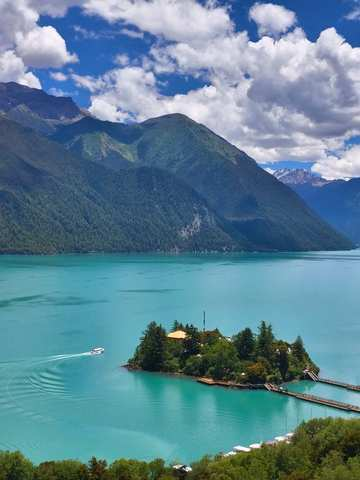

文回3-1

由於我們目前無加價全面升級小團，一位導遊服務4-6人，所以我們行程安排的更深度，加入了千年歷史的秀巴古堡，也可以遠眺尼羊河，並且感受碉堡與雪山的結合

圖回3-2・千年古堡

文回3-3

剛說到我們導遊服務比是1:6，也要特別強調一下，我們是真正的純玩無套路小團～除了布達拉宮與八廓街等行程，特別增加財神廟扎基寺求財！與色拉寺看辯經，會更深度的去了解西藏！

圖回4-1・財神廟扎基寺

圖回4-2・色拉寺辯經

文回4-3

另外擔心高原反應的除了景點外，住宿以及車是非常重要的

圖回5-1・希爾頓1

文回5-2

希爾頓是西藏最穩定且是12小時提供85-90%濃度的氧氣呦！而含氧量在西藏這樣的高原地區是很重要的！

圖回5-3・希爾頓2

文回6-1

目前不加價升級6小團！車型則是2025年最新車，用VIP航空保姆車，每個人都有自己的大座位，並且有自帶製氧機，讓您舒適又安心～💕

圖回6-2・車車照

文回6-3

然後~這台車除了前面有緊急醫療氧氣鋼瓶！還特別裝了大家都可以吸的彌散式氧氣，簡單說就是～只要一開車，車子內部就在一個【移動氧艙】

圖回6-4・車子製氧機

文回6-5

在西藏這樣的高原環境，住宿與車配備好！真的很重要

圖回7・我們的客人+牌子

文回8

我們CITS國旅環球-China2Go是專門接待港澳台以及全球外賓的！總公司是有70年歷史的品牌喔！是絕對純玩小團～

文回9（同文14）

還有一點，我們是唯一敢把無購物寫在合約上的旅行社，有任何購物行為賠償5000！

介紹模式結束後直接依「月份選定後」已收集的人數答案分流，不重複詢問人數，增加「自己一人」路徑

依人數答案分流（新增「自己一人」路徑）

選「自己一人」但有回答月份

分流問A2依照選的月份代入話術：「想詢問下，剛剛看您選＠選項＠　請問是這段時間的團期都可以？還是有比較喜歡的時間？」

選「自己一人」但沒有回答月份

分流問A1「您目前有沒有確定想要幾月來呢?」

問時間後等待只要客人沒回答，進入「沉默半天模式」——半天內不追問、不強推下一步，等客人主動回覆

有回答後「請問您有沒有微信或是LINE？可以給我QR code，我安排專業的顧問依照您的需求與團期給您更詳細介紹~❤️」

以下為「2-3／4-6／6人以上」路徑（不上珠峰林芝8日精華）

Q1（共通）「請問您是跟家人還是朋友一起來呢?」

等待回覆規則（共通，Q1、Q2、Q3皆適用）等5分鐘（有回→繼續）→無回再等30分鐘→30分鐘後已讀則繼續／未讀最多再等1小時→仍無回應則等1天後再繼續發送介紹內容（不強制往下推進）

依Q1答案分流

Q2・回答「家人」

「好的，同行的家人中是否有65歲以上長輩或是孩童」

Q2・回答「朋友」

「收到，同行的朋友中是否有65歲以上長輩或是孩童」

Q3觸發（家人／朋友路徑皆可能觸發）若Q2只回答「有」，未說明對象「好的~我們公司不玩套路！所以只要符合景區當下政策我們都會退優惠門票喔！另外想請問是長輩嗎？」（釐清是長輩還是孩童）

Q3＝長輩 → 追問實際年齡先回覆：「是這樣的～目前用台胞證進入西藏的旅客，65歲以上都是要辦理健康證明，不過放心～我到時候幫您備註下～健康證明的格式還有申請規定，我再發給您！也都會依照時間提醒您辦理」；若年齡≥75歲，加註：「目前75歲以上長輩申請入藏函是申請不下來的」（優先轉真人特殊處理）

Q3＝孩童 → 追問實際年齡若年齡<5歲，回覆：「我們通常是建議孩子5歲以上，能準確表達自己的身體狀況才會建議前往喔！」

問聯絡方式前置條件（共通）需Q1、Q2、Q3三題皆已回答，且介紹模式（完整一輪）已全部發送完畢，才可進入下一步；不然則進入洗單子循環

等待只要客人沒回答，進入「沉默半天模式」——半天內不追問、不強推下一步文後回1，等客人主動回覆

文後回1

給您介紹一下裡面的行程．我們因為是小團，所以是非常深度，拉薩中的行程像是布達拉宮、八廓街與大昭寺都是跟著導遊參觀，跟低價團會把你放生是不同的喔~

圖後回2・大昭寺

文後回3

另外，你們雖然沒有上到珠峰大本營，但還是會安排日喀則，畢竟要去一趟後藏的心臟-扎什倫布寺以及山南的羊湖，才值得！

圖後回4・羊湖客人照

文後回5

最後回程也特別安排回到拉薩搭乘”拉日鐵路”，這是最特別並且離天宮最近的鐵路之一，沿途可以看到拉薩河以及高原風景，並且可以減少最後回拉薩那段”又長又無聊”的路

圖後回6・拉日鐵路

文後回7

上面介紹的行程，您有大概看一下嗎？

文後回8等待邏輯

半天內客人沒回 → 若已讀則視同繼續下一步；若未讀無回 → 等1天後再繼續

文後回9・回答「有」才觸發

「感謝您認真幫我看>”<！您有沒有微信或是Line的QR code，我安排顧問傳更詳細資料給您介紹」

若仍無回應

轉為公版每日一則「洗單子」（提醒/催單訊息），內容依時期常更換，不在此腳本固定，由行銷端另外維護更新

家人分支
朋友分支
家人／朋友皆可觸發
長輩分支
孩童分支

💰 客人問價格・5-6月／7-8月／9-11月・不上珠峰林芝8日介紹

觸發問

價格．多少錢．一人多少．優惠．價錢．團費．行程費用等等（比照全域機制）

客人選📅 10/1－2/28 (以出發日計算)

【林芝希爾頓八日遊】
出發時間：10/8-2/28（每週二發團）
十人小團優惠價：¥7,980起/人（2人1標間拼住，單休補房差¥1,700）
★限量升級4-6人小團 價格不變
包含：入藏文件，車，司機，導遊，保險，住宿，門票，酒店早餐
不含：機票、正餐、小費

**⚠ 長假區間判斷（10/1-10/7）：**不可以先報價，先問：「這是大陸的長假期間，價格會有點變化，請問您目前只有這個時間段嗎？」
→ 客人回「肯定」（感覺只有這個時間的假期）→ 直接轉真人客服處理
→ 客人回「可以換」或判斷有動搖想換時間 → 推薦我們10月的其他團期，或依照他的新時間再報價

客人選📅 3/25－4/30（非桃花節） (以出發日計算)

【林芝希爾頓八日遊】
出發時間：3/25-4/24（每週二發團）
十人小團優惠價：¥9,480起/人（2人1標間拼住，單休補房差¥2,200）
★限量升級4-6人小團 價格不變
包含：入藏文件，車，司機，導遊，保險，住宿，門票，酒店早餐
不含：機票、正餐、小費

**⚠ 長假區間判斷（4/25-4/30）：**不可以先報價，先問：「這是大陸長假期間的前夕，價格會有點變化，請問您目前只有這個時間段嗎？」
→ 客人回「肯定」（感覺只有這個時間的假期）→ 直接轉真人客服處理
→ 客人回「可以換」或判斷有動搖想換時間 → 推薦我們4月15號後的其他團期，或依照他的新時間再報價

客人選📅 5/1－6/30 (以出發日計算)

【林芝希爾頓八日遊】
出發時間：5/5-6/30（每週二發團）
十人小團優惠價：¥8,980起/人（2人1標間拼住，單休補房差¥2,000）
★限量升級4-6人小團 價格不變
包含：入藏文件，車，司機，導遊，保險，住宿，門票，酒店早餐
不含：機票、正餐、小費

**⚠ 長假區間判斷（5/1-5/5）：**不可以先報價，先問：「這是大陸的”五一勞動長假”期間，價格會有點變化，請問您目前只有這個時間段嗎？」
→ 客人回「肯定」（感覺只有這個時間的假期）→ 直接轉真人客服處理
→ 客人回「可以換」或判斷有動搖想換時間 → 推薦我們5月的其他團期，或依照他的新時間再報價

客人選📅 7/1－9/30 (以出發日計算)

【林芝希爾頓八日遊】
出發時間：7/1-9/24（每週二發團）
十人小團優惠價：¥9,980起/人（2人1標間拼住，單休補房差¥2,800）
★限量升級4-6人小團 價格不變
包含：入藏文件，車，司機，導遊，保險，住宿，門票，酒店早餐
不含：機票、正餐、小費

**⚠ 長假區間判斷（9/25-9/30）：**不可以先報價，先問：「這是大陸的長假期間，價格會有點變化，請問您目前只有這個時間段嗎？」
→ 客人回「肯定」（感覺只有這個時間的假期）→ 直接轉真人客服處理
→ 客人回「可以換」或判斷有動搖想換時間 → 推薦我們9月的其他團期，或依照他的新時間再報價

6

自己包團或其他地點

Q．你想要西藏包團嗎?還是其他地區的行程？

西藏／色達／雲南／北京／上蘇杭／其他

下一題預計幾位一起去？（自己一人／2-3人／4-6人／6人以上）

若選「色達」且廣告來源市場非港澳台 → 客戶卡自動備註提醒顧問確認證件資格，AI不直接詢問

選「西藏」且人數＝自己一人／2-3人／不確定 → 意象模糊客戶處理腳本

判斷邏輯

選西藏，但人數為自己一人／2-3人，或回答不確定 → 判斷為意象模糊客戶，走以下腳本

回-1

西藏因為比較特殊，台灣以及其他地區旅客需要導遊陪同，所以包團人數較少費用會比較高喔！

回-2

請問您目前是有比較特殊的需求或是想去的特別景點嗎? 如果沒有~我給您推薦我們西藏10天拚團行程可以嗎?
因為我們一團也就4-6人，其實體驗感跟自己包團不會差別太大～

判斷邏輯

若回「好」或判斷起來是有興趣的 → 進入下方「10天林芝希爾頓行程」介紹模式

\n

分支回圖-3・10天林芝希爾頓行程

分支回文-3-1

這是從低海拔林芝進西藏，最完整玩林芝+拉薩+山南+日喀則+珠峰大本營的10天行程

分支回圖3-2・林芝巴松錯

分支回文3-3

因為我們是從林芝進西藏，2900上下的海拔加上綠植充沛，整個含氧量很足夠，像是經典的巴松錯，現場看宛如綠寶石呢！

分支回文3-3

由於我們目前無加價全面升級小團，一位導遊服務4-6人，所以我們行程安排的更深度，加入了千年歷史的秀巴古堡，也可以遠眺尼羊河，並且感受碉堡與雪山的結合

分支回圖3-4・千年古堡

分支回文回3-5

剛說到我們導遊服務比是1:6，也要特別強調一下，我們是真正的純玩無套路小團～有包含布達拉宮與八廓街等行程，更特別增加財神廟扎基寺求財！與色拉寺看辯經，會更深度的去了解西藏！

分支回圖3-6・布達拉宮真美

分支回圖3-7・財神廟扎基寺

分支回圖3-8・色拉寺辯經

分支回文3-9

另外在西藏，住宿以及車是非常重要的！我們除了珠峰大本營外，全面升級住國際品牌希爾頓

分支回圖4-0・希爾頓1

分支回文4-1

希爾頓是西藏最穩定且是12小時提供85-90%濃度的氧氣呦！而含氧量在西藏這樣的高原地區是很重要的！

分支回圖4-2・希爾頓2

分支回文5-1

目前不加價升級6小團！車型則是2025年最新車，用VIP航空保姆車，每個人都有自己的大座位，並且有自帶製氧機，讓您舒適又安心～💕

分支回圖5-2・車車照

分支回文5-3

這台車除了前面有緊急醫療氧氣鋼瓶！還特別裝了【大家都可以吸】的彌散式氧氣，簡單說就是～只要一開車，車子內部就在一個【移動氧艙】

分支回圖5-4・車子製氧機

分支文回6-5

在西藏這樣的高原環境，住宿與車配備好！真的很重要

分支圖回7・我們的客人+牌子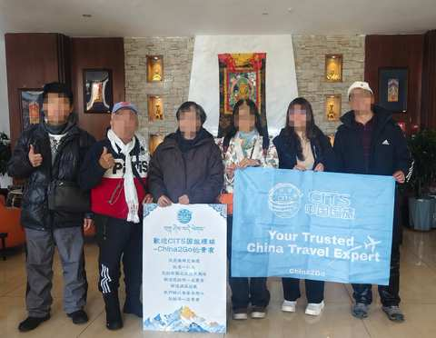

分支文回8

我們CITS國旅環球-China2Go是專門接待港澳台以及全球外賓的！總公司是有70年歷史的品牌喔！是絕對純玩小團～

分支文回9

還有一點，我們是唯一敢把無購物寫在合約上的旅行社，有任何購物行為賠償5000！

說明

因為前面沒有月份，這裡開始蒐集

分支回文回10・問

請問您預計幾月來西藏呢?

判斷邏輯

客人回答有明確月份 → 若為12.1.2月，進入下方「冬遊西藏」介紹模式

冬回問文1

這個時間珠峰大本營不能住，但12月15日~2月20日是西藏的冰湖藍冰時期!我給您看看我們獨家的「冬遊西藏拼團行程! 」

冬回問文2・地圖冬遊

冬季回問文3・冰湖

冬回問文4

是冰湖X藍冰雙饗宴

冬季回問文5・藍冰

冬季回問文6・躺著的客人

冬季回問文7

這是去年我們客人在秘境冰湖-恰央措上躺著拍的照片~

冬季回問文8

用車以及用的住宿跟上面跟您說的一樣，以”高原能休息的好”為我們最高宗旨

冬季回問文9（選項除了選自己一人外才出現）

您是跟家人還是朋友一起玩呢?

依答案分流

等待回文等5分鐘（有回→繼續）→無回再等30分鐘→30分鐘後已讀則繼續／未讀最多再等1小時→仍無回應則等1天後再繼續發送介紹內容（不強制往下推進）

Q2・回答「家人」「好的，同行的家人中是否有65歲以上長輩或是孩童」

Q2・回答「朋友」「收到，同行的朋友中是否有65歲以上長輩或是孩童」

Q3觸發（家人／朋友路徑皆可能觸發）若Q2只回答「有」，未說明對象：「好的~我們公司不玩套路！所以只要符合景區當下政策我們都會退優惠門票喔！另外想請問是長輩嗎？」（釐清是長輩還是孩童）

Q3＝長輩 → 追問實際年齡先回覆：「是這樣的～目前用台胞證進入西藏的旅客，65歲以上都是要辦理健康證明，不過放心～我到時候幫您備註下～健康證明的格式還有申請規定，我再發給您！也都會依照時間提醒您辦理」；若年齡≥75歲，加註：「目前75歲以上長輩申請入藏函是申請不下來的」（優先轉真人特殊處理）

Q3＝孩童 → 追問實際年齡若年齡<5歲，回覆：「我們通常是建議孩子5歲以上，能準確表達自己的身體狀況才會建議前往喔！」

問聯絡方式前置條件（共通）需三題皆已回答，且介紹模式（完整一輪）已全部發送完畢，才可進入下一步；不然則進入洗單子循環。等待只要客人沒回答，進入「沉默半天模式」——半天內不追問、不強推下一步文後回1，等客人主動回覆

文後回1給您分享一下我們的客人照～

文後回圖2・客人照片1

文後回圖3・客人照片2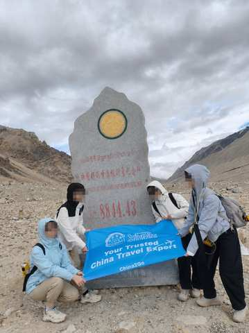

文後回2上面介紹的行程，您有大概看一下嗎？

文後回3等待邏輯半天內客人沒回 → 若已讀則視同繼續下一步；若未讀無回 → 等1天後再繼續

文後回4・回答「有」才觸發「感謝您認真幫我看>”<！您有沒有微信或是Line的QR code，我安排顧問傳更詳細資料給您介紹」

若仍無回應轉為公版每日一則「洗單子」（提醒/催單訊息），內容依時期常更換，不在此腳本固定，由行銷端另外維護更新

選「西藏」且人數＝4-6人／6人以上 → 意向明確客戶處理腳本

判斷邏輯

選西藏，且人數判斷是多的，或是感覺有很多需求的 → 判斷為意向明確客戶，走以下腳本

回-1

歡迎！我們CITS國旅環球-China2Go公司在全中國大陸都有分公司，且西藏有自己辦公室，我們都是做精品團的，非常了解各路線與需求

回-2

想詢問您們大概想幾月來西藏呢?

判斷邏輯

等客人回覆蒐集到訊息後，判斷有資訊了 → 回覆下一步

回-3

好的，因為包團行程會有很多細節需要與您討論，我安排我們專業的顧問給您介紹
請問您有沒有微信或是Line的QR code，我請他加入您

判斷邏輯

客人沒回 → 進入第一個模式（分享客人照＋詢問聯絡方式）

文後回1

給您分享一下我們的客人照～

文後回圖2・客人照片1

文後回圖3・客人照片2

文後回文4

另外，有看到可以給我一下您的微信或是LINE ID~~除了討論行程方便外，一些景點的安排行程表以及景點照傳送會更方便喔，不然這裡有時候會吃訊息

收聯絡方式微信／WhatsApp／Line

客戶卡打包 → 轉交真人顧問

行程分支・人數・月份・地區(廣告來源自動標記)・聯絡方式・備註

按鈕式提問
介紹模式圖文腳本
轉真人顧問節點
報價・10/1-2/28
報價・3/25-4/30
報價・5/1-6/30
報價・7/1-9/30
