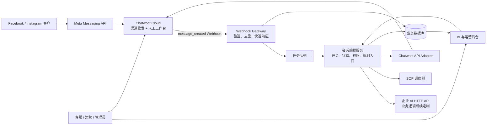
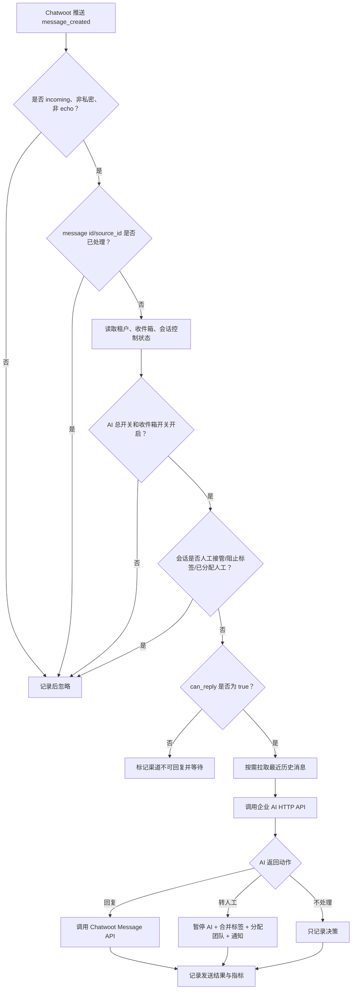
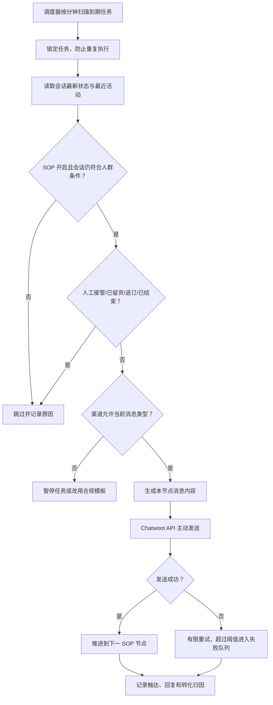
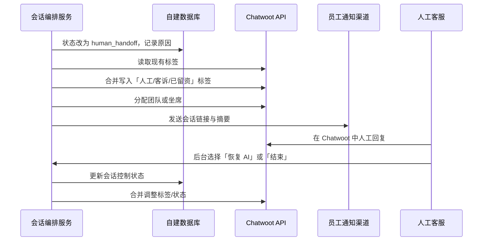
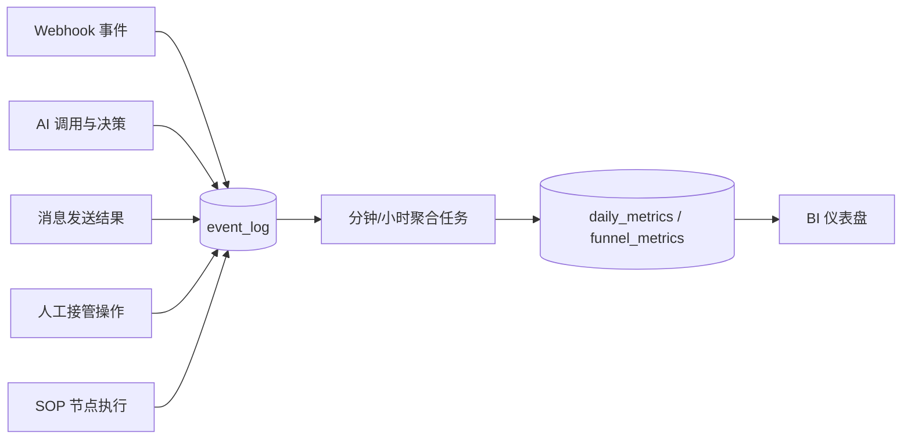
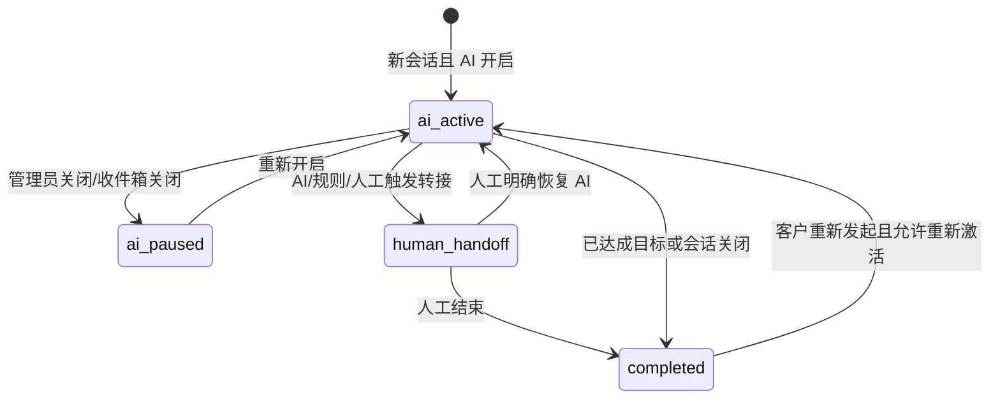
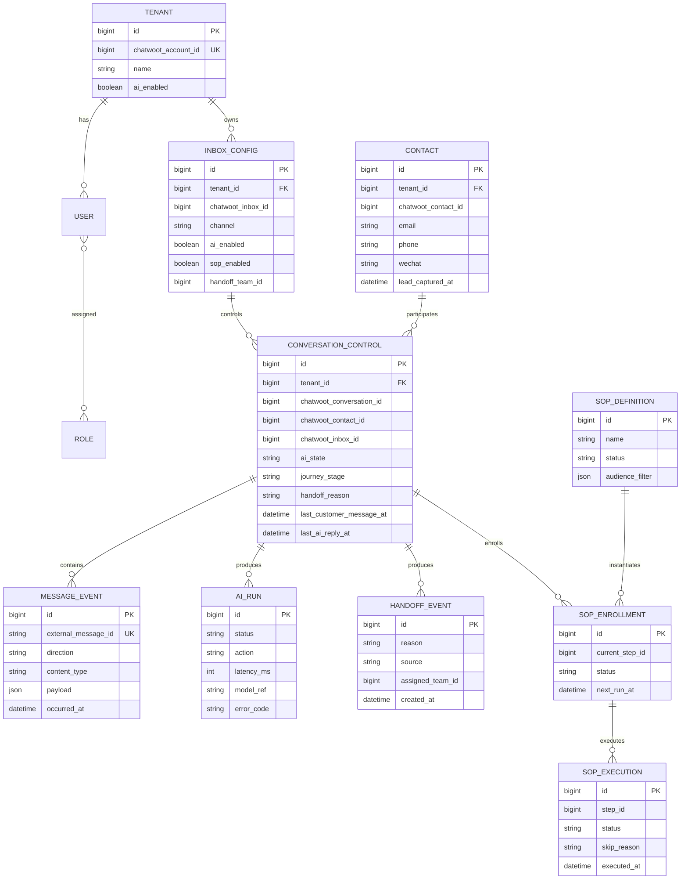

# Chatwoot 多渠道 AI 客服系统 MVP 设计

> 版本：0.2  
> 基线：Chatwoot Cloud 企业工作区 + 自建 AI 客服后台  
> 当前已验证渠道：Facebook Messenger  
> 当前已验证账号：`account_id=180474`，`inbox_id=128859`

## 1. 目标与边界

本系统面向旅游公司的公域客户承接。Chatwoot 继续负责渠道授权、消息收发和人工客服工作台；自建系统负责 AI 是否接管、主动 SOP、人工转接、业务状态、权限和 BI。

第一阶段完成以下闭环：

```text
Facebook / Instagram 客户消息
  -> Chatwoot Cloud
  -> Webhook 推送到自建系统
  -> 自建系统检查权限与会话状态
  -> 调用外部 AI 接口（业务逻辑后续定制）
  -> Chatwoot API 回复 / 打标签 / 分配人工
  -> 自建系统记录全过程供 BI 使用
```

本设计不定义旅游业务的具体 AI 提示词、知识库、报价规则和意图识别算法，只定义 AI 能被调用的时机、输入输出契约和控制边界。

## 2. 已验证事实

### 2.1 Webhook 实际字段

当前收到的真实 `message_created` 载荷可直接提供以下控制字段：

| 用途 | 实际字段 | 示例/说明 |
|---|---|---|
| 工作区隔离 | `account.id` | `180474` |
| 收件箱隔离 | `inbox.id` / `conversation.inbox_id` | `128859` |
| 会话主键 | `conversation.id` | 如 `20`、`26` |
| 联系人主键 | `conversation.contact_inbox.contact_id` / `sender.id` | Chatwoot 联系人 ID |
| 渠道 | `conversation.channel` | `Channel::FacebookPage` |
| 消息方向 | `message_type` | `incoming` / `outgoing` |
| 消息正文 | `content` | 客户文本 |
| 消息类型 | `content_type` | 当前已见 `text` |
| 私密备注 | `private` | `true` 时不能发给客户 |
| 外部回声 | `content_attributes.external_echo` | `true` 时通常是渠道侧发出的消息回流 |
| 是否可回复 | `conversation.can_reply` | 渠道窗口是否允许回复的重要信号 |
| 会话状态 | `conversation.status` | `open` 等 |
| Chatwoot 标签 | `conversation.labels` | 可用于人工、客诉、已留资等 |
| 当前坐席/团队 | `conversation.meta.assignee` / `team` | 判断是否已由人工接管 |
| 消息去重 | `id` / `source_id` | Webhook 重试时去重 |

自动回复入口必须至少满足：

```text
event == message_created
message_type == incoming
private == false
external_echo != true
conversation.can_reply == true
```

此外还必须经过自建系统的 AI 开关、会话状态、阻止标签、人工分配和消息幂等检查。

### 2.2 已确认可调用的 Chatwoot API

| 能力 | 结论 | 注意点 |
|---|---|---|
| 读取会话详情 | 可实现 | 可补全 Webhook 未携带的信息 |
| 分页读取历史消息 | 可实现 | `before` 最多返回 20 条，`after` 最多 100 条 |
| 发送文本/附件 | 已验证 | 文本用 JSON，附件用 multipart |
| 主动向已有会话发消息 | 已验证 | 仍受 Meta/WhatsApp 的回复窗口和平台政策约束 |
| 读取/写入会话标签 | 可实现 | 写入接口会覆盖全部标签，必须先读取再合并 |
| 分配坐席或团队 | 可实现 | `assignee_id` 优先于 `team_id` |
| 设置会话状态 | 可实现 | `open/resolved/pending/snoozed` |
| 更新会话自定义属性 | 可实现 | 必须使用 `merge=true` 避免覆盖其他属性 |
| 更新联系人信息 | 可实现 | 可同步已取得的邮箱、电话等 |
| 获取坐席和团队列表 | 可实现 | 用于人工转接配置 |
| Chatwoot 基础报表 | 可读取 | 无法完整表达 AI 决策与转化漏斗，BI 仍需自建事件表 |

完整 API 路径、请求字段、Webhook 事件、消息类型和开发前验证项见 [Chatwoot 集成开发接口与能力矩阵](./chatwoot-integration-development-matrix.md)。

### 2.3 Webhook 订阅与标签实时同步

MVP 订阅：`message_created`、`message_updated`、`conversation_created`、`conversation_updated`、`conversation_status_changed`、`contact_created`、`contact_updated`。

- 只有新的公开入站 `message_created` 才能触发 AI；标签更新事件只重算状态，不调用 AI。
- 会话标签变化由 `conversation_updated` 实时同步，当前源码的事件包含最新 `labels` 和 `changed_attributes`。
- 联系人标签变化触发 `contact_updated`，优先读取 `changed_attributes.label_list.current_value`；字段不足时调用 Contact Labels API 补全。
- 会话标签控制单个会话，联系人标签只承载跨会话强阻止事实。
- 同步失败或状态冲突时停止自动发送，并通过周期对账修复。

## 3. 可实现功能范围

### 3.1 MVP 必做

| 模块 | 功能 | 实现方式 |
|---|---|---|
| 渠道接入 | Facebook/Instagram 等消息统一进入 | Chatwoot Inbox |
| 自动回复 | 收到合格客户消息后调用 AI 并回复 | Webhook + Chatwoot Message API |
| AI 总开关 | 按租户、收件箱、会话三级开关 | 自建配置和会话状态表 |
| 人工接管 | 暂停 AI、加标签、分配团队/坐席、通知员工 | Chatwoot Label/Assignment API |
| 会话恢复 | 人工处理后恢复 AI 或结束会话 | 后台操作 + 状态同步 |
| 主动 SOP | 定时筛选合格会话并发送后续消息 | 调度器 + Message API |
| 客户阶段 | 初咨、方案、报价、已留资、人工、结束 | 自建字段为准，Chatwoot 标签作展示 |
| 留资记录 | 邮箱、电话、微信等结构化保存 | 自建联系人表，可同步 Chatwoot 联系人 |
| BI | AI 接管率、人工转接率、留资率、卡点、SOP 效果 | 自建事件与指标表 |
| 账号权限 | 管理员、运营、客服、只读分析 | 自建 RBAC，限制收件箱范围 |
| 审计 | 谁切换 AI、谁转人工、谁改配置 | 审计日志 |

### 3.2 后续阶段

- 多租户商户自助接入及 OAuth/token 生命周期管理。
- WhatsApp 模板消息审批与营销发送策略。
- 更复杂的 SOP 分支、A/B 实验、频控和人群包。
- 多语言知识库、报价工具、订单/CRM 深度集成。
- 细粒度字段脱敏、数据导出审批和合规保留策略。

### 3.3 不应承诺为无条件可实现

- 不能绕过 Facebook、Instagram、WhatsApp 的消息窗口和营销政策主动群发。
- `conversation.can_reply=false` 时不应尝试强行发送普通消息。
- Webhook 不是永久历史库；必须落库，并用 Chatwoot 历史消息 API 补拉。
- Chatwoot 标签不能作为唯一状态数据库，因为标签可被人工修改且写接口是全量覆盖。
- Chatwoot Cloud 的 Captain AI 计费与自建 AI 无关，本方案不依赖 Captain。

## 4. 总体架构



### 4.1 服务框架

```text
AI Customer Service Platform
├─ API Gateway
│  ├─ 登录与 RBAC
│  ├─ 管理后台 API
│  └─ Chatwoot Webhook Endpoint
├─ Integration Layer
│  ├─ Chatwoot API Client
│  ├─ AI HTTP Client (可替换)
│  └─ 通知适配器 (邮件/企业微信/Slack 等)
├─ Domain Services
│  ├─ Conversation Orchestrator
│  ├─ Handoff Service
│  ├─ Contact & Lead Service
│  ├─ SOP Service
│  ├─ Permission Service
│  └─ Analytics Service
├─ Async Workers
│  ├─ Webhook Consumer
│  ├─ SOP Scheduler
│  ├─ Retry Worker
│  └─ Metrics Aggregator
└─ Storage
   ├─ PostgreSQL：配置、状态、事件、统计
   ├─ Redis：队列、锁、短期缓存
   └─ Object Storage：可选，保存业务附件
```

## 5. 核心流程

### 5.1 客户消息自动回复



Webhook 必须先返回成功，再异步执行 AI。否则 AI 超时会导致 Chatwoot 重试，出现重复回复。

### 5.2 主动 SOP 触达

SOP 调度器属于自建系统。节点可使用相对时间、固定日期时间或指定周期时间；Chatwoot 没有通用的未来定时发送 Application API，任务到期后才调用 Create Message。



首期消息类型：

| 类型 | Facebook Messenger | Instagram DM | 备注 |
|---|---|---|---|
| 文本 | 支持 | 支持 | P0 |
| 图片 | 支持 | 支持 | P0，multipart 附件上传 |
| 音频/视频 | 支持 | 支持 | P1 |
| 文件 | 支持 | 不支持 | Instagram 禁用 |
| 快捷回复 | `input_select` 可映射 | 当前发送服务未实现 | IG 退化文本 |

Facebook/Instagram 必须先有客户发起的会话，自动化消息默认遵守最后入站后 24 小时窗口。Human Agent 延长窗口不能用于 AI/SOP。Create Message 成功只表示 Chatwoot 已创建消息，最终送达由 `message_updated` 或消息状态确认。

### 5.3 转人工与恢复 AI



### 5.4 数据统计链路



## 6. 会话状态模型

Chatwoot 的 `status` 与 AI 控制状态是两套不同概念，不能混用。



推荐独立维护：

- `ai_state`: `ai_active | ai_paused | human_handoff | completed`
- `journey_stage`: `new | consulting | proposal | quoted | lead_captured | complaint | closed`
- `chatwoot_status`: 镜像 Chatwoot 的 `open | pending | snoozed | resolved`

## 7. 数据模型

### 7.1 关键实体



### 7.2 Chatwoot 字段与本地字段映射

| Chatwoot 字段 | 本地字段 | 处理策略 |
|---|---|---|
| `account.id` | `tenant.chatwoot_account_id` | Webhook 路由与租户隔离 |
| `inbox.id` | `inbox_config.chatwoot_inbox_id` | 收件箱级开关和策略 |
| `conversation.id` | `conversation_control.chatwoot_conversation_id` | 核心外部主键 |
| `sender.id` | `contact.chatwoot_contact_id` | 联系人关联 |
| `message.id/source_id` | `message_event.external_message_id` | 唯一索引、幂等去重 |
| `message_type` | `message_event.direction` | incoming/outgoing |
| `conversation.labels` | 会话标签快照 | `conversation_updated` 实时同步，控制当前会话 AI，发送前复核 |
| `contact_updated.changed_attributes.label_list` | 联系人标签快照 | 承载拒绝联系/黑名单等跨会话强阻止，缺失时 API 补全 |
| `conversation.meta.assignee/team` | 当前人工分配快照 | 有人工时默认停止 AI |
| `conversation.status` | `chatwoot_status` | 展示和过滤 |
| `conversation.can_reply` | `channel_reply_allowed` | 每次发送前重新检查 |
| `custom_attributes` | 业务字段镜像 | 写入时 `merge=true` |

## 8. 权限设计

自建后台使用 RBAC，并增加收件箱数据范围。Chatwoot 自身权限继续约束人工工作台；两套权限分别生效。

| 权限 | 超级管理员 | 运营管理员 | 客服主管 | 客服 | BI 只读 |
|---|---:|---:|---:|---:|---:|
| 管理租户与密钥 | 是 | 否 | 否 | 否 | 否 |
| 配置收件箱 AI 开关 | 是 | 是 | 可选 | 否 | 否 |
| 配置 SOP | 是 | 是 | 可选 | 否 | 否 |
| 查看全部会话 | 是 | 按授权收件箱 | 按团队 | 仅分配范围 | 否 |
| 转人工/恢复 AI | 是 | 是 | 是 | 自己会话 | 否 |
| 查看客户联系方式 | 是 | 按授权范围 | 按团队 | 可脱敏 | 可脱敏 |
| 查看 BI | 是 | 是 | 按团队 | 个人 | 是 |
| 导出数据 | 是 | 需授权 | 可选 | 否 | 可选 |

后台权限控制能决定“是否调用 AI、是否主动发消息、谁能修改开关”。但如果某人仍持有 Chatwoot API Token，他可以绕过后台直接调用 Chatwoot，因此生产环境必须由服务端托管密钥、定期轮换，并禁止前端接触 Token。

## 9. 标签与人工接管约定

建议 Chatwoot 标签仅使用少量、稳定、可人工理解的标签：

| 标签 | 含义 | AI 行为 |
|---|---|---|
| `AI处理中` | 当前由 AI 接管 | 允许自动回复 |
| `人工接管` | 已进入人工队列 | 禁止自动回复和 SOP |
| `客诉` | 投诉或高风险会话 | 禁止自动回复，优先通知 |
| `已留资` | 已获得至少一种有效私人联系方式 | 默认停止拉新型 SOP，可转销售跟进 |
| `拒绝联系` | 客户明确退订/拒绝 | 禁止所有主动触达 |
| `报价中` | 已进入报价阶段 | 允许使用报价阶段策略 |

标签写入流程：读取当前标签 -> 在内存中合并/删除目标标签 -> 全量写回。所有变更记录审计日志，防止覆盖人工添加的标签。

## 10. BI 指标定义

| 指标 | 推荐口径 |
|---|---|
| AI 接管率 | AI 实际处理过的有效入站会话 / 有效入站会话 |
| AI 独立解决率 | 未转人工且已完成的 AI 接管会话 / AI 接管会话 |
| 人工转接率 | 进入 `human_handoff` 的会话 / AI 接管会话 |
| 留资率 | `lead_captured_at` 非空的会话 / 有效咨询会话 |
| AI 留资贡献率 | AI 接管期间完成留资的会话 / 全部留资会话 |
| 首次响应时间 | 第一条客户消息到第一条有效回复的时间 |
| SOP 回复率 | SOP 触达后指定归因窗口内回复人数 / 成功触达人数 |
| SOP 留资率 | SOP 触达后完成留资人数 / 成功触达人数 |
| 卡点分布 | 转人工原因、无回复节点、渠道不可回复、AI 错误等分类计数 |

所有比率都要固定时间范围、去重单位（会话或联系人）和归因窗口，避免 BI 数字看似精确但不可比较。

## 11. 后台信息架构

```text
总览
├─ 今日消息、AI 接管、人工队列、留资、异常
├─ 渠道和收件箱表现
└─ 转化漏斗与主要卡点

会话控制
├─ 会话列表与筛选
├─ AI 状态、旅程阶段、标签、负责人
├─ 历史消息与 AI 决策摘要
└─ 暂停 AI / 恢复 AI / 转人工 / 结束

人工队列
├─ 待接管、处理中、超时
├─ 接管原因与优先级
└─ 分配团队/坐席、打开 Chatwoot

SOP 触达
├─ SOP 列表、状态、覆盖人群
├─ 节点与等待时间
├─ 频控、退出条件、渠道限制
└─ 执行记录与效果

数据分析
├─ AI 表现
├─ 转人工与卡点
├─ 留资漏斗
├─ SOP 效果
└─ 渠道/收件箱/团队对比

系统设置
├─ Chatwoot 账号和收件箱
├─ AI HTTP 接口
├─ 标签与人工接管
├─ 用户、角色、数据范围
└─ 审计日志
```

对应低保真原型见 [prototype/index.html](./prototype/index.html)。

## 12. MVP 验收标准

1. Facebook 客户发送消息后，系统在 3 秒内完成 Webhook 入库并返回 2xx。
2. 合格消息只触发一次 AI 请求；Webhook 重试不会重复回复。
3. 租户、收件箱或会话任意一级关闭 AI 后，不产生自动回复。
4. 会话有 `人工接管/客诉/已留资/拒绝联系` 等阻止状态时，不产生自动回复和主动 SOP。
5. 转人工可同时完成本地状态更新、Chatwoot 标签合并、团队分配和通知记录。
6. 人工明确点击“恢复 AI”之前，客户继续发消息也不自动恢复。
7. SOP 发送前重新检查会话状态、退订、人工接管和渠道可回复条件。
8. 后台角色只能看到被授权的收件箱和字段；API Token 不下发浏览器。
9. BI 可按日期、渠道、收件箱、团队筛选，并能追溯指标到事件记录。
10. Chatwoot API、AI API 或通知失败时有状态、错误码和有限重试，不静默丢失。

## 13. 推荐实施顺序

1. Webhook 网关、事件落库和幂等。
2. Chatwoot API Adapter：历史、发消息、标签、分配、状态。
3. 租户/收件箱/会话三级 AI 开关与状态机。
4. AI HTTP 接口契约和自动回复闭环。
5. 人工队列、通知和恢复 AI 操作。
6. SOP 调度、频控和退出条件。
7. BI 事件口径、聚合任务和仪表盘。
8. 用户、角色、收件箱数据范围和审计。
