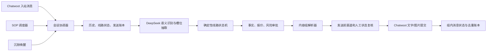

# China2Go 第一、二条线路分析与系统设计

## 1. 文档结论

来源页不是普通产品详情页，而是一套面向 Facebook 广告线索的对话决策树。第一、二条线路分别是：

1. `peach_11d_2027`：桃花＋珠峰 11 日。
2. `peach_9d_2027`：桃花 9 日，不上珠峰。

两条线路都包含入口识别、人数组别、14 组图文介绍、客户插问、同行人信息、时间收集、沉默跟进、联系方式获取和报价。系统不能把整页文字作为一个大提示词让模型自由执行；正确做法是：

```text
版本化业务知识
→ 模型识别客户语义与提取槽位
→ 确定性状态机选择下一业务节点
→ 风险与渠道规则审批
→ 统一内容组发送器提交文字和图片
→ AI / SOP 共用发送账本去重
```

完整网页原文、三条全局规则和图片清单见 [原始资料归档](./china2go-routes-1-2-source.md)。机器可读清单位于 `data/knowledge/china2go/routes-1-2/manifest.json`。

## 2. 抓取结果

| 项目 | 结果 |
|---|---:|
| 完整线路 | 2 条 |
| 全局规则 | 3 条 |
| 网页图片引用 | 29 次 |
| 去重后独立图片 | 13 张 |
| 两线路共用图片 | 11 张 |
| 11 日独有图片 | 11 日行程总览、绒布旅馆 |
| 9 日独有图片 | 9 日行程总览 |

网页图片本身是 Base64 内嵌数据，并非稳定外链。现已转为本地 JPEG，并以 SHA-256 去重。网页密码未写入任何交付文件。

## 3. 两条线路的标准化差异

| 维度 | 桃花＋珠峰 11 日 | 桃花 9 日 |
|---|---|---|
| 路线标识 | `peach_11d_2027` | `peach_9d_2027` |
| 核心差异 | 含珠峰大本营、绒布旅馆 | 不上珠峰 |
| 覆盖区域 | 林芝、波密、拉萨、山南、日喀则、珠峰 | 林芝、波密、拉萨、山南、日喀则 |
| 网页出发期 | 3/20–4/10 | 3/20–4/10 |
| 网页发团日 | 每周五、六、日、一 | 每周五、六、日、一 |
| 网页成人价 | ¥11,480/人 | ¥9,980/人 |
| 网页单房差 | ¥3,200 | ¥2,600 |
| 网页包含 | 入藏函、车、导游、司机、保险、住宿、酒店早餐、门票 | 同左 |
| 网页不含 | 机票、正餐、小费 | 同左 |

价格和发团日来自网页当前内容，只能作为待审核的版本化报价来源。网页没有为这段报价单独声明年份、币种有效期、库存和批准人，不能直接进入真实 AI 自动报价。

## 4. 完整业务场景

### 4.1 入口与线路选择

网页把“桃花节、林芝桃花、赏花、春天”全部直接指向 11 日线路，但同时又存在 9 日线路，因此入口规则冲突。应按以下优先级判断：

1. 已映射的广告或广告系列明确指定线路。
2. 客户明确说 9 日、11 日、上珠峰或不上珠峰。
3. 会话已有已确认的线路状态。
4. 仍不明确时只问一次：“您想看上珠峰的 11 日行程，还是不上珠峰的 9 日行程？”

不能仅凭“桃花”关键词默认选择 11 日，更不能把“9 月”识别为“9 日”。广告来源和客户原话必须保存为线路判断证据。

### 4.2 人数分流

客户人数分为：

- 自己一人。
- 2–3 人。
- 4–6 人。
- 6 人以上。
- 1 分钟内未回复或模型无法判断。

不同人数只改变首段话术和后续问题，不改变线路事实。人数无法判断时可以发送通用欢迎语，但不能推断人数。

### 4.3 线路介绍

两条线路共享大部分介绍内容：

1. 行程总览图。
2. 林芝、波密、拉萨、山南、日喀则等路线摘要。
3. 嘎拉桃花村、波密桃花沟等桃花主题。
4. 帕邦喀寺、秀巴古堡。
5. 酒店客房和供氧设备。
6. 车辆和车载供氧设备。
7. 第二张住宿图。
8. 布达拉宫、八廓街、扎基寺的后续内容。

11 日额外包含珠峰和绒布旅馆内容。网页所称“14 则图文”不是 14 个网络消息；一个业务内容组可能包含一段文字和一张图片。系统应记录“内容组”和“组内消息项”，不能按 DOM 图片数或文本段数推进。

### 4.4 客户中途提问价格

网页规则：在住宿第二张图之前问价，不立刻报价，先告知介绍完成后再给价格；30 分钟后再询问微信或 LINE。

系统设计应将其建模为可中断流程：

```text
记录 price_interrupt
→ 暂停原介绍节点
→ 回复已审核的暂缓话术
→ 保留 resume_node
→ 完成介绍或客户再次追问时处理报价
→ 联系方式最多询问一次
```

这里存在产品体验风险：客户明确问价却 30 分钟后仍只被要求留联系方式，可能造成流失。建议改为“完成必要介绍后先展示已审核价格，再询问是否需要顾问发送完整文件”，并通过 A/B 数据验证，不应把网页旧流程视为不可变规则。

### 4.5 同行人、长辈和儿童

多人客户会被询问家人或朋友、是否有 65 岁以上长辈或儿童、实际年龄。语义提取可以交给模型，但以下答复不能自动使用网页原话：

- 65 岁以上必须办理健康证明。
- 75 岁以上无法申请入藏函。
- 5 岁以下儿童的健康与出行建议。
- 优惠门票退款承诺。

这些属于政策、健康或履约边界，必须有来源、适用证件、有效期和批准人；缺任一字段时只收集年龄并转人工。

### 4.6 时间与特殊日期

网页有三类时间规则：

- 普通桃花档期：3/20–4/10。
- 长假重叠：4/25–5/5、9/25–10/7、2/1–2/16，只要区间相交即命中。
- 过年：2/1–2/16，询问日期是否固定；固定则转人工，可调整则继续收集日期。

日期区间判断必须由代码完成，不由模型计算。网页“2028 年以前自动当作 2027 年”的规则不可长期使用；缺年份时应结合当前业务活动版本询问或明确采用哪个年份，并保存推断来源。

### 4.7 沉默与继续跟进

网页包含：

- Q1/Q2/Q3：5 分钟、30 分钟、1 小时、1 天的等待链。
- 问出发时间后：半天内不追问。
- 问客户是否看过行程后：已读继续，未读等待 1 天。
- 仍无回复：进入每天一则的营销内容。

“半天”必须配置为明确时长；建议默认 12 小时并受 09:00–21:00 联系时段约束。已读状态只有在渠道和 Chatwoot 提供可靠回执时才能作为条件，否则统一走未读兜底。每天营销内容没有在页面定义具体内容、停止条件和有效期，因此不能自动发布。

### 4.8 联系方式和人工接管

联系方式只应在以下条件满足后询问一次：

- 线路、人数组别和大致出发时间已经明确。
- 尚未获得 LINE、微信、电话或 Email。
- 客户没有拒绝联系、投诉或要求停止。
- 当前没有真人客服接管。
- 渠道仍允许自动回复。

收到联系方式后应更新留资状态并创建人工任务，不再让 AI 重复索取。客户只发二维码图片时，首期由真人识别，不让模型猜测二维码内容。

## 5. 资料冲突与风险审查

### 5.1 必须先解决的口径冲突

| 冲突 | 后果 | 处理 |
|---|---|---|
| 11 日入口关键词覆盖所有桃花咨询，但 9 日也存在 | 选错线路、发错图片 | 广告映射优先，未知时澄清 |
| 介绍称 4–6 人小团，报价称“十人小团优惠价” | 客户无法理解实际团型 | 拆成“价格基准团型”和“实际服务团型”两个字段 |
| “地区条件有限以外”与“全酒店都有供氧” | 住宿承诺不一致 | 按城市/酒店逐项审核，不使用全称量词 |
| 2027 行程使用“2025 年最新车” | 随时间失效 | 车辆描述必须有有效期和车型版本 |
| 页面说 14 则图文，但实际文本、图片和跟进项更多 | 节点推进和去重错误 | 使用稳定内容组 ID，不用数量作为完成条件 |
| 9 日广告名中出现“上不要珠峰” | 广告映射不稳定 | 后台维护广告 ID 到线路 ID，名称只作显示 |

### 5.2 风险等级

| 等级 | 内容 | 默认动作 |
|---|---|---|
| L1 | 景点、路线差异、是否上珠峰、已审核行程图 | 可自动回复 |
| L2 | 酒店品牌、车型、供氧设备、房型 | 需版本有效且素材已审核 |
| L3 | 价格、团期、房差、包含/不含、长假加价 | 需报价版本有效，过期转人工 |
| L4 | 氧气浓度、医疗效果、健康证明、年龄/证件政策 | 不自动承诺，优先人工 |
| L4 | “唯一旅行社”、无购物写入合同、购物赔偿 5000 | 法务批准前禁止自动发送 |

任何 L3/L4 内容都应有 `source_ref`、`valid_from`、`valid_to`、`approved_by`、`approved_at` 和 `status`。模型不能用历史客服回复补齐缺失批准。

## 6. 推荐系统架构



统一优先级：

```text
人工接管 / 拒绝联系 / 客诉
> 客户新入站与被动回复
> 正在提交的内容组
> SOP 到期节点
> 沉默唤醒
```

客户发来新消息时，取消尚未提交的 SOP 项，先回答客户问题；回答完成后根据 `resume_node` 决定是否恢复介绍。已提交的文字或图片不能假装撤回。

## 7. AI 与确定性逻辑的边界

DeepSeek 负责：

- 识别客户是问线路、价格、日期、住宿、车辆、长辈、儿童还是联系方式。
- 从客户原话抽取人数、日期、同行关系、是否上珠峰等槽位及证据片段。
- 判断客户是否明确要求人工、拒绝联系或投诉。
- 在已批准事实范围内生成简短自然的繁体中文草稿。

确定性代码负责：

- 日期区间相交、等待时间、联系时段和渠道窗口。
- 当前线路、节点、版本、前序依赖和恢复位置。
- 价格有效期、风险审批、素材适用性和发送权限。
- AI/SOP/唤醒竞争、幂等、重试和跨模块去重。
- 是否真正调用 Chatwoot。

建议模型输出：

```json
{
  "intent": "route_intro|price|date|hotel|vehicle|companion|contact|complaint|other",
  "route_variant": "peach_9d_2027|peach_11d_2027|unknown",
  "route_evidence": "客户原话片段",
  "slot_updates": {},
  "slot_evidence": {},
  "interrupt": "none|price|question|human|opt_out",
  "suggested_action": "advance|answer_fact|ask_clarification|handoff|no_action",
  "reply_draft": "",
  "evidence_refs": [],
  "confidence": 0.0
}
```

模型不直接输出本地文件路径，也不决定真实发送；状态机根据 `suggested_action` 和审批数据选择内容组。

## 8. 线路节点与内容组设计

每个业务节点使用稳定 ID，例如：

```text
peach.shared.ask_party_size
peach.shared.welcome.solo
peach.shared.welcome.two_to_three
peach_11d.itinerary_overview
peach_11d.rongbuk_intro
peach.shared.peach_highlights
peach.shared.hotel_facilities
peach.shared.vehicle_facilities
peach.shared.no_shopping_claim
peach.shared.ask_companion
peach.shared.ask_departure
peach.shared.ask_contact
```

内容组结构：

```json
{
  "key": "peach_11d.rongbuk_intro",
  "route_variant": "peach_11d_2027",
  "items": [
    {"key": "text", "type": "text", "template": "..."},
    {"key": "image", "type": "image", "asset_key": "rongbuk_hotel_room"}
  ],
  "conditions": {"requires": ["route_confirmed"]},
  "risk_level": "L2",
  "resume_to": "peach.shared.peach_highlights",
  "skip_if_content_family_sent": true
}
```

组内文字和图片分别记录 Chatwoot Message ID。文字成功、图片超时时不能重发整组；图片进入 `submission_unknown` 对账。AI 和 SOP 使用相同 `content_family`，任一模块已经发送后，另一模块跳过或引用原消息。

## 9. 对现有代码的复用判断

| 现有模块 | 可复用 | 缺口 |
|---|---|---|
| `decision_service.py` | DeepSeek 调用、证据过滤、路线变体校验 | 事实过粗，缺完整节点和全局中断 |
| `decision_knowledge.py` | 已审核事实包和高风险兜底方向 | 需从新来源版本生成事实，不应手工长期维护代码常量 |
| `KnowledgeVersion/RouteBranch/RouteNode` | 版本、线路和基本节点模型 | `RouteNode` 缺条件、内容组、风险状态和恢复节点 |
| `MaterialAsset` | 文件哈希、可用状态、元数据 | 新抓取素材尚未进入受控上传、审核和 `StoredMedia` 绑定 |
| `material_library.py` | 路线校验、内容族去重、素材解析 | 当前目录版本固定为旧素材库，未导入本次 13 张网页图 |
| `sop_schedule.py` | 相对时间、固定时间、客户加入日、上一节点 | 需把网页等待规则编译成正式 SOP 版本 |
| `SopVersion` | 不可变发布快照 | 需增加线路知识版本引用，防止知识和 SOP 版本错配 |
| `live_sop.py` | 白名单、AI 标签、24 小时窗口、人工阻断、发送前复核 | 需共用被动 AI 的内容组账本，不只按媒体判断 |
| `OutboundMessage` | 真实发送结果和幂等 | 建议增加 `content_group_key`、`content_family`、`knowledge_version_id` |

不建议另建第二套素材库或第二套 SOP 引擎。应扩展现有模型：

1. `RouteNode` 增加 `node_config`、`content_group_key`、`risk_level`、`approval_status`。
2. 新增 `price_rule_versions`，单独管理价格、房差、币种、适用日期、团型、包含/不含和审批。
3. 新增或明确 `conversation_journeys`，保存线路、槽位、当前节点、暂停节点、联系方式状态和版本。
4. `OutboundMessage` 增加共享内容族字段，实现 AI/SOP/人工可核验去重。
5. `SopVersion.config` 引用 `knowledge_version_id` 和 `price_rule_version_id`。

## 10. 后台页面设计

建议增加“线路知识”页面，而不是把所有配置继续塞进 SOP 弹窗。

### 10.1 线路列表

- 线路名称、天数、是否上珠峰、知识版本、发布状态。
- 价格版本状态、素材完整度、风险待审核数量。
- 最近发布时间、发布人、正在使用的 SOP 数量。

### 10.2 线路详情

使用六个标签页：

1. **线路事实**：目的地、天数、适用月份、包含/不含。
2. **对话流程**：按时间线展示节点、条件、等待和中断恢复。
3. **图文内容**：内容组、文字、图片顺序、适用线路和预览。
4. **报价规则**：价格、房差、币种、日期、发团日、有效期和审批。
5. **风险审核**：健康、证件、医疗、合同、赔偿等逐条批准或禁用。
6. **测试发布**：长上下文模拟、分支覆盖、版本差异和白名单发布。

### 10.3 SOP 页面

SOP 只负责“谁、何时、按什么顺序触发已发布内容组”，不重复编辑线路事实和价格。节点编辑器选择已发布的内容组，并显示：

- 相对客户加入、相对上一节点、客户加入第 N 天三类时间。
- 文字、图片或组合内容的实际消息数。
- 前序依赖、停止条件、频控和渠道窗口预警。
- 内容已由 AI 提供时的跳过策略。

## 11. 推荐实施顺序

1. 业务审核本次 13 张图的线路、年份、版权和可发送范围。
2. 业务/法务逐项确认 L3/L4 内容，未确认项保持禁用。
3. 将清洗后的 `manifest.json` 导入现有 `KnowledgeVersion` 和 `MaterialAsset`，复制到受控 `data/uploads` 并绑定 `StoredMedia`。
4. 把两条线路编译成稳定节点和内容组，补全广告 ID 映射。
5. 建立报价版本和日期规则，不再让模型从网页长文抄价格。
6. 将线路节点接入现有 `decision_service`，SOP 只引用已发布内容组。
7. 用演练环境覆盖入口冲突、问价中断、日期重叠、长辈/儿童、客户插问、AI/SOP 去重。
8. 只对白名单测试会话启用真实文字和图片发送，验收后再扩大范围。

## 12. 验收条件

- 9 日与 11 日不会因“桃花”泛词互相选错。
- 客户问 9 月不会被识别为 9 日。
- 11 日可发送正确行程图和绒布旅馆图，9 日不会发送绒布旅馆图。
- 同一内容组被 AI 发过后，SOP 不重复发送。
- 客户插问时未提交的 SOP 项停止，回答后可从正确节点恢复。
- 价格过期、无批准或日期不完整时不自动报价。
- 健康、年龄、证件、氧气浓度和赔偿承诺在未批准时全部转人工。
- 联系方式只询问一次，获得或拒绝后不再索取。
- 所有真实消息可追溯到知识版本、内容组、素材哈希和外部 Message ID。

