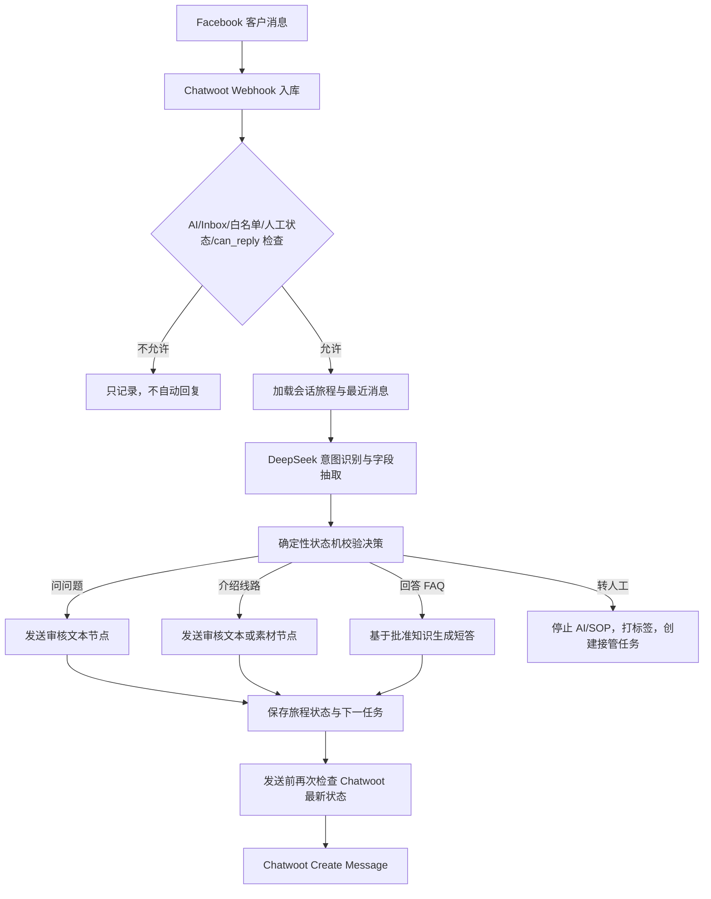

# 林芝桃花节 AI 客服试点设计

## 1. 设计目标

在现有 Facebook Messenger → Chatwoot → 本平台 → Chatwoot 回复链路上，验证一个真实旅游产品的 AI 承接闭环：

```text
识别林芝桃花咨询
→ 判断 9 日或 11 日需求
→ 收集人数、时间和同行人信息
→ 分阶段发送已审核的图文资料
→ 回答限定范围内的线路问题
→ 收集私人联系方式
→ 必要时转人工并打包客户卡
```

试点不是“让大模型自由当销售”。主流程、素材、等待、发送许可、标签和转人工由确定性业务逻辑控制，DeepSeek 只承担语言理解与受约束生成。

资料依据：

- [试点资料盘点](./linzhi-peach-pilot-materials.md)
- 业务决策树页面：<https://china2go.com/7693-2/>

## 2. 一期范围

一期只开放同一产品族的两个分支：

1. `桃花 + 珠峰 11 日`
2. `桃花 9 日`

暂不自动运行：

- 自己包团的深度介绍，只收集基本需求后转人工。
- 冬游西藏，原因是图片素材不完整。
- 其他月份的一般西藏线路，原因是脚本明确标记为待补。
- 色达、云南、北京、上苏杭等其他目的地介绍。
- 报价、库存确认、优惠承诺、合同解释。
- 超出 Meta 允许窗口的主动发送。
- 面向全部真实客户自动开启；试点只允许带指定白名单标签的会话。

## 3. 核心架构判断

### 3.1 DeepSeek 负责什么

- 判断客户是在选 9 日、11 日、包团、其他时间还是其他目的地。
- 从自然语言中抽取人数、月份、同行关系、长辈/孩童年龄、联系方式。
- 识别客户是否要求人工、投诉、拒绝联系或明显不感兴趣。
- 将客户插入的问题归类到已批准知识项。
- 在不改变事实的前提下，用繁体中文生成简短自然回复。
- 输出结构化 JSON，不直接调用 Chatwoot。

### 3.2 DeepSeek 不负责什么

- 不决定当前是否允许发消息。
- 不直接操作标签、分配客服或关闭会话。
- 不自行选择本地文件路径。
- 不计算定时任务或重试时间。
- 不编造价格、团期、余位、签证/入藏政策、健康结论和合同承诺。
- 不因“觉得合适”而跳过业务节点。
- 不在没有业务依据时承诺一定成团、一定入住或一定获得许可。

### 3.3 为什么不能用一个大提示词完成全部流程

旅游销售流程包含长时间等待、跨消息状态、媒体发送、渠道窗口、重复事件和人工并发。把这些交给单次模型输出会导致：

- 重复发图或跳节点。
- 客户中途提问后丢失原流程。
- 业务规则随模型措辞漂移。
- 无法可靠取消 30 分钟、半天、1 天后的任务。
- 无法审计“为什么发了这条消息”。

因此采用“状态机 + 结构化 AI 决策 + 审核模板”的组合。

## 4. 总体流程



## 5. 会话旅程状态

建议为每个 Chatwoot Conversation 建立一条独立旅程记录，不把详细状态塞进 Chatwoot 标签。

| 状态 | 含义 | 正常下一步 |
|---|---|---|
| `NEW` | 刚进入试点，尚未选择线路 | 询问 9 日/11 日/包团/其他 |
| `ROUTE_SELECTED` | 已识别线路 | 询问人数 |
| `PARTY_SIZE_CAPTURED` | 已收集人数 | 开始分段介绍；多人同时询问同行关系 |
| `INTRO_IN_PROGRESS` | 正在发送审核图文节点 | 等客户消息或调度下一节点 |
| `COMPANION_CAPTURED` | 已知家人/朋友 | 询问长辈或孩童 |
| `AGE_CHECK` | 正在收集长辈/孩童年龄 | 安全规则判断或继续 |
| `DEPARTURE_CAPTURE` | 收集具体出发时间 | 准备留资 |
| `CONTACT_CAPTURE` | 请求微信/Line/WhatsApp | 成功后转人工 |
| `HANDOFF_PENDING` | 已创建人工任务 | AI 停止 |
| `HUMAN_ACTIVE` | 真人处理中 | AI 停止 |
| `CLOSED` | 客户拒绝、黑名单或流程结束 | 不再触达 |

任何状态都允许以下中断：

- `要求人工` → `HANDOFF_PENDING`
- `客诉/强烈负面` → P1 人工接管
- `拒绝联系` → `CLOSED`
- `渠道不可回复` → 保持状态，取消到期发送
- `客户提出线路问题` → 临时回答 FAQ，再恢复原状态
- `客户改变线路` → 更新线路并重置不再适用的下游字段

## 6. 旅程字段

建议新增 `conversation_journeys`，关键字段如下：

```text
id
conversation_state_id
campaign_key                    # linzhi_peach_2027
flow_version
journey_state
selected_route                  # peach_9d / peach_11d / custom / other
party_size_bucket               # solo / 2_3 / 4_6 / 6_plus
companion_type                  # family / friends / mixed / unknown
has_senior
senior_ages                     # JSON list
has_child
child_ages                      # JSON list
departure_window
contact_methods                 # JSON: wechat/line/whatsapp/email/phone
contact_capture_status
last_script_node
resume_script_node
pending_question
silence_since
state_version
status
created_at / updated_at
```

另建 `journey_events` 保存每次状态变化、AI 抽取结果、节点发送、任务取消及人工覆盖，便于排错和 BI。

## 7. DeepSeek 输入输出协议

### 7.1 输入

每次只传必要数据：

```json
{
  "campaign": "linzhi_peach_2027",
  "flow_version": 1,
  "journey_state": "PARTY_SIZE_CAPTURED",
  "known_slots": {
    "selected_route": "peach_11d",
    "party_size_bucket": "4_6"
  },
  "pending_question": "companion_type",
  "approved_route_facts": [],
  "recent_messages": [],
  "customer_message": "和家人一起，有一位70岁的长辈"
}
```

不向模型提供：Chatwoot Token、DeepSeek 密钥、Webhook Secret、其他客户信息、无关历史会话。

### 7.2 输出

使用 DeepSeek JSON Output，后端必须进行 Pydantic 校验：

```json
{
  "intent": "answer_slot",
  "slot_updates": {
    "companion_type": "family",
    "has_senior": true,
    "senior_ages": [70]
  },
  "customer_question": null,
  "requested_human": false,
  "negative_or_complaint": false,
  "suggested_action": "advance",
  "reply_draft": null,
  "confidence": 0.96,
  "reason_code": "family_and_senior_extracted"
}
```

后端接受动作仅限：

```text
advance
ask_clarification
answer_faq
handoff
no_action
```

模型输出 `advance` 不等于立即发送；状态机仍需检查当前节点、版本、标签、人工状态和 `can_reply`。

## 8. 脚本节点和素材

主流程使用不可由模型修改的节点定义：

```json
{
  "key": "peach_11d.itinerary_image",
  "type": "image",
  "asset_id": "peach_11d_itinerary",
  "allowed_routes": ["peach_11d"],
  "requires_can_reply": true,
  "next": "peach_11d.summary"
}
```

素材使用上一份盘点中的稳定 ID，不直接保存业务方原始文件名。首期资产：

```text
peach_9d_itinerary
peach_11d_itinerary
rongbuk_hotel_room
pabongka_peach
xiuba_fort_peach
hilton_room
hilton_oxygen_room
vip_vehicle
vehicle_oxygen_unit
hotel_room_secondary
potala_palace
barkhor_street
zaki_temple
```

## 9. 图文发送策略

网页将主体介绍描述为连续 14 则图文，但不建议一次性全部发送：

- 每次只提交一个节点。
- 文本与紧邻图片可以作为一组，但仍分别记录发送状态。
- 每个节点之间使用可配置短间隔，避免平台限流和消息轰炸。
- 客户发来任何新消息时，暂停尚未发送的介绍节点，先处理客户问题。
- 客户改变线路时，取消旧线路的待发送节点。
- 图片发送失败不得自动跳到依赖该图的文案，进入重试或人工处理。
- 所有主动节点到期时重新检查 `can_reply`，不允许绕过 Meta 窗口。

## 10. Chatwoot 标签设计

详细状态保存在本平台数据库；Chatwoot 只同步客服真正需要看到或操作的高层标签：

| 标签 | 用途 |
|---|---|
| `ai` | 是否允许 AI 接管的主控制标签 |
| `试点-林芝桃花` | 限定试点白名单 |
| `桃花9日` | 已识别产品意向 |
| `桃花珠峰11日` | 已识别产品意向 |
| `客制包团` | 包团需求，尽快转人工 |
| `需资格确认` | 年龄、证件或政策需要真人确认 |
| `已留资` | 已获得至少一种有效私人联系方式 |
| `人工接管` | 停止 AI 并进入人工队列 |
| `拒绝联系` | 禁止后续 AI 和 SOP |

不建议为每个问答节点创建标签，否则 Chatwoot 会变成内部状态数据库，容易被客服误删并导致流程错乱。

## 11. 人工接管规则

立即接管：

- 客户明确要求真人。
- 客诉、退款、合同争议或支付问题。
- 包团需求已回答人数或月份之一。
- 年龄/证件问题触发业务资格核验。
- 客户要求具体价格、余位、优惠或确认团期，而系统没有实时数据。
- DeepSeek 连续失败或低置信度澄清超过 2 次。
- 客户发来微信/Line QR Code，首期由真人读取。

转交客户卡至少包含：

```text
客户名称和 Chatwoot 会话链接
9日/11日/包团意向
人数
出发时间
同行关系
长辈/孩童及年龄
已取得的联系方式
广告/市场来源（若链路提供）
触发转人工原因
AI 已发送到的最后节点
```

## 12. 知识和生成边界

### 可由 AI 回答

- 9 日与 11 日行程差异。
- 是否上珠峰。
- 现有行程图中明确列出的景点顺序。
- 已批准的住宿、车辆、供氧和无购物说明。
- 已确认的行前准备类常见问题。

### 必须模板回答或转人工

- 报价、优惠、余位、确定团期。
- 退改、赔偿、合同解释。
- 入藏资格、健康证明、年龄限制。
- 高原反应医疗建议。
- 客户要求修改线路、增加住宿或私人包团报价。

高风险事实必须带 `valid_from`、`valid_to`、`approved_by` 和来源，过期后自动禁止 AI 使用。

## 13. DeepSeek 运行配置

本地环境变量：

```text
DEEPSEEK_API_KEY
DEEPSEEK_BASE_URL=https://api.deepseek.com
DEEPSEEK_MODEL=deepseek-v4-flash
```

选择 `deepseek-v4-flash` 用于首期分类和字段抽取，默认关闭思考模式，以降低延迟和成本。复杂任务也不应改用模型自由规划，而应继续由状态机拆解。

建议调用参数：

```text
stream=false
thinking.type=disabled
response_format.type=json_object
temperature=0.1
max_tokens=800
timeout=15s
```

密钥只从后端环境读取，不通过设置接口返回，不写入日志，不进入前端。

## 14. 试点开启条件

同时满足以下条件才自动回复：

```text
租户 AI 总开关开启
Inbox AI 开关开启
Conversation 存在 ai 标签
Conversation 存在 试点-林芝桃花 标签
不存在 人工接管/拒绝联系/黑名单
没有活动中的人工接管任务
Chatwoot can_reply=true
消息为 incoming + public + text
Webhook 消息未处理过
```

初期只给内部 Facebook 测试账号的会话添加试点标签，不对 Page 现有真实客户开放。

## 15. 最小验收场景

1. 客户选择 11 日、4 人、家人同行、70 岁长辈、4 月初出发，系统正确收集并在资格问题处转人工。
2. 客户选择 9 日、自己一人，系统不问家人/孩童问题，完成线路介绍并询问时间。
3. 客户在介绍中途问“9 日和 11 日差在哪里”，AI 回答后从原节点继续。
4. 客户中途改为 9 日，系统取消 11 日未发送素材。
5. 客户要求报价，系统不编造价格，创建人工任务。
6. 客户发 QR Code，系统保存附件但不自动识别，转人工。
7. 客服在 Chatwoot 删除 `ai` 标签，3 秒内停止未发送节点。
8. 客服添加 `人工接管`，所有 AI 和 SOP 任务取消。
9. 相同 Webhook 重放，不产生重复回复或重复图片。
10. `can_reply=false` 时，即使定时节点到期也不发送。
11. DeepSeek 返回无效 JSON，任务安全失败且不向客户发送错误内容。
12. DeepSeek 超时连续达到阈值，创建 AI 故障人工任务。

## 16. 推荐开发顺序

1. 建立素材目录表和 13 个稳定资产 ID。
2. 建立 `conversation_journeys` 与 `journey_events`。
3. 实现 DeepSeek 结构化抽取 Adapter，不接 Chatwoot 实发。
4. 用保存的真实脱敏对话做离线回放，评估字段抽取准确率。
5. 实现分支 1/2 状态机和文本节点，保持图片 dry-run。
6. 接入图片发送及节点级幂等。
7. 接入标签同步、取消任务和人工接管客户卡。
8. 只对白名单测试会话开启真实发送。

