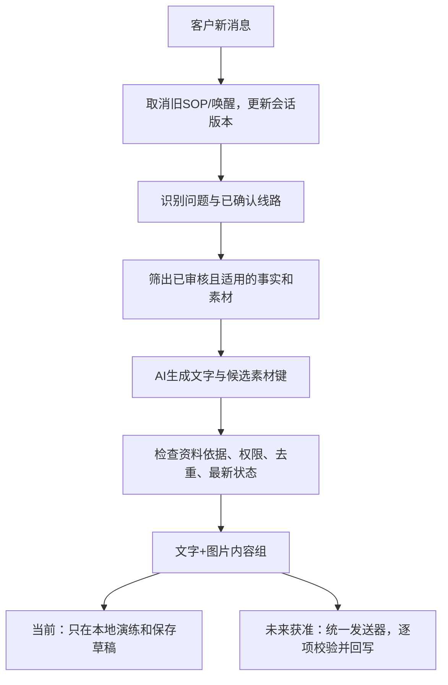

# 旅游素材全量盘点与 AI / SOP 共用方案

日期：2026-08-26。范围：本地 `E:\AI\codexproject\ai_chatwoot\給ai` 全部层级，以及当前平台素材、AI、SOP 相关代码。

本文中的“建议”“待接入”不是已经上线的功能。本轮未修改原图、客户标签、运行策略或数据库，未调用模型，未向客户发送消息。旧网页资料未重新抓取；本次新增发现来自文件名和实际图片。

## 1. 先说结论

应该按客户问题选择不同素材，但不能“命中一个关键词就把整个文件夹发出去”。推荐：

1. 同一份素材库服务 AI、SOP 和后续沉默唤醒，不分别维护三套附件。
2. AI 负责回答眼前的问题，按已确认的线路、季节和意图选图；SOP 负责客户未继续发言时的预设介绍节奏。
3. 人工接管优先；客户新消息取消旧 SOP 轮次；新轮次也复用客户的素材发送记录，不清空去重历史。
4. 文件名是分类依据，不能代替业务审核。目录与画面冲突时先阻断自动发送，不能让模型猜。
5. 当前素材只包含图片，没有独立视频、音频、报价表或正文脚本文件。SOP 虽能配置视频，本目录没有可绑定的视频。

## 2. 交付文件与盘点方法

| 文件 | 用途 |
|---|---|
| [图片图册](../../output/materials-2026-08-26/gallery.html) | 本地直接打开；按目录筛选、按名称搜索、查看缩略图、打开原图 |
| [完整清单](../../output/materials-2026-08-26/inventory.md) | 44份独立图片的用途和风险、105个原文件逐项路径、重复分布 |
| [CSV清单](../../output/materials-2026-08-26/files.csv) | 用表格软件查看每个文件的目录、含义、尺寸、SHA-256和用途 |
| [机器可读目录](../../output/materials-2026-08-26/manifest.json) | 后续导入素材库的候选数据，不是自动发布配置 |

方法：递归遍历全部文件，计算 SHA-256，读取真实图片格式与尺寸，验证可解码；浏览44份独立图片，并放大核对6张完整行程海报。不是把105份图片做OCR全文审定，也没有核验拍摄地、版权、产品有效性或实时旅游供应。

- 顶层项目：6个；实际存图叶子目录：8个；子目录总数：11个。
- 文件：105个，全为可解码图片；PNG扩展名67个、JPEG扩展名34个、JPG扩展名4个。
- 按内容哈希去重：44份；29组有重复副本，共61个重复副本。
- 原文件合计约195.82 MiB；哈希去重后约84.75 MiB。
- M02/M26、M07/M27另有两组视觉近重复，哈希不同；不把44误当作44个不同业务用途。
- 原始图片未删除、改名或移动；图册使用派生缩略图，原图仍是原目录里的文件。

## 3. 所有项目与资料组

G编号、M编号仅用于本次报告。运行时使用稳定业务键、内容哈希与发布版本，不能依赖排序编号。

| 资料组 | 原目录 | 文件数 | 可理解的业务用途 | 主要素材 |
|---|---|---:|---|---|
| G01 | `11天的圖-台灣繁體字版` | 11 | 2027桃花+珠峰11日 | M04行程；M01绒布；M05/M06桃花；M07/M08酒店；M09车辆；M02设备 |
| G02 | `6包團/西藏` | 14 | 西藏包团需求的参考方案与往期体验，不是“6人团”的确定产品 | M12冬游8日、M16全览10日；M13-M15冬景；M17-M23景点/客照；M07/M08酒店 |
| G03 | `9天的圖-台灣繁體字版` | 11 | 2027桃花9日，不上珠峰 | M24行程；与11日共9份文件；独有M25八廓街 |
| G04 | `其他時間 上珠峰/其他時間・上珠峰--12~2月選項-冬遊西藏-台灣繁體字` | 14 | 冬游且想上珠峰的入口，实际线路有冲突 | M12主海报未含珠峰；M13-M15/M28-M33冬景；M09/M26车辆；M03/M27酒店 |
| G05 | `其他時間 上珠峰/其他時間．上珠峰-- 5~6月7~8月9~11月-西藏精華8天` | 13 | 目录标5-11月，拉萨进、上珠峰8日 | M35行程；M37珠峰；M38萨迦寺；M39铁路；M19-M21/M36拉萨；车辆酒店 |
| G06 | `其他時間不上珠峰/其他時間 不上珠峰-12-2月選項-冬遊西藏` | 13 | 冬游林芝冰川、冰湖8日 | 与G04有13份完全相同文件；没有G04的M26设备图 |
| G07 | `其他時間不上珠峰/其他時間．不上珠峰-- 5~6月7~8月9~11月-林芝8天` | 14 | 目录标5-11月，林芝进、不上珠峰8日 | M40行程；M17/M18林芝；M19-M21/M41拉萨；M42羊湖客照；M39铁路 |
| G08 | `西藏全覽-10天林芝+拉薩+珠峰` | 15 | 林芝+拉萨+珠峰10日 | M16行程；M43日照金山；M44鲁朗客照；巴松措、古堡、拉萨、酒店、车辆、铁路 |

注意：“6包團”可能是原始脚本编号，不能自动理解为“必须6人”或“6人以上”。目录已经有非桃花产品，但不等于这些路线的价格、日期、合同和文字知识都补齐了。

## 4. 六张行程海报的实际内容

以下为图片内容摘要，用于区分资料，不是现行供应承诺。机场接送、酒店、门票/机票包含关系等仍需审核完整原图与合同。

| 素材 | 图内路线概况 | 要防止的混用 |
|---|---|---|
| M24：2027桃花9日 | D1林芝/嘎拉桃花村；D2色季拉山、南迦巴瓦、鲁朗；D3波堆/波密桃花与嘎朗区域；D4秀巴古堡、巴松措、拉萨；D5布达拉宫/八廓街/大昭寺；D6扎基寺/色拉寺/桃花秘境；D7羊湖/卡若拉/白居寺/日喀则；D8扎什伦布寺/拉日铁路；D9送机/送火车 | 不上珠峰，不可替换成普通林芝8日 |
| M04：2027桃花+珠峰11日 | 前7日与9日图基本一致；D8加乌拉、绒布寺、珠峰大本营，图示绒布旅馆；D9嘉措拉/萨迦寺；D10扎什伦布寺/拉日铁路；D11离开 | 珠峰段住宿不能套用8日/10日帐篷版本 |
| M12：冬游冰川冰湖8日 | D1林芝；D2色季拉/南迦巴瓦/鲁朗；D3然乌湖/来古冰川；D4嘎朗区域/雪山牧场；D5秀巴古堡/巴松措；D6拉萨；D7羊湖/卡若拉/恰央措/拉萨；D8离开 | 图中没有珠峰，却放进“上珠峰”目录，必须纠正绑定 |
| M35：西藏精华8日 | 拉萨入；D2扎基寺/色拉寺；D3布宫/大昭寺/八廓街；D4羊湖/卡若拉/白居寺；D5珠峰；D6嘉措拉/萨迦寺；D7扎什伦布寺/拉日铁路；D8离开 | 不是林芝进，不是桃花；珠峰住宿图内写2025年新帐篷 |
| M40：林芝进不上珠峰8日 | D1林芝；D2色季拉/南迦巴瓦/鲁朗/扎西岗村；D3秀巴古堡/巴松措/拉萨；D4扎基寺/色拉寺；D5布宫/大昭寺/八廓街；D6羊湖/卡若拉/白居寺；D7扎什伦布寺/铁路；D8离开 | 不是桃花9日，也不是珠峰8日 |
| M16：西藏全览10日 | D1林芝；D2色季拉/南迦巴瓦/鲁朗；D3秀巴古堡/巴松措/拉萨；D4拉萨经典；D5扎基寺/色拉寺；D6羊湖/卡若拉/白居寺；D7珠峰；D8嘉措拉/萨迦寺；D9扎什伦布寺/铁路；D10离开 | 不是桃花11日；图内珠峰住宿为2025年新帐篷 |

没有发现独立的“冬游上珠峰”完整行程海报。不能把冬游海报拼上珠峰风景图后宣称已经形成一条获批线路。

## 5. 必须处理的素材问题

### 5.1 线路与命名冲突

1. **G04冬游上珠峰**：M12与不上珠峰版本完全一样，图中未含珠峰。建议阻断该路线自动选择M12，先收集需求并转顾问。
2. **M16/M35年代和住宿**：海报写2025年新帐篷。当前已经2026年，不能认定必然失效，也不能当作当前供应保证。由业务确认保留还是换新版；它们与2027桃花11日绒布旅馆是不同产品。
3. **“希尔顿1/2”不稳定**：普通月份的“希尔顿1”多为M08，冬游的“希尔顿1”为M03。禁止按“希尔顿1”字符串选图。
4. **M02/M26设备名称不一致**：文件名分别写制氧机、弥散氧气瓶，视觉近同。不能凭名字推导设备工作原理、氧浓度或医疗效果。
5. **序号不是计划时间**：“图回1-14”“图后回2”“统回图19”是原脚本定位，不能自动解释成第14分钟、第2天或第19个定时节点。保留原始序号，不擅自拼出缺失文案。
6. **旧资料过期部分**：2026-08-24盘点的“仅22张、冬游图缺失”已不适用于当前目录；但新增图片不等于所有业务脚本已补齐。

### 5.2 还缺什么

- 每条路线明确的产品ID、有效年份/季节、获批完整文字介绍、酒店房型及可替代条款。
- 当前报价、币种、人数规则、团期、余位、单房差、费用包含/不含、退改与付款政策。
- 正确的冬游上珠峰方案，或明确该入口是否只推荐不上珠峰冬游。
- 客照授权及商用范围；有摄影署名/水印的图片需确认来源授权。已有模糊脸部也不自动等于授权。
- 视频原文件、审核字幕和文字话术；本目录没有视频。
- 其他目的地的图片和路线。现在全部资料均为西藏方向，不能支持云南、北京等目的地介绍。

有住宿/供氧照片，不等于能承诺高反不会发生；有客照，不等于能编造评价；有雪景，不等于能保证当日天气。

## 6. 客户问什么，应该给什么

**原则：先答问题，再给最相关的1张图；明确比较需求可给2张。不是每条回复都带图。** 图片数量是建议默认值，不是现有代码已实施的限制。

| 客户问题/意图 | 先确认 | 候选素材 | 不该做的事 |
|---|---|---|---|
| “有行程表吗？” | 路线、天数、是否珠峰、是否桃花/冬游 | 明确后选M04/M24/M12/M35/M40/M16之一 | 六张行程全部发出，让客户自己找 |
| “9天和11天差在哪？” | 确认说的是2027桃花版本 | 文字对比珠峰段，再按需要发M24和M04 | 把普通8天/10天掺进同一次比较 |
| “珠峰那晚住什么样？” | 11日、普通8日还是10日 | 11日候选M01；其他产品先核对住宿版本 | 所有珠峰客户统一承诺绒布旅馆 |
| “酒店怎么样/有双床吗？” | 具体路线和入住地；实际安排未承诺 | M08或M03；有设施问题再加M07 | 图好看就说保证入住、全部房型相同 |
| “坐什么车/车里有氧气吗？” | 具体线路及获批配置 | M09；需要设备示意时再加M02或M26中的一个 | 把设备照片当作医疗建议或安全保证 |
| “桃花有什么看点？” | 客户确实咨询桃花路线 | M05/M06按具体景点选择 | 给冬游客户硬推桃花、承诺具体花期 |
| “冬天可以看什么？” | 冬游意图、是否珠峰 | M14蓝冰或M13冰湖；需要总览才发M12 | 上珠峰需求直接发不含珠峰的海报 |
| “林芝哪里值得看？” | 普通季节/桃花/冬季、已选路线 | M17巴松措、M18古堡、M33雪山等选相关项 | 几个主题各发一张造成刷屏 |
| “拉萨有哪些地方？” | 已选路线包含哪些景点 | 布宫M10/M19/M31按版本选；M21色拉寺、M41大昭寺等 | 因目录里有图就承诺一定进景点 |
| “有火车体验吗？” | 路线是否包含拉日铁路及费用安排 | M39加已审核说明 | 从照片推断车次、票价、座位或包票 |
| “有你们客人的照片吗？” | 允许用途与人物授权 | M22/M23/M34/M42/M44，按路线选一张 | 编造人物身份、出行日期、满意度或评论 |
| “价格/余位/日期能确定吗？” | 人数、计划时间、路线 | 当前无可据以报价的图；收集信息转顾问 | 发风景图回避报价问题或从海报猜价 |
| “老人能去吗/高反安全吗？” | 只记录客户需求并转顾问 | 需要时提供获批设施示意，不代替答复 | 用氧气图片证明适合所有人 |
| “谢谢/收到/先不用/退订/投诉” | 识别停止或人工需求 | 通常不附图 | 自动开启下一组景点介绍 |
| “这张看不清，再发一次” | 能定位到原图/原消息 | 允许本次明确请求的受控重发 | 永久关闭所有去重、频控和渠道检查 |

## 7. AI 回复如何接入

### 7.1 线路判断不能只用现有六个大分支

保留现有大分支做业务分流，但增加具体产品维度：

```text
branch: peach_11d / peach_9d / private_group / other_peak / other_no_peak / other_destination
route_variant: peach_11d_2027 / peach_9d_2027 / tibet_peak_8d /
               linzhi_no_peak_8d / tibet_panorama_10d / winter_linzhi_8d
departure_window: 客户明确给出的时间
route_status: unknown / tentative / confirmed
```

“其他时间上珠峰”至少有8日、10日与未核实冬游，不能只靠`other_peak`发同一套图。包团是服务方式，可参考8日/10日，但必须经过需求匹配，不自动锁死产品。客户改路线后使旧候选结果失效，不能继续发旧路线图。

### 7.2 决策与发送分离



候选素材筛选必须在服务端完成。DeepSeek只从候选业务键里选择，不能输出任意磁盘路径、URL或数据库ID。模型收到说明文字与审核事实即可，不必每次把44张图传入模型。

建议结果扩展：

```json
{
  "action": "reply",
  "route_variant": "peach_11d_2027",
  "intent": "vehicle",
  "reply": "我先給您看看這條路線的車內參考照片，實際用車由顧問確認。",
  "materials": [{"asset_key": "vip_vehicle_interior", "revision": 1}],
  "content_group_key": "vehicle_intro",
  "evidence_refs": ["approved_route_vehicle_fact"]
}
```

上述是协议设计示例，不是新增获批事实。发送器把业务键映射到本地文件并上传到Chatwoot，客户不会收到`E:\...`路径或公网不可达的本地链接。

## 8. SOP 怎样使用同一套素材

### 8.1 配置方式

保留现有时间配置和文字/图片/视频内容组；图片来源增加“从素材库选择”，不用在每条策略重复上传相同图片。

配置顺序：选择目标路线 → 选择入组事件/标签 → 时间节点 → 审核文案与素材 → 查看重复/错配/版本提示 → 演练。

- 时间：本轮入组后10分钟、20分钟；入组第N天指定时刻；上一内容组确认后N分钟。
- 每个节点是有序内容组，例如“一条短文字 + 一张行程图”，不是一张图一个策略。
- 发布版本冻结文字、文件哈希、素材修订号、适用路线、节点和退出条件。
- 新版图片不能静默替换已发布策略引用；业务撤回素材时立即阻断旧策略后续发送，再人工发新版。
- 触发标签与退出标签不能配置成相同值；退出/人工/拒绝联系条件优先。
- “客户首次进入”采用可信首条客户入站时间，不是加Facebook好友、关注粉专或文件导入的时间。

### 8.2 桃花11日演练示例

前提：路线已确认，审核素材齐全，有测试白名单，渠道窗口有效。下列文案与时长是配置样例，未创建真实策略。

| 节点 | 时间 | 内容组 | 发送前还需判断 |
|---|---|---|---|
| N1 | 本轮入组后10分钟 | 简短路线介绍 + M04行程 | 客户没新回复；本路线行程尚未发过 |
| N2 | 本轮入组后20分钟 | 审核的住宿说明 + M08；客户明确关心珠峰住宿才用M01 | 不重复AI/人工已发送素材；不能把酒店图当房量保证 |
| N3 | N2确认完成后10分钟 | 简短车辆说明 + M09；确有设施需求可附M02 | 逐项去重；遵守本轮主动内容组上限 |

不要把目录中11张图全部做成连续定时轰炸。建议先限制每轮主动介绍2-3组，在本地观察再调整，不把无限连发视为“同一轮所以不限次数”。

第2/3天可配置不代表Facebook一定可发：平台现有自动窗口检查、允许联系时间、过期宽限仍生效。客户新回复默认取消旧轮次，不能靠重入组延长渠道窗口。此处是在说明现有本地保护，不重新承诺Meta政策的全部例外。

## 9. AI 与 SOP 防冲突规则

### 9.1 三层分工

| 层 | 负责什么 | 不能替代什么 |
|---|---|---|
| 共享素材库 | 哪张图、适用路线/季节、是否审核、文件版本 | 不决定现在能不能联系客户 |
| 共享内容发送记录 | 谁在什么会话、通过AI/SOP/人工发过哪些内容 | 不等于客户已读、理解或同意 |
| 统一调度与发送关卡 | 优先级、客户锁、最新状态、渠道窗口、频控、每项发送 | 不能撤回已在外部平台提交的消息 |

优先级：人工/拒绝联系等阻断 > 客户新问题 > 被动AI答复 > 已有SOP > 沉默唤醒。

### 9.2 必须共同遵守的规则

1. **一个客户级出口**：同一联系人关联会话共享内容记录和发送预留；不可用不同会话/不同SOP绕过去重。未确认跨渠道为同一人时，不擅自合并身份。
2. **新问题先停旧SOP**：收到客户新消息立即取消旧轮次未发送节点，更新generation。AI完成后再次检查版本，不发过时答案。
3. **完成或取消不自动重开**：仍保留当前“一客户一策略一轮”的规则。重新加标签、去掉退出标签、AI开关和新发布不重启旧轮；显式重新入组才是新轮。
4. **重新入组不清空素材历史**：客户上轮收到过行程图，新轮不能默认再发一次。只有明确请求重发或审核新版本有实质变化，才允许有记录的例外。
5. **两级去重**：相同SHA-256是同一文件；M02/M26等近重复按人工维护的`content_family`去重。同景点冬季/夏季和9日/11日不同版本不能乱合并。
6. **内容目的也要去重**：AI已经用另一张图讲完车辆介绍，SOP不应再发一套相同话题；记录`content_group_key`，但不推断客户“已看懂”。
7. **幂等逐内容项**：组内每条文字/图片都有稳定业务键、提交状态和Chatwoot消息ID；接口重试不能重发整个组。
8. **提交未知先对账**：网络超时且可能已发出的项是`submission_unknown`，既不能当成功，也不能立即重发或让另一模块顶替发同一图。
9. **客户明确重发请求**：只豁免该次内容去重，仍需人工/AI开关、权限、文件审核、版本和渠道窗口通过。
10. **人工发送也参与**：Chatwoot外部人工发图不能只标“outgoing”。已知本平台媒体通过消息ID关联；外部附件通过可信附件标识或只读拉取后的哈希核对。无法识别时记录`unknown`，不虚构已发送素材。
11. **部分组成功**：文字已发、图片失败时不重发文字。下游依赖只有在组必需项已确认或被可靠既有发送满足时解除。
12. **阻断优先于新规则**：人工接管、拒绝联系、客诉、关闭AI、不可回复、素材被撤回等，所有模块同样遵守。

### 9.3 几个实际冲突如何处理

| 情形 | 应有结果 |
|---|---|
| 入组第9分钟客户问“住什么酒店”，第10分钟SOP将发酒店图 | 先取消旧SOP；AI围绕酒店答复并选相关图，不能两边各发一次 |
| AI已经发过M09，第10分钟手动入组新的路线介绍SOP | 新轮记录照常，但车辆节点匹配发送记录后记`already_provided`；不重复发 |
| SOP已提交行程图，下一秒客户提问 | 已提交项无法撤回；取消组内未发送项和剩余节点，AI看到已发内容后回答新问题 |
| 节点只有一张图且已由AI成功发送 | 记`skipped_already_provided`并引用原消息，不冒充SOP的delivered；后续相对时间用真实满足时间 |
| 文字未发过但图片已发过 | 只能保留不依赖“下面这张图”的文案；依赖图片的组整体跳过或进入人工检查，不能发送悬空指代 |
| 前序被频控/窗口/未知提交阻断 | 不视为满足依赖，不能自动推进后一节点 |
| SOP与唤醒同一时刻到期 | 联系人级领取只有一个成功；已有SOP优先，唤醒跳过/取消，不能同时发 |
| AI停止、客服接管又重新加ai标签 | 依照显式恢复流程；不能恢复已结束SOP或清空频控 |

“满足过内容”与“节点已经执行”要分开记。相对上一组时间应以可信的`dependency_satisfied_at`为锚点，不重新从现在开始滚动拖延；若导致后继已过期，按过期规则跳过。以上`already_provided`依赖语义尚待接入，不能在当前代码里直接将skipped当delivered。

外部消息已经在途时无法保证绝对不交错。目标是：本地队列内不重复竞争，每项发送前检查最新状态，明确记录最后检查时间与无法撤销的已提交项；不许宣称零延迟或事务式原子发送整个内容组。

## 10. 本地版数据与接口接入建议

### 10.1 不需要OSS，但需要受控素材目录

```text
业务原目录（只读来源）
  -> 导入清单和预览
  -> 人工确认线路/版本/授权
  -> data/uploads 下的受控文件副本
  -> SQLite 元数据与已审核绑定
  -> AI候选 / SOP发布快照
  -> 统一内容组执行器
```

不要把整个业务目录挂成公开静态目录，也不要把本图册发布到公开Demo。图册含原路径和人物照片，仅供本地整理。后续正式本地应用复用现有鉴权媒体预览，不把绝对路径或客户信息返回公共页面。

### 10.2 最小必要数据

| 数据对象 | 需要的内容 | 处理方式 |
|---|---|---|
| MaterialAsset修订 | 稳定业务键、修订号、SHA-256、素材族、类型、标题、审核状态、有效期 | 扩展现有资产，不另造独立AI素材库 |
| 原始位置 | 相对路径、原文件名、原脚本号、文件时间、哈希 | 多个路径可指向同一文件；原命名全保留 |
| 路线绑定 | route_variant、季节/年份、可回答意图、获批用途、禁止场景 | 和文件实体分离；同图可多路线但逐一审批 |
| StoredMedia | 已管理的本地路径、尺寸、格式、文件大小、上传来源 | 复用现有上传与预览；一个实体避免反复上传 |
| 内容组 | 稳定键、文字版本、有序媒体项、依赖和可选项 | AI动态选组、SOP固定审核组；同一执行协议 |
| 内容记录 | tenant/contact/inbox/会话、source、route_variant、素材族/修订、状态、外部消息ID、时间 | 去重与查询共用；模拟与真实环境严格分开 |
| 执行预留 | contact作用域、owner、lease、generation、业务幂等键、未知提交锁 | 复用并完善现有TouchReservation/出站体系 |

SQLite现阶段足够；对图片原文做全文向量搜索不是第一优先级。44份图片先靠可审核标签、路线与素材族就能稳定选择，暂不增加向量库、OSS或新模型。

建议在现有`/v1/knowledge/assets`上扩展筛选、导入预览、审核与路线绑定，在现有SOP编辑器复用选择器；不是新增未鉴权的文件浏览接口。所有导入/审核/发布要求管理员权限，素材使用遵守租户与Inbox范围。Supervisor的跨创建者媒体访问需要单独补权限，不能只靠前端显示。

## 11. 对照当前代码，哪些已经有、哪些还没有

| 能力 | 本次检查结论 | 相关代码 |
|---|---|---|
| 旧素材初始化 | 有SHA-256去重，但已有知识版本只检查旧文件是否存在，不导入新增图 | `backend/app/business_knowledge.py:89` |
| 稳定命名 | 旧别名以文件名包含词生成；多张不同布宫图会共用`potala_palace`，新库导入可能违反唯一键 | `business_knowledge.py:76`；`models.py:439` |
| 事实知识 | 当前事实包主要支持桃花9/11日，仍声明冬游/其他月份资料不足；新图不会自动变成获批事实 | `backend/app/decision_knowledge.py` |
| AI素材候选 | 只按available和文件存在列出素材键/名称，没有完整路线、季节、审核和素材族筛选 | `backend/app/automation_service.py:219` |
| AI选择校验 | 校验material_keys必须在候选中，但仅“候选存在”不能保证线路适用和客户未收到 | `backend/app/decision_service.py:70` |
| AI图片落地 | 当前被动试用处理主要把reply存成text草稿；material_keys没有在该流程中组装为媒体发送组 | `backend/app/automation_service.py:251` |
| SOP本地媒体 | 已有上传、图片/视频预览、有序内容组、缺图拦截；主要绑定StoredMedia ID，没有共用素材选择器 | `frontend/src/pages/SopEditorDrawer.tsx`；`automation_service.py:284` |
| 资产绑定上传文件 | 已有MaterialAsset绑定StoredMedia的接口，可作为接入起点 | `backend/app/automation_api.py:499` |
| 取消和频控 | 已有客户新消息取消SOP、版本失效、轮次、联系人主动触达预留 | `backend/app/automation_service.py:97`、`:156`、`:380` |
| 跨模块素材去重 | 未见完整material/content_family级发送账本；仅有频控不等于不会重复同图 | `automation_models.py`与上述执行路径 |
| 受控真实发送 | `controlled_delivery.py`目前主要为文本submit_once边界；不能当作分组图片实发已验收 | `backend/app/controlled_delivery.py` |

因此不能简单把105张图片复制到旧目录后就说“AI/SOP已全部接入”。还需要修订导入和别名、审核绑定、AI内容组、共享记录与测试。本轮只给清单和设计，不擅自修改正在演练的策略。

## 12. 实施顺序与验收

### 第一批：小范围、可验证

1. 先由业务审核桃花9/11日的主图、酒店和车辆，解决冬游上珠峰错配及8/10日年份问题。
2. 导入时只注册为待审核，内容哈希去重但保存全部105条原始路径；补素材族并建立受控副本。
3. AI试用中接入“问题 → 候选素材 → 文字和图片预览”，不开放客户实发。
4. SOP增加同一素材选择器；发布冻结版本。
5. 接入共享内容记录及协调器，做虚拟时间与消息竞态测试。
6. 单独验收图片组真实发送、部分失败、外部回执后，才讨论启用实发；继续保留现有出站禁用默认值。

### 最小测试用例

| 测试 | 成功信号 |
|---|---|
| 客户说2027桃花9日 | 选M24，绝不选M04/M40/M35 |
| 客户只说“西藏行程” | 先澄清关键路线，不盲发六张图 |
| 冬天要上珠峰 | 标记资料冲突/需要顾问，不用M12冒充珠峰方案 |
| 问住宿，AI已发M08，再开启酒店SOP | 重复项跳过，记录原发送来源，不能重复同图 |
| AI用M02，SOP选M26 | 同素材族识别，仍然去重 |
| 客户问高反，图有氧气设备 | 不输出无高反/医疗效果承诺 |
| 客户第9分钟发新问题，第10分钟SOP到期 | 旧SOP取消，被动回复优先；正在提交的项独立记录 |
| 文字成功、图片超时 | 不重发文字；图片保持未知提交并对账 |
| 完成后反复打触发标签 | 不自动重新入组；显式新轮仍保留素材历史 |
| 文件移动/删除、哈希变化、审核撤回 | 发布校验或发送前阻断，不展示可发送假状态 |
| 客照授权不明/无对应路线 | 不进入自动候选，仍可在管理端查看待审核原因 |
| 出站关闭下演练全流程 | 无Chatwoot写请求、无真实出站新增，只有模拟记录 |

## 13. 需要业务确认的三个事项

1. 冬游“上珠峰”入口是放错主海报，还是实际上推荐冬游林芝8日？需要给出明确产品规则或正确图。
2. M16/M35的2025帐篷描述是否仍有效？酒店图分别属于哪家酒店/城市/房型，哪些线路获准使用？
3. 人物合影及摄影署名素材是否获准向潜在客户展示？哪些照片只能内部看、不能自动发？

这些确认影响自动发送范围，但不影响本次完成清单、图册和设计。

## 14. 本轮交付校验

- 105个原文件均有路径记录、哈希、尺寸、用途和风险说明；CSV与JSON中的文件集合一致。
- 二次核验全部原文件哈希未变，原资料未被改写。
- 浏览器实际加载44张预览图，8个目录筛选、名称搜索、空结果、原图打开和全部文件链接通过检查。
- 1440×960桌面与390×844移动视口检查无横向溢出、无页面脚本错误，并已查看截图。
- 校验记录：`output/playwright/materials-catalog/result.json`。没有修改应用运行代码，因此未把应用功能回归或AI/SOP实发验收列为本轮已完成项。
