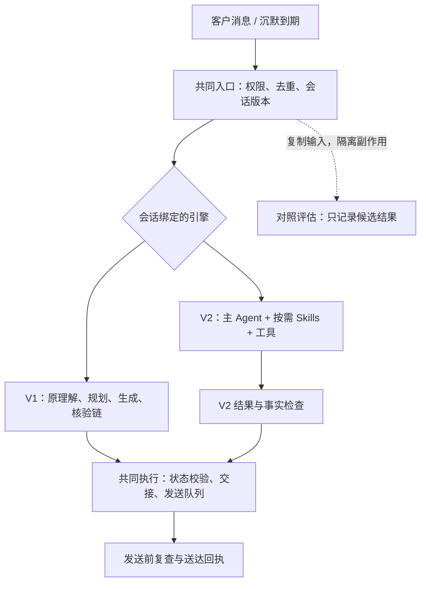

# AI 接待 V2：Skills 架构与 V1 共存开发方案

日期：2026-09-16。状态：V2 共存预览已实现并部署，默认仍为 V1，尚未启用真实 V2 流量；实现与验收记录见 `ai-reception-v2-preview-release-20260916.md`。

## 1. 目标与决策

在当前应用内新增 V2 回复引擎，保留 V1 可运行、可选择、可回退。V2 采用“一个主 Agent + 按需 Skills + 受控事实/素材工具”，同时处理客户消息和沉默事件。不是复制整套应用，也不是让两个版本同时回复同一客户。

V2 要验证四个结果：多轮承接自然、追问与留资适时、沉默时知道不发、完成回复更快。事实边界、拒绝停止、人工接管、发送权限不能退步。

先沿用现有模型供应商，核实其工具调用能力后接入独立适配器；不把改架构与换模型混成一个实验。另行比较模型时使用相同 V2 版本、数据和用例。暂不引入多 Agent、向量数据库或全新 Agent 框架。

## 2. 现有接入依据

| 当前代码 | V2 接入方式 |
| --- | --- |
| `backend/app/decision_service.py` | 现有统一决策入口；在其上增加引擎分派，V1 仍走原路径 |
| `realtime_reply_pipeline.py`、`silence_touch_pipeline.py` | 保留 V1 实现及测试，V2 不在其内部叠加分支 |
| `live_reply.py`、`live_sop.py` | 读取同一个会话版本绑定；复用交付控制，但不得把 V1 的资料推进隐式施加到 V2 |
| `automation_service.py`、`automation_api.py` | 演练选择版本、隔离会话副本和虚拟时间 |
| `route_packages.py`、`web_knowledge.py` | 复用批准事实、素材和发布作用域；V2 工具按需读取 |
| `reception_rollout.py`、发送队列和人工接管模块 | 继续作为两版本共同的授权与执行边界 |
| `release_provenance.py` | 新增 V2 Skill、策略、工具契约指纹；不以全项目源码指纹代替实际引擎发布身份 |

仅切换 `generate_decision` 内模型是不够的：现有适配器还可能展开首轮资料、更新内容组并创建跟进任务。实施时必须逐条核对这些后处理，确保 V2 的简短回复不会再次被展开成整包资料。

## 3. 共存架构



共用业务事实、客户真实消息、人工状态和已送达记录。V2 的推理状态、跟进判断和候选草稿独立存储，不能污染 V1 的阶段计数。共用基础设施的修改仍须运行 V1 回归，并不意味着 V1 文件不变就绝对无回归。

### 版本绑定与发布

- 老会话与缺失版本的旧任务默认 V1；数据库采用增量迁移。
- 绑定包含 `engine_version`、`engine_release_id`、`binding_revision`。真实会话与演练会话使用明确的主体类型及作用域，不能仅按 Chatwoot 会话数字 ID 区分。
- 一个会话的即时回复和自动沉默跟进必须绑定同一引擎。新默认只影响新绑定，不逐条消息随机切版本。
- 任务入队时记录引擎绑定、策略版本、会话控制版本和输入水位；执行前及每条实际发送前复查。
- 发布制品记录 Skill 包哈希、工具契约、模型配置、跟进策略与产品快照。每个已发布 Skill 包不可原地修改。
- 新任务使用经解析的有效知识快照；同一任务内固定。知识被撤回或禁用时发送前必须拦截，不能用“固定快照”绕过撤回。
- V2 选择范围只是现有真实发送许可的子集，不能开启总开关、绕过 AI 标签、Inbox 权限、会话白名单或渠道限制。

## 4. Skills 组织

建议源码位置：`backend/app/reception_v2/skills/`。首期由代码版本管理并通过发布流程生效，不开放在线任意编辑或加载任意路径。

```text
skills/
  routes/
    peach_9d_2027/SKILL.md
    peach_11d_2027/SKILL.md
  route_selection/SKILL.md
  concern_resolution/SKILL.md
  lead_handoff/SKILL.md
  silence_followup/SKILL.md
```

每条线路一个 Skill，但相同规则放在通用技能中，避免两条线路各复制一套风格、留资和停止规则。

### 线路 Skill 的内容

适用/不适用场景、线路定位与差异、回答组织方法、事实工具查询指引、素材选择原则、需要核实的边界、少量高质量多轮示例。价格、余位、优惠、图片及完整长篇资料继续放在批准产品数据中；示例数字明确作为占位或来自测试夹具，不作为现行报价。

主提示词只保留身份、通用对话原则、工具使用边界和技能索引。绑定线路的 Skill 可由服务端预载；未知线路时只提供索引与简短目录，通过工具加载；比较时允许读取两条线路。通用技能按当前任务加载，同一版本内容不在每次工具轮重复注入。

“已选线路”不等于“立即发送完整资料包”。V2 默认先回答当前问题；客户明确要求完整资料时，才生成有序发送计划。每份素材必须有当前问题或明确请求作为发送理由。

## 5. V2 主 Agent 与工具边界

建议模块：`contracts.py`、`runtime.py`、`model_adapter.py`、`skill_registry.py`、`tools.py`、`validation.py`、`state.py`、`silence_policy.py`，位于 `backend/app/reception_v2/`。增加轻量引擎入口和 V1 适配，不重写现有 V1 决策契约。

### 首期工具

| 工具 | 返回与限制 |
| --- | --- |
| `load_skill` | 仅返回已发布包中的已知技能；不能执行脚本或访问任意路径 |
| `get_route_catalog` | 批准上线线路的简短差异与标识 |
| `get_route_facts` | 当前主题需要的事实、引用、版本、作用域及未知项；按服务端会话身份查询 |
| `get_route_materials` | 素材标识、用途、相关事实、是否已送达；不直接发送 |
| `get_contact_policy` | 可用联系渠道和接待规则；不暴露服务凭证 |

首期不提供任意 SQL、浏览器、Shell、任意 URL 抓取或直接 Chatwoot 写工具。价格计算和未来实时库存应通过确定性业务工具完成；暂无数据时返回未知，不用历史聊天推断。

主 Agent 输出结构化结果：`reply / handoff / no_action`，正文、有据引用、素材标识、结构化状态更新建议；沉默事件另含 `send / defer / stop`、原因及受约束的建议时间。其输出映射到现有交付契约；留资、转人工和任务调度由共同执行层完成，模型不直接写库或发送。

### 对话状态

保留原始消息、已验证客户事实和送达记录；新增带证据的已解决/未解决问题、最后未答追问、考虑或讨论状态、留资是否询问、连续未回应次数、下一次联系约定。

把客户原话事实与模型推断分开。状态更新携带来源消息 ID；沉默事件不能凭空新增客户偏好。总结可以用于压缩上下文，但不能覆盖原始证据。只有有效结果被接受、相关交付确认后，才提交对应的沟通状态；不能在草稿生成时就标记“客户已收到”或“问题已解决”。

### 核验与延迟

- 不再固定要求“理解模型 → 代码销售规划 → 生成模型 → 核验模型”每轮完整串行。
- 主 Agent 在有界工具循环中完成判断，独立只读工具并行；设置最大轮次、输出与总耗时预算，超限给出可控失败结果。
- 引用存在不等于正文受其支持。涉及自由表述的费用、优惠、供氧、手续或其他需核实承诺，首期保留发送前专项核验；确定性报价使用结构化批准数据渲染。后续按证据缩减核验，不能凭模型自报“低风险”跳过。
- 对一般承接、简短追问和拒绝回应不强制增加第二次模型核验，仍做停止条件、长度、素材和结构检查。
- 适配器核实现有模型是否支持稳定工具调用、并行调用、流式输出和缓存；不把 Anthropic 的缓存或提前分发机制假定为现有供应商能力。
- 演练 UI 可显示生成进度/草稿，必须区分未核验内容；真实渠道只发最终通过检查的消息，不能为首字速度发送半成品。

## 6. 沉默唤醒

复用现有持久化任务、执行租约、取消和送达设施。V2 自动跟进策略独立配置，默认继承共同频次上限而不继承 V1 的内容推进顺序。V1 保持原有节奏。

处理步骤：

1. 到期先检查发送许可、最近客户消息、明确拒绝、人工接管、时段、频次、连续未回复上限。
2. 通过后把 `silence_due` 事件、沉默时长、客户阶段、上次追问、待解决问题和已发送内容交给主 Agent。
3. 主 Agent 按线路与沉默技能决定：发一个有价值的补充、延后，或停止本轮主动联系。
4. 服务端约束延后时间、次数和最大跟进周期；跳过/延后不自动推进销售阶段。无新价值不发送。
5. 队列执行时再次校验绑定版本、会话版本和触发水位；新消息或人工接管使旧结果失效。

状态语义：`defer` 仅在将来重新评估；`stop` 结束该轮主动任务，不永久拒绝客户；客户明确拒绝的自动联系禁用状态独立持久化，收到新消息也不能简单抹除其渠道拒收偏好。客户重新主动咨询可以正常回答。

### 首期建议配置（仅供隔离验证，不自动发布）

- 普通沉默：先以 30 分钟为首次评估等待，单日最多 2 次主动跟进，连续 2 次无回应后停止本轮；是否有效由评测和后续小范围真实数据决定。
- 已约定联系时间：遵守明确约定，并受渠道/联系时段约束。
- 与家人讨论或需要考虑：不进入分钟级连发；无约定时间时至少等待 24 小时再评估，最多一次未提供过的转发摘要。
- 等待人工核实：没有新结果就不追加销售内容。
- 明确拒绝或人工接管：代码阻断，不调用模型寻找新的营销话术。

对照实验分两层：先相同事件、相同计时比较 V1/V2 内容决策；再用各自策略的虚拟时间评估整段旅程，避免把调慢频次产生的改善全部归于模型架构。

## 7. 数据、任务与切换一致性

新增引擎绑定和 V2 状态存储，任务/运行记录增加执行版本信息；实际表设计在第一阶段基于现有约束确定，但必须满足以下不变量：

- 同一触发事件在真实交付侧只有一份交付许可，不能因为引擎不同而允许重复发送。幂等身份由事件/发送项决定，引擎版本作为元数据，不作为绕开原幂等约束的方式。
- 对照运行单独记录，使用只读业务工具和内存/隔离状态，无出站、交接、客户画像及调度写权限；现有 `automation_shadow.py` 的观察机制不自动等于完整 V2 对照隔离。
- 后台对照使用独立低优先级执行容量和预算，不能阻塞正式回复或共享同一个模型限流桶导致线上变慢。
- 多条资料发送期间切版本，只取消未发送部分；已发送记录保留且不能重发。发送结果不确定时先核对，不把它当成未发送重试。

### 手动切换/回退

先暂停该会话自动任务，等待执行中的发送结束或进入可核对状态；事务内增加绑定版本、取消旧版本待发任务并切换引擎。旧 worker 即使稍后返回也不能提交。交付中的外部请求不能靠数据库版本追溯撤销，必须先结束或核对后再恢复。

V2 → V1 时只投影有证据的客户字段、当前线路、真实送达记录和拒绝/人工状态，不能直接把 V2 推断阶段当 V1 状态；兼容性无法证明时暂停自动跟进，正常提示人工检查。回退绝不解除已存在的停止或人工接管状态。

默认不在 V2 失败后自动调用 V1 再回复：这会增加尾延迟并带来重复动作风险。首期采用有限重试及受控暂停/交接，运营可显式回退。紧急开关可停止 V2 新任务和未发消息，V1 原会话继续运行。

## 8. 演练与管理界面

- 新建演练时选择 V1 或 V2，默认 V1，显示绑定发布版本。
- “同题对比”从相同输入快照创建两份独立状态；支持连续多轮和虚拟时间，不能让一个版本读到另一个版本刚生成的答案。
- 比较显示最终回答、是否跟进、耗时、模型调用次数、事实引用、加载技能及工具调用摘要；展示决策原因摘要，不索取或展示模型隐藏推理过程。
- 管理页展示当前默认、新会话试点范围、V2 暂停状态和发布版本；权限及 CSRF 沿用现有机制。
- 切换正在运行的真实会话时展示待取消任务和恢复策略。版本设置不得伪装成“开启发送”。

## 9. 分阶段开发与交付

| 阶段 | 工作与交付 | 完成条件 |
| --- | --- | --- |
| P0：基线与接口 | 固化 V1 发布、构建输入/结果契约、盘点资料展开与任务副作用、确认模型能力 | V1 回归通过，确定可复现基线和适配范围 |
| P1：共存基础 | 引擎分派、绑定、增量迁移、任务版本校验、纯 V1 适配 | 全部默认 V1，旧会话和旧任务兼容，切换竞态测试通过 |
| P2：V2 主动回复 | 主 Agent、只读工具、9 日 Skill、通用技能、状态证据、风险核验、11 日与比较支持 | 演练多轮可用，无实际交付副作用；两条线路和切换有覆盖 |
| P3：V2 沉默跟进 | 同一 Agent 接受沉默事件，send/defer/stop、有界调度、停止与取消 | 虚拟时间验证拒绝、考虑期、新消息打断、待人工核实、无价值不发 |
| P4：对照与界面 | 演练版本选择、隔离对比、指标、发布制品和切换界面 | 可重现完整对话对比，所有记录可追溯到实际版本 |
| P5：发布与试点 | 部署未启用的 V2、验证恢复流程，提供小范围启用清单 | 发布时保持发送许可不变；达到门槛后再决定真实试点 |

每一阶段都产出可运行代码和检查结果。当前请求交付设计方案，不预先声称实现完成。真实试点的渠道、会话范围、时间和回退方案应在评测完成后形成具体清单；已有生产禁发状态继续保持。

## 10. 验收设计与建议门槛

### 基线公平性

V1/V2 固定模型、批准知识作用域、输入历史、并发、网络条件和冷热缓存条件。记录每轮调用数、输入/输出 token、模型等待、工具耗时、核验、排队、最终可发送耗时和实际交付耗时；UI 首字与真实渠道可发送时间分开。

现有 68 条历史问题逐条复核期望，明确合理转人工与不必要转人工；保留原始结果，不事后批量改判。19 场景和 12 场景作为回归来源而非新的独立统计总体。

### 必测场景

普通咨询、连续简短追问、两线路比较与切换、带人数日期的复合提问、临时路况和优惠未知、健康承诺、先与家人讨论、已索取未留资、明确拒绝及主动恢复、8 人交接、有效联系方式交接、人工插话、客户消息在生成/排队期间到达、部分素材已送达、供应商超时、Skill/事实版本变化、跨租户/Inbox 读取隔离。

### 门槛

| 维度 | 建议接受条件 |
| --- | --- |
| 操作安全 | 双发、越权、拒绝后主动联系、人工接管后自动发送、对照运行写业务状态均为 0 |
| 事实 | 发布验收集无未经支持的关键价格、优惠、实时状态和保证；未知项有合理处理 |
| 对话质量 | 人工盲评问题覆盖率至少 95%；重复解释、不合时机留资等分别统计，不用关键词通过率替代 |
| 多轮效果 | 代表性多轮场景至少重复 3 次；自然度和适时推进优于 V1，且不靠大量转人工获得表面正确 |
| 速度 | 同条件普通问答的最终可发送 p50 目标比 V1 降低至少 30%，p95 不恶化；工具密集/高风险场景单列 |
| 样本与成本 | 性能对比建议每引擎至少 100 轮并报告实际样本量；记录单轮及整段旅程成本，若显著上涨须解释收益 |
| 回退 | 带待发任务、部分送达、模型运行中的切换演练通过；V1 核心回归保持通过 |

这些是待验证目标，不是预先保证。真实留资率、满意度和投诉率需要受控真实运行后评估，不能从模拟回答推导。

## 11. 主要工程取舍

1. Skill 是对话能力描述，不是绕过后端权限的插件。首期不运行 Skill 附带代码。
2. 保留 V1 不等于建立两套业务事实、队列和客服后台；共用稳定设施，隔离决策与状态。
3. 不把“更快”建立在取消所有事实检查或提前发送未经验证文本上。
4. 不把首轮整包资料、固定尾问和内容组推进偷偷带入 V2；这是架构迁移必须检查的重点。
5. 第一版追求能公平比较、能停止和能回退，不先建设复杂的在线技能编辑平台。

开发起点为 P0/P1；首个可供试用的交付节点为 P2 的 V2 演练回复，随后接入 P3 沉默跟进。V1 在整个过程中保留为默认和基线。
