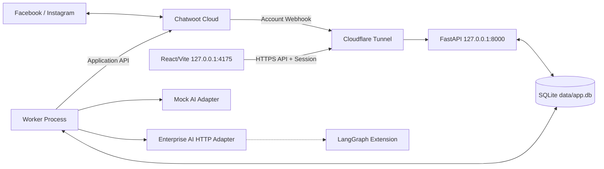
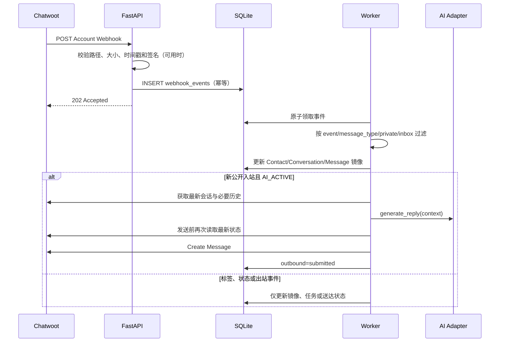

# 系统架构设计

## 1. 系统边界

Chatwoot 负责渠道授权、消息收发、联系人、会话、人工工作台、团队和坐席。本平台负责 AI 接管判断、SOP 调度、人工升级、业务状态、权限、审计和 BI。



Cloudflare 路由：

```text
ai.luoxuecong.asia  -> http://127.0.0.1:4175
api.luoxuecong.asia -> http://127.0.0.1:8000
```

## 2. 进程模型

本地运行四个进程：

| 进程 | 职责 | 不承担的职责 |
|---|---|---|
| Frontend | 页面、表单、状态展示 | Token 托管、权限最终判断 |
| API | 登录、RBAC、业务 API、Webhook 校验与入库 | 长时间 AI 调用、SOP 等待 |
| Worker | Webhook 消费、AI 调用、SOP、Chatwoot 出站 | 浏览器请求会话 |
| cloudflared | 公网 HTTPS 转发 | 业务鉴权和数据存储 |

API 和 Worker 使用同一代码库、配置和 SQLAlchemy 模型，但以不同入口启动。开发环境固定一个 API 进程和一个 Worker 进程。

## 3. Webhook 数据流



Webhook API 不调用 AI，不直接向 Chatwoot 发消息。成功入库返回 `202`；重复事件也返回 `202`，但不创建第二个处理任务。

## 4. AI 生效状态

生效判断按以下优先级执行，高优先级阻止不能被低优先级开启覆盖：

```text
租户关闭
  > Inbox 关闭
  > Contact 拒绝联系/黑名单
  > Conversation 客诉/人工接管/AI关闭
  > can_reply=false 或渠道时间窗口关闭
  > Conversation AI开启
  > Inbox 默认策略
```

Conversation 标签控制当前会话；Contact 标签只承载跨会话强阻断。`conversation_updated` 和 `contact_updated` 只更新状态，不调用 AI。只有新的公开入站 `message_created` 可以触发被动回复。

## 5. 出站一致性

同一 Conversation 的 AI、SOP 和人工平台动作必须串行：

1. Worker 原子领取任务并取得 `conversation_id` 锁。
2. 重新读取本地最新版本，必要时调用 Chatwoot Conversation Details。
3. 检查人工接管、阻止标签、最后入站时间、`can_reply`、频控和消息能力。
4. 使用业务幂等键创建 `outbound_messages`。
5. 调用 Chatwoot Create Message。
6. API 成功只更新为 `submitted`。
7. 收到 `message_updated` 或主动查询后更新 `delivered/failed/read`。

AI 生成期间若状态版本发生变化，生成结果作废，不允许继续发送。

## 6. SOP 调度

SOP 不是 Chatwoot 定时任务。平台保存版本化流程，并将每个到期动作写入 `sop_jobs`：

- 相对客户入站、出站、标签或阶段变化的时间。
- 固定日期时间，按租户时区解析后保存 UTC。
- 周期检查，只为符合受众且已有会话的客户创建任务。

Worker 轮询到期任务。发送前执行与 AI 相同的会话锁和最终检查。客户新入站、人工接管、已留资、拒绝联系或策略暂停会取消未提交任务。

## 7. SQLite 运行约束

连接初始化执行：

```sql
PRAGMA journal_mode=WAL;
PRAGMA foreign_keys=ON;
PRAGMA busy_timeout=5000;
PRAGMA synchronous=NORMAL;
```

约束：

- API 与 Worker 使用短事务，外部 HTTP 调用不得持有数据库事务。
- Worker 首期单进程运行；同一会话永远只允许一个运行中任务。
- 任务领取使用条件更新和租约时间，崩溃后可重新领取。
- 数据库文件位于 `data/app.db`，媒体位于 `data/uploads/`。
- 每次迁移前备份数据库；测试使用独立临时数据库。

## 8. 迁移边界

出现以下任一情况时迁移 PostgreSQL，并考虑 Redis/专用队列：

- API 或 Worker 需要多实例。
- 持续写入竞争导致 `database is locked`。
- 待处理任务长期超过 10,000 条。
- 需要高可用、跨机器部署或零停机迁移。

数据访问必须通过 Repository/Service，不在业务代码中使用 SQLite 专属 SQL。时间统一保存 UTC ISO 8601，JSON 字段以 SQLAlchemy JSON 类型访问，为后续迁移保留兼容性。

