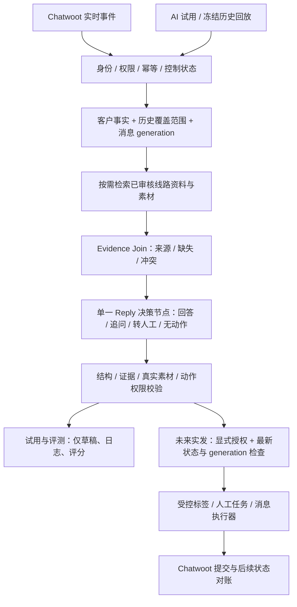

# 其他项目 AI 架构在旅游 Chatwoot 平台中的复用评估

日期：2026-08-26。本文是代码对照与架构建议，不是已完成的迁移说明。

## 1. 结论与核查范围

**建议：保留本项目的 Chatwoot、Cloudflare Relay、登录权限、FastAPI、SQLAlchemy/Alembic、SQLite 和 React/Vite；借用原项目 V3 的 Evidence → Reply 决策方式，并逐项提取模型调用、消息协调、交付确认和回放评测能力。**

不是把美业系统换一套提示词，也不是把 M、V3 所有节点串成更长的流程。本平台的目标仍是旅游咨询承接、资料介绍、需求收集、合规留资和人工协作，而非迁入原项目的门店、预约金和支付流程。

本次依据：

- 阅读用户提供的[架构文档](E:/ai_code/vscode_codex/coze_cli_project/output/architecture/2026-08-26/项目流程框架与可复用架构设计文档.md)及[代码证据索引](E:/ai_code/vscode_codex/coze_cli_project/output/architecture/2026-08-26/代码证据索引.md)。
- 抽查索引指向的 M 冻结源码：`model_client.py`、`platform_reply_coordinator.py`、`message_delivery.py`；V3 冻结源码：`parallel_reply_chain.py` 中证据汇合与 Commit 准备部分。
- 对照本项目的模型适配、业务分支、评测、试用接口、Webhook Worker 和 Chatwoot Client。
- 未重新审阅原项目全部源码、未执行其测试、未验证其线上性能。原文标为“建议方案”的通用对象不能当作现成 SDK。
- 本轮只新增评估文档，不修改业务代码、数据库、运行开关，不调用模型或 Chatwoot，不发送客户消息。

**“高复用价值”不等于“可以直接复制运行”。目前没有足够证据认定任何完整服务可以零改造迁入。**

## 2. 可复用能力与当前代码的对应关系

| 能力 | 复用方式 | 对当前旅游项目的作用 | 必须适配的边界 | 优先级 |
|---|---|---|---|---|
| 统一 ModelClient | 提取代码候选，适配配置和测试 | 统一 DeepSeek、HTTP AI 的超时、有限重试、JSON 校验、Token 与耗时记录 | 原实现依赖专有 Settings、模型档位和响应辅助模块；异步接口与本项目同步调用需统一 | P0 |
| EvidenceSnapshot 与 Evidence Join | 复用合同和编排方式，不整段复制领域字段 | 把聊天、真实需求、线路事实、素材和缺失资料作为同一份有来源的输入 | Follow/门店事实改为本地知识版本、Chatwoot 事实和旅游资料 | P0 |
| V3 的单一最终决策节点 | 复用决策所有权设计 | 同时处理客户多个问题、推荐资料、追问需求、提出转人工 | 旅游提示词重写；代码保留安全与执行约束，不再多次重写销售语义 | P0 |
| 带来源的客户记忆 | 复用事实与推断分层方法 | 保留人数、月份、珠峰偏好、已发素材、联系方式状态，减少重复询问 | 客户陈述、顾问确认、模型推测分开；客户修正需求需更新证据 | P0 |
| Run / NodeTrace / 模型尝试记录 | 复用结构与测试思路 | AI 试用页定位慢在哪里、为何转人工、引用了什么资料 | 不迁入原始日志快照；沿用本项目权限、脱敏和留存 | P0 |
| 多轮回放、golden/critic | 复用评测组织和 fake client 思路 | 判断真实咨询承接是否改善，而不只验证 JSON 合法 | 用旅游标注样本替换美业样本；模型评分是辅助，不是真值 | P0 |
| 消息合并、取消和新鲜度检查 | 提取协调算法，持久化适配 | 客户连续发“几个人”“九月”“不去珠峰”时避免逐条抢答与过时回复 | 原协调器是进程内字典与锁；本项目必须补 SQLite generation/租约语义 | P1 |
| 结构动作和素材引用 | 复用 allowlist、真实资源校验方法 | 生成文字、选择行程图、建议标签、留资、转人工 | 不迁入支付/门店工具；模型只能选 asset_id，不能编造 URL 或直接操作 Chatwoot | P1 |
| Dispatch 与交付确认 | 复用状态机和冲突校验，重写平台协议 | 关联 AI/SOP 生成、提交、送达、失败和未知结果 | 原 client_message_id/回调协议不是 Chatwoot 协议；不能假设下游支持相同幂等保证 | P1 |
| Plan / Task 依赖与取消 | 复用调度方法，扩展现有 SOP 表 | 首节点成功后才执行后续；客户回复、人工接管后取消旧计划 | 不复制首日营销频次与加微时间规则；依当前渠道与策略判断可否自动触达 | P2 |
| 配置版本、审计与回滚 | 复用版本化方法 | 每次试用对应明确模型、Prompt、知识、安全策略版本 | 使用 SQLite revision 与乐观锁，不迁入多个可覆盖的 JSON 配置副本 | P1 |
| BI / 调试页 / 日志下钻 | 复用信息结构和指标链路 | 首页看业务结果，第二页试 AI，失败可下钻节点记录 | 保留 React/Vite；原 Next API、全站壳、权限和美业指标不直接搬 | P1 |

P0 是当前只读试用阶段最值得先做的能力；P1 是可靠性与未来受控联调；P2 不阻塞当前回复质量验证。此排序不是工期承诺。

## 3. 当前实现中，复用最能解决的缺口

### 3.1 素材已登记，不等于模型已经掌握业务资料

当前 `_system_prompt()` 只把六分支名称、必填槽位、完整标记和简短描述交给模型，没有把线路页面正文或素材事实作为可检索证据注入。[代码位置](E:/ai_code/travel_ai_Chatwoot/backend/app/deepseek_evaluation.py:76)

知识初始化为每个分支建立的节点也只是该句简介；`complete=true` 不能证明具体问题的资料完整。[代码位置](E:/ai_code/travel_ai_Chatwoot/backend/app/business_knowledge.py:99)

应复用 Evidence 设计，建立“问题 → 已审核事实 → 原始来源片段 → 可用素材”的关联。图片文件名只辅助分类，不足以证明价格、设施参数、医疗效果或合同承诺。资料完整性按问题/事实判断，不只按整条线路判断。

### 3.2 当前存在业务语义被关键词覆盖的问题

`apply_business_guard()` 会重新用关键词确定分支，覆盖模型给出的分支。[代码位置](E:/ai_code/travel_ai_Chatwoot/backend/app/evaluation_service.py:65)

按当前判断顺序，“桃花9日，不上珠峰”会先命中 `other_no_peak`，而不是 `peach_9d`。这是静态代码可推导的行为，本轮没有做线上复现。[代码位置](E:/ai_code/travel_ai_Chatwoot/backend/app/business_knowledge.py:46)

**保留代码控制出站、权限、人工状态、未知事实和动作合法性；不要让几个关键词替代对完整客户需求的理解。** 现有高风险关键词是粗筛，不是事实核验器，也不能靠删除它们就直接开放实发。应在补齐证据检查和回放测试后逐步替换。

### 3.3 评测和未来实时回复不是同一条业务链

正式 Worker 调用通用 `decide()`，而离线评测、试用页调用 `call_deepseek()` 与业务 guard。[实时入口](E:/ai_code/travel_ai_Chatwoot/backend/app/worker_main.py:298)、[试用入口](E:/ai_code/travel_ai_Chatwoot/backend/app/evaluation_api.py:214)

目标应是三个入口共用同一套只生成决策的旅游应用服务，外部效果由不同执行器处理：

- 试用：使用模拟上下文，只返回草稿和追踪结果。
- 离线回放：使用冻结历史与知识版本，保存评测，不更新真实客户状态。
- 未来实时：使用最新授权事实，二次检查后才允许受控动作。

这比单独把试用页“调得很聪明”、但实时仍走另一套流程更可靠。

### 3.4 现有评测不能直接证明语义准确率

当前评测将 `expected_branch` 作为 `branch_hint` 传给模型，而后又与该分支比较；最终输出还受同类关键词规则覆盖。这不能作为独立分支识别准确率。[模型输入](E:/ai_code/travel_ai_Chatwoot/backend/app/deepseek_evaluation.py:88)、[指标实现](E:/ai_code/travel_ai_Chatwoot/backend/app/evaluation_service.py:79)

应复用原项目的多轮回放和标注流程，并修正口径：模型不读取预期答案或后续人工回复；人工参考答案仅用于评审。用户在试用界面主动选的路线可以作为场景约束，但必须与“自动识别能力评测”分开统计。

### 3.5 已有版本检查，但不足以表示客户消息新鲜度

当前发送前会重读会话标签与 `can_reply`，值得保留；但该路径主要比较 AI 状态版本，没有完整的“本次决策覆盖到哪条客户消息”合同。[代码位置](E:/ai_code/travel_ai_Chatwoot/backend/app/worker_main.py:327)

适配原协调器时，要新增消息 generation 与输入截止 ID。即使模型无法立刻取消，其过时结果也必须被丢弃。不能只依赖单个 Worker 的内存，因为模型调用期间可能已经有新事件到达入口或 Relay。

### 3.6 超时不是确定发送失败

当前 Worker 把 `ChatwootError` 收口为失败，尚未在该路径区分“请求未被接受”和“可能已接受但响应丢失”。[代码位置](E:/ai_code/travel_ai_Chatwoot/backend/app/worker_main.py:373)

复用 Delivery 时应增加待对账状态。只有下游权威消息 ID/事件能确认结果；无法确定时保留未知，不通过内容相同就武断确认，也不盲重发。不能承诺未经验证的端到端 exactly-once。

## 4. 业务建模也要调整，但不必推翻六分支

现有六分支混合了“线路产品”“出行时间”“是否上珠峰”和“包团方式”，并不天然互斥。客户可能同时要求“桃花11日、自组包团、明年出发”。

建议保留六分支作为兼容字段与运营分类，底层拆为以下独立信息：

| 维度 | 示例 | 事实来源要求 |
|---|---|---|
| 线路候选 | 桃花9日、桃花11日、其他、未定 | 客户偏好或明确推荐，不把推荐当客户确认 |
| 目的地与珠峰偏好 | 西藏、上珠峰、不上珠峰、未知 | 客户原话及对应消息 ID |
| 出行方式 | 拼团、自组包团、未定 | 客户确认，不能由人数自行推断 |
| 人数与出行时间 | 人数、时间范围 | 保留原始表述与标准化值；“明年”相对事件时间解析 |
| 本轮意图 | 了解行程、询价、日期、设施、留资、投诉 | 支持一轮多个问题，允许后续修正 |
| 服务阶段 | 初步咨询、需求确认、方案沟通、待顾问、已留资 | 区分可验证事件与模型建议 |
| 联系方式 | mail、电话、LINE、微信等 | 必须确认是客户自己的联系方式，不把顾问账号/官方链接计入留资 |
| 接管与联系许可 | AI 允许、人工接管、拒绝联系 | 以授权系统状态和明确客户要求控制，不由模型自行覆盖 |

历史顾问回复可以学习沟通顺序和表达方式，但不能直接升级为永久有效的价格、团期、合同和健康事实。

## 5. 推荐目标流程

以下是建议架构，不表示当前已经实现。

- Evidence Join 是确定性整理，不再调用模型重新决定业务阶段。
- Reply 是唯一最终语义决策者，不是唯一安全授权者。权限、禁发、人工接管和缺少必要事实时的阻断仍由代码强制执行。
- 小范围线路试点先用已审核的结构资料和索引；检索确有需要时再增加语义 Router，不要求每轮都调用多个模型。
- 不为复用引入 Coze、Follow、向量库或 LangGraph 等强依赖。当前有限流程可以继续采用普通应用服务与持久任务。
- 生成、标签修改、分配客服和发送都是不同结果。任一动作失败不得对客户声称“已经处理成功”；评测时更不能假装已真实转交。

## 6. 三个关键合同

### 6.1 身份范围

原项目的 `corp + wechat + customer` 不应机械替换成“客服 ID + 客户 ID”。Chatwoot 客服会被改派，他是操作者或当前负责人，不是会话身份的固定部分。

建议使用 `tenant_id + connection_id + account_id` 作为平台资源命名空间；会话以 `conversation_id` 定位，校验其 `inbox_id` 与 `contact_id`。联系人记忆与会话状态分开存储。多 Inbox/多渠道身份关联必须有明确映射，不按昵称合并。

### 6.2 证据与记忆

每项事实至少记录：`fact_id`、值、来源类别、来源消息或文档段落、观察时间、知识版本、确认状态。另保存 `missing_facts`、`conflicts`、历史覆盖范围与输入截止消息。

权威顺序按事实类型定义：Chatwoot 管分配和标签状态；客户原话管出游需求；已审核资料管线路说明；模型推断仅是待确认候选。不能拿旧摘要覆盖新客户修正。

`unknown` 必须显式存在。历史没取到不等于客户没说过，找不到联系方式不等于从未留资，渠道状态缺失不等于可以发送。

### 6.3 决策、动作和交付

统一决策包含：回答/转人工/无动作、问题覆盖、槽位更新建议、证据引用、有序消息候选、动作建议和停止原因。保留原模型结果与校验后的结果，便于解释何处被拦截。

执行器只接受批准的动作，例如 `reply_text`、`reply_asset`、`request_handoff`、受控标签建议。资源必须属于当前租户和知识版本；价格、团期等缺少实时业务来源时不自动承诺。

交付状态区分 `draft / queued / submitting / submitted / delivered / failed / submission_unknown / cancelled`，并保存平台原始状态。不是每个渠道都会给齐全部回执；未知不能显示为已读或成功。SOP 前序依赖具体依据哪个确认状态，应由策略显式定义。

## 7. 不应迁入的部分

| 原项目部分 | 不迁入的理由 | 本项目取舍 |
|---|---|---|
| M Gate、Planner 与 V3 Reply 全部叠加 | 多个节点重复解释业务，增加耗时与冲突 | 一个最终语义决策者，复杂工具确有需要再加规划 |
| 美业 Prompt、预约金、门店、订单工具 | 业务事实和写权限不同 | 重写旅游业务规范和动作合同 |
| 首日加微、沉默3分钟、两次计划等默认参数 | 企微场景不等于 Facebook/IG 自动触达规则 | 保留调度能力，另行验证渠道窗口、频控、白名单和联系许可 |
| 外部 SOP consume 20/30/70 协议 | 本项目已有自己的 SOP 与任务表 | 接入原理可用，不复制外部状态码 |
| 原进程内协调器作为唯一可靠队列 | 进程重启会丢运行状态，不能跨进程仲裁 | SQLite 持久 generation、租约和恢复流程 |
| 未知历史走透传、无响应假定发送成功 | 隐藏事实缺失和交付不确定性 | 不可靠时停止自动动作并记录原因 |
| 原 Repository、SQLite/MySQL 镜像整包替换 | 会引入第二套事务、迁移和业务模型 | 扩展现有 SQLAlchemy/Alembic，不另建主库 |
| 多版本服务、旧 fallback、Next 全站壳 | 与现有部署和前端重复，迁入历史兼容负担 | 复用必要模块及交互设计，不复制旧系统 |
| 原日志原样存储、管理密钥空值放行 | 截断不是脱敏，空配置不能成为授权 | 保留真实登录/RBAC/CSRF，按权限读取脱敏日志 |

## 8. 分阶段落地和验收

### 第一批：只读回复质量，优先完成

1. 把模型调用的预算、有限重试、JSON 校验和 usage 提取为当前项目的小模块，先锁定单一已配置提供方，不默认开启跨供应商自动回退。
2. 导入并审核旅游资料，建立事实与素材引用，接上 Evidence Builder。
3. 试用、回放、未来实时入口共用同一决策服务，但执行器严格分开。
4. 保存试用 Run 与各节点记录，建立独立人工标注的多轮回放集。

验收：每项业务事实能追到来源；假素材被拒绝；未读取评测答案；多轮需求修正正确；不请求 Chatwoot 写接口，不创建真实出站记录。**仅 schema 合法率不能代表回答质量。**

### 第二批：实时可靠性，但仍不开放客户发送

1. 合并连续客户消息，持久化 generation 和输入截止 ID，过时草稿丢弃。
2. 增加动作合同、最新权限和人工状态检查；试用与回放不得修改真实标签或客户记忆。
3. 引入交付未知状态、对账和逐条消息关联，测试重启与重复事件。
4. 知识、Prompt、安全策略、模型参数和工作流版本都进入运行记录及缓存/幂等版本键。

验收：新消息能使旧草稿失效；人工接管后不产生允许执行的发送动作；重复事件不重复创建候选；超时未知不会盲目重发；范围外资源拒绝访问。全部使用假客户端和隔离数据验证。

### 第三批：SOP 与 BI 整合

在现有 SOP 上增加依赖、取消和消息对账，不另建一套营销平台。统一区分实时回复与主动触达，避免两者同时跟进同一轮咨询。首页使用实际事件统计，试用数据不进入客户业务转化率。

未来开通实发需要单独授权和渠道验收；不在本轮架构复用中顺带启用。

## 9. 最小验证集与未确定事项

| 验证问题 | 最小实验 | 成功/失败信号 |
|---|---|---|
| 证据整理是否改善回复 | 固定模型、样本和其他配置，仅替换证据输入 | 人工复核事实依据和问题覆盖；不依赖自评分 |
| 是否需要额外 Router | 同一组多意图样本，比较有/无 Router | 按召回、漏答、总耗时和调用次数决定，不预先认定越多节点越好 |
| 需求能否跨轮修正 | 回放“桃花9日、不上珠峰”，再修改人数/月份/包团方式 | 保留已确认需求、更新被修正项，不重复问、不串分支 |
| 是否误把顾问联系方式当留资 | 分别提供客户号码、顾问 LINE、官方链接和客户仅说“有LINE” | 仅确认客户实际提供的联系方式；其余分成意向/引导/未知 |
| 新消息和接管是否能撤销草稿 | 假模型阻塞时注入新客户消息或人工接管 | 原 generation 不再获得执行资格 |
| 交付不确定如何恢复 | 假平台已接受但客户端超时，再注入状态事件 | 不盲重发，可关联确认；缺少权威关联时持续未知 |
| 哪些代码真能低成本提取 | 从冻结提交提取候选及最小依赖到隔离测试包 | 不导入原项目全局配置/业务服务，合同测试通过 |

性能必须分别记录排队、合并等待、资料检索、每次模型尝试、校验和总耗时，报告样本规模与 P50/P95。当前单次试用耗时不能证明线上吞吐或延迟目标。

仍需后续核实：冻结源码候选的完整依赖与测试兼容性、Chatwoot 各渠道实际交付与自动发送约束、资料版本的业务审核、跨 Inbox 记忆共享授权、SQLite 在目标并发下的领取和取消行为。

## 10. 本次抽查的源代码候选

- [M ModelClient](C:/Users/24159/.codex/worktrees/architecture-audit-20260826/ai_paths/app/services/model_client.py:20)：异步 HTTP、JSON、共享 deadline 和有限重试；先提取小合同，不搬原 Settings 全部字段。
- [M PlatformReplyCoordinator](C:/Users/24159/.codex/worktrees/architecture-audit-20260826/ai_paths/app/services/platform_reply_coordinator.py:51)：合并、新 generation、旧运行取消；需更换身份算法和持久化方式。
- [M MessageDeliveryService](C:/Users/24159/.codex/worktrees/architecture-audit-20260826/ai_paths/app/services/message_delivery.py:16)：幂等冲突校验、逐条回调、未知状态；平台回调合同和 Repository 必须适配。
- [V3 Evidence Join](C:/Users/24159/.codex/worktrees/architecture-audit-v3-20260826/ai_paths/app/graph/nodes/parallel_reply_chain.py:457)：汇合事实、缺失和冲突，不写客户话术；保留方法，替换原业务字段。
- [V3 Commit 准备](C:/Users/24159/.codex/worktrees/architecture-audit-v3-20260826/ai_paths/app/graph/nodes/parallel_reply_chain.py:531)：允许动作、参数和证据验证；旅游动作另行定义。

最终建议：**先把“有依据地回答、理解连续需求、可追踪地评测”复用好，再扩充主动 SOP。当前收益来自业务证据与决策质量，不来自更换框架或增加模型节点。**
