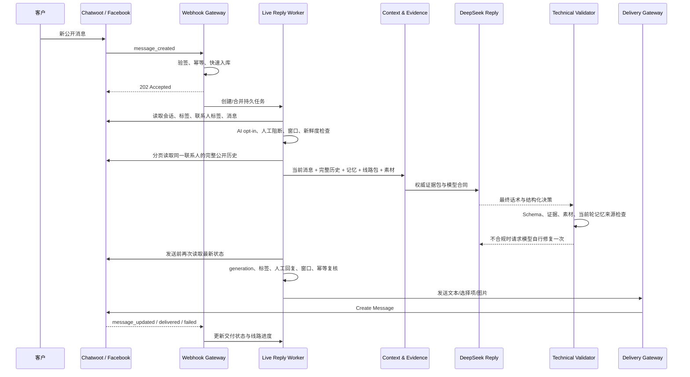

# 模型主导的 AI 客户接待架构

> 历史文档，已于 2026-09-05 停止作为当前架构依据。当前生产架构请以 `docs/product/llm-nodes-background-and-prompts.md` 和 `docs/product/llm-node-prompts-current.md` 为准。当前实现已改为“模型理解 -> 代码裁决 -> 模型表达 -> 独立事实核验”，不再由单个模型决定全部业务动作。

更新日期：2026-08-31  
适用范围：China2Go Facebook Inbox `128859`，桃花 9 日与桃花加珠峰 11 日两条已审核线路。

## 1. 核心原则

本系统采用参考项目 V3 的 **Evidence → Reply → Validate → Deliver** 思路。一次客户回复只有一个业务决策者：DeepSeek。代码不得再次用关键词、正则或分支表重判客户意图、选择线路、决定销售阶段、改写话术或决定是否索取联系方式。

| 职责 | 所有者 | 允许做什么 | 禁止做什么 |
|---|---|---|---|
| 客户意图、线路选择、当前问题、下一步推进 | DeepSeek | 结合完整历史与当前消息生成结构化决策 | Python 关键词覆盖模型判断 |
| 最终客户话术 | DeepSeek | 生成可直接发送的繁体中文 | 代码拼固定兜底文案或替换答案 |
| 内容组、图片、快捷选项、留资时机 | DeepSeek | 只引用提供的候选和证据 | 代码按问题关键词强制选素材 |
| 事实与资源真实性 | 代码 | 提供版本化 facts、线路包、可用素材；校验引用存在 | 代码新增业务事实或推断未知事实 |
| 权限与发送资格 | 代码 | AI 标签、人工阻断、24 小时窗口、幂等、新鲜度、并发检查 | 模型绕过权限直接写 Chatwoot |
| 记忆 | 模型提取，代码保存 | 模型从当前轮提取更新；代码按 generation 持久化 | 旧记忆覆盖客户最新原话 |
| SOP 时间与执行 | 代码调度，运营配置内容 | 到期、顺序、取消、频控、交付 | SOP 与被动回复同时抢发 |

只有以下极少数场景允许模型输出 `handoff`：

1. 客户已经提供可验证的 LINE、微信、电话、Email 或 WhatsApp 联系方式，需要顾问接续。
2. 客户明确要求真人。
3. 投诉、退款或合同争议需要人工实际处理。

资料不足、其他月份、其他线路、健康顾虑、实时余位、特殊报价都不是自动转人工理由。模型应说明可确认范围，继续承接客户。

## 2. 端到端流程



### 2.1 Webhook 与消息合并

- 只处理 `message_created + incoming + private=false + external_echo=false`。
- Webhook 不等待模型，先幂等入库并返回 `202`。
- 同一会话连续消息默认等待 2 秒合并，最长等待 5 秒。
- 每个新客户消息会产生新的 generation；旧的排队任务和旧模型结果失效。
- 超过 5 分钟的历史积压消息只同步，不自动补回复。
- 真人在模型生成期间回复、移除 `ai` 标签或添加阻断标签，旧结果不得发送。

### 2.2 AI 开启条件

新会话默认关闭 AI。最终状态按以下顺序计算，任一项不满足都停止：

1. 租户 AI 总开关开启。
2. Inbox AI 开关开启。
3. 联系人没有 `拒绝联系` 或 `黑名单`。
4. 会话没有 `客诉`、`人工接管` 或 `AI关闭`。
5. 本地 AI 状态与 Chatwoot 标签同步状态为 `synced`。
6. 会话当前存在精确标签 `ai`，且本地 `ai_mode=enabled`。
7. Chatwoot `can_reply=true`。
8. 最新真实客户消息仍在自动消息窗口内；Facebook 当前实现保守使用 23 小时 55 分钟。
9. 没有活跃人工任务、真人新回复或待对账的未知提交。

后台切换 AI 时必须同步 Chatwoot `ai` 标签；Chatwoot 端手工删除该标签后，本地会同步为关闭。标签被整个标签目录删除时，状态进入冲突并停止，不用本地字段偷偷继续发送。

## 3. 模型输入

每轮 DeepSeek 获得以下数据，当前客户消息始终放在输入末尾以强化最新语义：

```text
module
knowledge facts（版本化、带 fact id）
route playbook（两条线路、内容组、顺序、SOP、素材）
available materials（当前真实可用文件）
完整公开聊天历史（目标消息之前）
known route / durable memory / journey
lead capture state
current customer message
```

历史通过 Chatwoot 分页接口完整读取，不只取 Webhook 自己保存的几条消息；同时读取同一联系人在当前 Inbox 内的相关会话。私密备注、系统活动、未来消息及其他 Inbox 历史不会进入客户上下文。读取不完整或时间顺序无法确认时关闭本轮回复，不把残缺历史当成完整历史。

历史人工回复只用于理解对话，不是产品事实。价格、日期、天数、地点、酒店、车辆、接送和包含项目只能来自 `knowledge facts` 与已审核线路包。

## 4. 模型输出合同

```json
{
  "action": "reply|handoff|no_action",
  "branch": "peach_9d|peach_11d|other_destination|unclassified",
  "intent": "route_intro|price|departure|itinerary|contact|complaint|other",
  "reply": "最终可发送话术",
  "route_variant": "peach_9d_2027|peach_11d_2027|",
  "content_group_key": "本轮采用的内容组或空",
  "material_keys": [],
  "reply_options": [],
  "journey_stage": "route_selection|discovering_needs|introducing|answering|contact_ready|contact_requested|completed",
  "slots": {},
  "slot_evidence": {},
  "lead_action": "none|ask|captured",
  "contact_values": {},
  "evidence_refs": [],
  "safety_flags": []
}
```

关键合同：

- `reply` 是最终话术，外层不追加固定回复。
- 每轮最多要求客户回答一件事；多问句会退回模型自己修复，代码不删句。
- `slots` 只表示当前消息产生的记忆更新，不是完整记忆快照；当前只允许 `party_size`、`departure_window`、`budget`、`destination`，且每个字段都必须有同名 `slot_evidence` 逐字来自当前消息。
- LINE、微信、电话、Email、WhatsApp 只能进入专用 `contact_values`，不得重复进入通用 `slots` 或 Journey。
- 未确认线路时 `route_variant` 留空，返回两条合法 `reply_options`，不绑定内容组或图片。
- `material_keys` 只能引用所选线路、所选内容组和真实可用素材的交集。
- 具体事实必须带合法 `evidence_refs`。
- 模型不能生成 Chatwoot ID、文件路径、URL、标签写操作或发送权限。

## 5. 技术校验边界

Validator 只做以下客观检查：

- JSON Schema 与枚举合法。
- 线路与 branch 字段一致。
- 当前轮 slot 证据确实出现在当前客户消息。
- fact id、内容组、素材 key、快捷选项均在允许集合。
- 待选择线路时不得同时绑定线路、内容组或素材。
- 客户联系方式必须能从当前原文逐字验证。
- 通用记忆字段必须属于已声明业务 Schema；联系方式写入通用记忆会被判为合同错误并要求模型修复，持久化层仍会再次过滤。
- 最多一个问句；不合格交给模型修复。

Validator 不做以下操作：

- 不通过关键词判断客户属于哪条线路。
- 不选择下一内容组。
- 不把模型回复替换成固定文案。
- 不因资料不足自动转人工。
- 不决定何时索要联系方式。

## 6. 记忆与线路主线

记忆分三层：

| 层 | 内容 | 更新方式 |
|---|---|---|
| 原始历史 | Chatwoot 公开消息与时间 | 只读分页同步 |
| Durable Memory | 人数、时间、偏好等稳定事实及原文证据 | 模型从当前轮提取，代码按 generation 合并 |
| Journey | 当前线路、阶段、已发送内容组 | 模型决定，交付成功后代码确认 |

最新客户原话优先级最高。客户改变线路时由模型清空旧线路进度；线路真正切换后，代码只负责重置旧线路的已发内容组，防止跨线路素材污染。

两条线路都来自版本化产品包：

- `peach_9d_2027`：桃花 9 日，不上珠峰。
- `peach_11d_2027`：桃花加珠峰 11 日。

每条线路包包含 facts、内容组、主线顺序、图片引用、价格/留资阶段和沉默 SOP 节点。增加新线路时优先新增同一 Schema 的产品包、资料和回放集；只有产品确实出现新能力时才改全局 Prompt 或代码合同。

## 7. 被动回复与 SOP 协调

统一优先级：

```text
人工/安全阻断
→ 客户新消息
→ AI 被动回复
→ 已发布且合格的 SOP 节点
→ 沉默唤醒
```

- 客户新消息到达后，旧 SOP 入组按策略结束，未提交节点取消，被动回复优先。
- 被动回复命中具体问题时可跳到对应内容组；之后的沉默主线仍从未成功交付的组继续。
- 内容组和素材只在 Chatwoot 返回可追踪消息 ID 后标记已提供；提交未知不盲重发。
- 同一内容组默认不重复发送；只有模型明确判断客户要求重发且 `allow_material_resend=true` 才允许。
- SOP 只负责按发布版本执行审核过的文字、图片和时间，不重新理解客户问题。
- SOP 到期前重新读取标签、人工状态、最新客户消息、自动窗口和素材状态。
- 客户回复、人工接管、留资、阻断标签或窗口关闭都会终止后续节点。

## 8. 留资与人工接管

模型决定何时自然索要一种联系方式。代码只防止重复索取，并验证客户本轮确实提供了账号、号码、邮箱或链接。

客户只说“我加你 LINE”但没有实际 ID，不算留资；AI 继续请客户直接发 ID。客户提供有效值后：

```text
模型确认收到
→ 写入留资状态
→ 移除 ai 标签
→ 添加已留资/人工接管标签
→ 创建人工任务
→ 后续 AI 与 SOP 停止
```

## 9. 超时、失败与一致性

- 模型单次最多 20 秒，整轮预算 30 秒；仅对网络、限流和服务端临时错误重试。
- JSON/合同错误允许模型自行修复一次，不用 Python 生成替代业务回复。
- DeepSeek 无首 token 或持续超时时，本轮标记失败并保留可重试状态；不向客户发送乱码、固定“请找顾问”或半截回复。
- 发送前再次读取 Chatwoot。generation、标签、人工回复、窗口或会话版本变化时丢弃旧结果。
- 每个触发消息、AI Run、文本和图片都有独立幂等键。
- Chatwoot Create Message 成功只记 `submitted`；`message_updated` 或查询结果决定 `delivered/failed`。
- `submission_unknown` 必须先对账，不自动重发。

## 10. 当前验证结论与边界

- v22 冻结快照：217 个会话、591 个有效真实客户轮次；排除 13 个纯附件轮次和测试会话 `#26`。
- v22 DeepSeek 全量分层回放：68 个案例全部完成并通过，其中桃花 9 日 24 个、桃花加珠峰 11 日 24 个、长上下文 12 个、留资与联系方式 8 个。
- 模型 P50 为 2511 ms，P95 为 4932 ms；模型基础设施失败 0，结构输出失败 0。
- 3 个真实联系方式捕获案例均只把联系方式保存在专用字段，通用记忆没有联系方式副本。
- 评测前后 `outbound_messages` 均为 22，Chatwoot 写请求为 0；真实客户没有收到回放消息。
- `intent_match_rate=0.5588` 只是模型意图与离线启发式标签的一致度，没有独立人工标注，不能称为业务准确率；验收以事实、线路、素材、转人工必要性和交付安全合同为准。
- 当前只完整承接两条线路。其他线路会说明资料边界并继续引导，但不会编造行程。
- 图片理解尚未作为客户入站能力验收；客户只发附件且无可解析文本时不应猜测图片内容。
- SQLite 与单 Worker 适合当前小规模联调；多实例生产前需迁移 PostgreSQL/Redis 或实现等价的分布式租约与队列。
