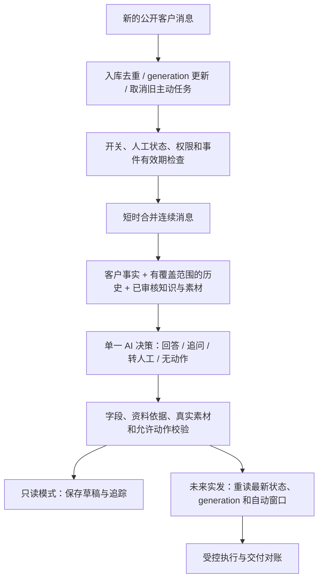
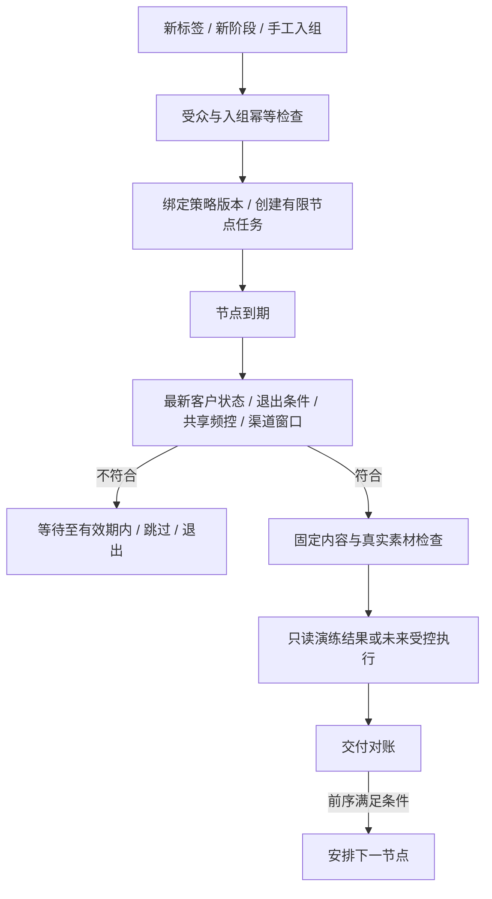
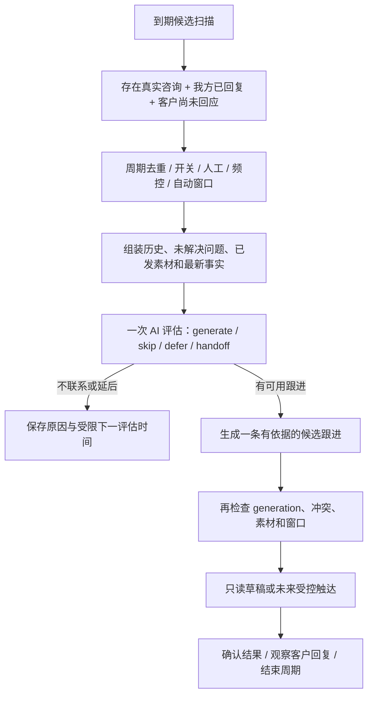
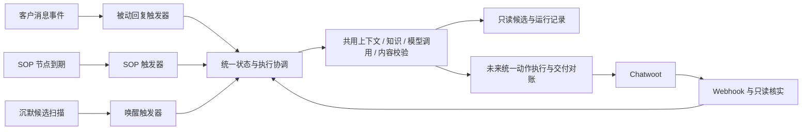

# AI 被动回复、SOP 定时触发、沉默客户唤醒设计

版本：设计稿 v1，2026-08-26。

本文定义产品边界、流程和开发合同，不表示功能已经完成。本轮只新增文档，不修改数据库、运行配置或消息发送链路。

## 1. 总体定位

平台的三项核心业务能力按触发原因划分，而不是建设三个独立的 AI 系统。

| 板块 | 解决的问题 | 触发来源 | 内容来源 | 主要结果 |
|---|---|---|---|---|
| AI 被动回复 | 客户刚发来消息，应该怎么回答和承接 | 新的公开客户消息 | 当前问题、历史需求、已审核线路资料 | 回复、追问、转人工、无动作 |
| SOP 定时触发 | 事先设计的跟进应该何时执行 | 已发布策略的节点到期 | 运营配置的文字和素材，必要时限定润色 | 执行节点、延期、跳过、退出 |
| 沉默客户唤醒 | 客户没有继续回应，现在是否值得再联系 | 沉默周期达到策略条件 | 当前咨询上下文、已发内容、可用补充资料 | 唤醒草稿、不联系、延后评估、提醒人工 |

**SOP 是运营预先安排的任务；唤醒是基于当前沉默情况作出的跟进判断。两者都属于主动触达，必须共用频控和发送资格。**

Chatwoot 继续负责渠道、客户会话、人工工作台、标签、分配和实际收发。本平台负责自动化决策与协调，不重写人工客服工具。BI、AI 试用、知识素材、权限、人工接管和日志是三板块的公共支撑，不需要各做一套。

### 1.1 本期边界

- 保留 FastAPI、SQLAlchemy/Alembic、SQLite、单 API 与单 Worker 的本地部署方式，现有 Cloudflare Relay 不变。
- 三个板块先支持模拟与只读回放；全局 `OUTBOUND_MODE=disabled` 保持不变。
- 旅游试点先使用已审核的桃花线路资料；不定义未经业务确认的报价、医疗、合同或团期承诺。
- 内容基础能力为文本和真实图片引用；SOP 保留视频、音频、文件合同，但按各渠道已验证能力开放，不把“可上传”当作“可送达”。
- 不包含广告投放、冷启动群发、跨渠道自动追踪客户、邮件/LINE 新渠道发送或无限循环营销。

### 1.2 一个必须纠正的渠道前提

Messenger 的普通发送存在标准 24 小时消息窗口；窗口外发送需要另行具备相应许可与能力，不能由本平台任意放宽。[Meta 官方 Messenger Send API](https://www.postman.com/meta/messenger-platform-api/folder/vilwbh4/send-api)

Meta 的 Instagram 文档明确把自动消息列为 HUMAN_AGENT 不允许的用途，人工扩展窗口不是自动唤醒通道。[Meta 官方 Instagram HUMAN_AGENT 说明](https://www.postman.com/meta/instagram/documentation/6yqw8pt/instagram-api?entity=request-23987686-af579d08-121e-4897-8f45-5fd41ace49df)

本地 Chatwoot 的 `MessageWindowService` 在启用相应 HUMAN_AGENT 配置时，可能把 Messenger/Instagram 的 `can_reply` 按 7 天计算。因此 **`can_reply=true` 不是充分的自动发送许可**；本地源码也不代表已核实 Cloud 的实际配置。原检查位置为 `chatwoot/app/services/conversations/message_window_service.rb:51`；该上游源码已于 2026-09-26 按要求清理，此处保留历史检查结论，见[清理记录](storage-cleanup-20260926.md)。

本期采取保守、可验证的规则：Facebook/IG 普通自动消息同时要求 `can_reply=true`、有可信的最近客户消息时间、仍在该消息后的 24 小时内。临近边界留出发送余量；时间或权限未知则不自动发送。不实现窗口外例外发送。

**所以“沉默 3 天、7 天后自动发 Messenger”不在本期能力内。** 这些会话可以进入人工待跟进列表，但列表本身不代表人工也必然有发送权限，更不能通过标签绕过窗口。

## 2. 三板块共用的控制规则

### 2.1 开关与人工接管

| 控制层 | 作用 |
|---|---|
| 全局出站模式 | 只读模式下，三个模块均不得创建真实出站或调用 Chatwoot 写接口 |
| Account / Inbox 总开关 | 关闭后，三个模块全部停止自动执行 |
| 会话 `ai_mode` 与 `ai` 标签 | 继续作为该会话允许本平台自动化的总许可；移除 `ai` 则三个模块都停 |
| 各模块开关 | 分别控制被动回复、SOP、唤醒，只能进一步收紧总许可 |
| 联系人拒绝联系、黑名单 | 联系人级阻断；跨会话也不主动触达，不由模型自行恢复 |
| 人工接管、客诉、待人工任务 | 阻断自动化，待有权限人员显式恢复 |
| 标签同步冲突 | 暂停等待核实，不偷偷重新加标签或继续发送 |

本地字段用于保存期望状态、来源、版本和冲突，不用于绕过 Chatwoot 明确移除标签的操作。总开关从关闭变成开启，也不立即补发积压消息或让历史客户批量入组。

试用可以在隔离上下文中模拟这些开关，但不能修改真实客户标签、记忆或人工任务。

### 2.2 三者如何互相避让

统一顺序：**安全与人工阻断 → 客户新消息 → 被动回复 → 符合条件的 SOP → 符合条件的唤醒。**

| 发生的情况 | 确定性处理 |
|---|---|
| 客户发来新消息 | 更新消息 generation；取消旧唤醒；SOP 默认退出当前入组；旧 AI 草稿失效 |
| 被动回复正在生成 | 主动任务等待当前轮结束，且不得越过任务有效期 |
| SOP 与唤醒同时到期 | 符合条件的 SOP 优先；唤醒延期或结束，不再另发一条 |
| 近期已有计划中的 SOP | 在可配置的临近执行区间内预留主动触达名额；无效或远期 SOP 不永久占用名额 |
| 已确认的人工公开回复 | 取消旧 AI 草稿，暂停当前轮主动任务，待显式恢复自动化 |
| 人工接管或拒绝联系 | 取消尚未提交的三个模块动作；不能撤回已经提交给渠道的消息 |
| 新增留资/成交事件 | 本旅游获客试点默认结束获客 SOP 和唤醒，进入人工流程 |
| 历史导入、消息状态更新、系统活动 | 只同步事实，不当作新的客户咨询或新入组事件 |
| 本地关机后恢复、Relay 积压 | 原始事件时间决定是否过期，不按恢复时间重新启动旧跟进 |

客服发出的消息需要先与本平台出站记录关联，避免把使用同一 Chatwoot Agent Token 的 AI 消息误判为真人。仍无法确定来源的公开 outgoing 暂停主动动作并待核实，不靠头像或昵称判断。

### 2.3 共享主动频控

- 建议初始演练默认：同一已明确关联的联系人，SOP 与唤醒合计滚动 24 小时最多一次主动触达；策略只能收紧此上限。
- 一次触达最多包含一段文字和一份必要素材；平台逐条发送，但作为同一次有界触达包统计，不能用一个任务塞入大量消息绕过频控。
- 被动回答不消耗主动频控额度，但占用当前会话执行权，并更新主动计划的适用性。
- 同一联系人多个会话之间共享主动额度；无法证明是同一人的跨渠道联系人不得按昵称强行合并。
- 提交中和结果未知的触达先占用额度；只有确认未送出的失败才可按规则释放。不能把超时当作“没发出去”。
- 客户回复、客服回复、系统活动、SOP 发送都不会被当成同一种时间事件；只有符合渠道规则的真实客户消息才能更新本期自动窗口。

## 3. 板块一：AI 被动回复

### 3.1 目标、入口和输出

目标是先回应客户当前问题，再收集缺失需求，必要时给出有资料依据的线路/素材，最终将需要人工处理或已留资的客户交给顾问。

实时入口只接受 `message_created + incoming + private=false`，排除重复、外部发送回声、系统活动和历史回填。附件也应作为客户发言更新 generation，不能因为无法理解图片/语音就当客户没回应；一期不能解析时进入人工处理，不编造内容。

一轮输出限定为：`reply`、`handoff`、`no_action`，并携带结构化需求、证据引用、消息候选和动作建议。资料缺失与未问到人数是两回事：前者可能需要人工确认，后者通常可以合理追问。

### 3.2 流程

代码负责事实、边界和执行许可；模型负责理解完整需求和表达。六分支继续用于运营分类，但同时保存线路、时间、人数、包团方式、珠峰偏好等独立维度，不能只凭一个关键词覆盖其他需求。

转人工先锁住自动化，再创建任务与通知。动作失败时显示失败/待重试，不对客户声称已经成功交接。只读模式连真实人工任务也不创建。

### 3.3 核心配置与页面

| 配置 | 说明 |
|---|---|
| 适用 Account / Inbox | 继承用户数据范围，不允许规则跨租户读取上下文 |
| 工作模式 | 关闭、只读演练；实发需未来单独批准 |
| 知识与素材版本 | 固定本轮使用的审核版本，记录来源片段 |
| 语言与表达规范 | 旅游试点默认繁体中文，业务可配置 |
| 回复目标与可追问项 | 回答当前问题、收集基本需求，不强迫每轮索要联系方式 |
| 合并等待与总期限 | 可配置；建议演练从短等待开始，以实际多轮样本调整，不承诺固定响应 SLA |
| 转人工规则 | 客户要求真人、客诉、重要事实缺失、执行失败等 |
| 版本发布与回滚 | 新版与旧版可在相同回放样本对照，不在线直接覆盖 |

页面采用“配置 / 运行记录”标签页，AI 试用跳到公共试用页。运行列表显示时间、会话、输入摘要、动作、耗时、依据版本、被拦截原因、交付状态。详情显示客户轮次、事实、候选回复、素材、节点耗时和最终结果，不展示模型隐藏推理链。

### 3.4 指标与失败处理

- 回复总耗时 P50/P95、模型耗时、JSON/请求失败、无动作数、转人工原因、资料缺失原因。
- 区分草稿完成、渠道提交、确认发送/送达，不拿草稿数当客户已收到。
- 超时或无效结构安全停止；有限重试共用总预算。过时草稿直接废弃，不排队等待以后再发。
- 留资统计要求客户真实提供自己的联系方式；顾问 LINE、官方邮箱、客户只说“我有 LINE”不算留资。

## 4. 板块二：SOP 定时触发

### 4.1 定义与适用场景

运营提前定义“哪些客户、什么时间、发什么、何时结束”。例如某线路资料发送后的补充说明、客户同意后的活动提醒。这里只定义机制，不预设所有客户都应该接受该营销顺序。

SOP 不负责自由决定客户心理或自动重写策略。第一版以已审核固定内容为主；后续允许限定润色时，只能调整表达，不得改价格、日期、承诺、素材和触达目标。

### 4.2 策略结构

| 区域 | 字段/能力 |
|---|---|
| 基本信息 | 名称、说明、适用 Inbox、草稿/发布/暂停/归档、版本、演练/实发模式 |
| 入组方式 | 手工选择会话、指定标签新增、明确阶段进入；重复 Webhook 不重复入组 |
| 受众条件 | 会话标签全部/任一匹配、排除标签、路线/阶段、可选联系人阻断条件 |
| 节点 | 名称、顺序、时间基准、延时/固定时间、文字、媒体引用、有效期 |
| 退出条件 | 客户回复、人工接管、拒绝联系、黑名单、留资、成交、总许可关闭、窗口失效 |
| 限制 | 共享频控、触达包大小、允许时段、白名单、最大节点数、前序依赖 |
| 入组预览 | 匹配、排除、窗口过期、频控冲突和资料缺失人数，按会话可查看原因 |

时间规则必须有明确语义：

- 相对入组：`enrolled_at + delay`。
- 相对客户最后回复：使用入组时确认的客户消息时间作为锚点；新客户回复默认退出旧入组，不悄悄把所有任务往后顺延。
- 相对前一节点：前序达到规定的确认发送状态后才开始计时，不按“预计发送时间”提前排后续。
- 固定时间：明确日期、时间和 IANA 时区，默认 `Asia/Shanghai`，入库使用 UTC；不随浏览器时区改变。
- 任务有效期与渠道窗口同时检查。允许时段、频控等待或本地离线导致错过有效期，就跳过，不在恢复时集中补发。
- 发布前提示时间冲突：例如同一联系人 24 小时仅一次主动触达时，两个相隔 1 小时的节点不能假装都能发送。

默认一个策略在一次咨询周期内只自动入组一次；重新贴标签不是无限重复发送许可。手工重入也需预览、权限、频控和审计，不能绕过渠道限制。发布版本不可修改，已入组任务绑定版本快照。

### 4.3 流程与状态

入组状态：`active / paused / exited / completed`。节点状态：`scheduled / waiting / evaluating / dry_run / submitting / submitted / delivered / failed / submission_unknown / skipped / cancelled / expired`。

`submitted` 不代表成功送达；前序未知时后序不执行。暂停后恢复需要重新计算有效性，不自动“追赶”所有错过节点。演练结果不占用真实客户触达额度。

### 4.4 页面与指标

策略页使用表格，显示名称、状态、受众、触发方式、版本、节点数、演练/实发、当前入组和最近执行。操作为新建、编辑草稿、复制、校验、发布、暂停、归档、入组预览。

编辑器采用宽侧栏或独立编辑页：顶部固定名称和状态，正文分为基本信息、入组/退出、节点时间线、频控；底部固定取消、校验、保存。标签使用搜索多选，时间使用明确日期/时区控件，素材使用实际缩略图与失效状态。

执行页显示客户、节点、计划时间、实际时间、跳过原因、平台消息 ID、重试、确认状态、客户后续回复。只读试用按钮不等于发送按钮，不提供不受控的“立即群发”。

统计包括入组、到期、执行、确认发送、送达、退出、客户回复和后续留资，演练与真实业务分开。失败、未知和窗口阻断单独显示。

## 5. 板块三：沉默客户唤醒

### 5.1 什么才算可唤醒的沉默

不是“数据库里很久没动的客户”，而是满足全部条件的咨询周期：

1. 客户确实有公开发言，且不是只有系统活动或历史外部发送回声。
2. 我方已对本轮咨询作出有确认发送证据的公开回复；客户没有继续发言。
3. 该回复不是 SOP/唤醒自己制造的新锚点；不是尚未确认的本地草稿或单纯 HTTP 提交成功。
4. 没有待处理客户消息、正在生成的回复、人工接管、拒绝联系、已留资或已成交阻断。
5. 沉默达到策略阈值，仍在自动消息窗口和允许时段内。
6. 没有冲突中的主动任务，且共享频控和本咨询周期唤醒次数允许。
7. 会话来自启用后的实际活动，或经过明确的人工预览入选；历史回填不会自动激活。

沉默锚点采用本轮有效顾问/被动 AI 回复的确认发送时间。客户附件消息也会结束沉默；私密备注、打标签、分配、已读事件不算客户重新开口。没有真实已读证据时只显示“未回复”，不显示“已读不回”。

“客户有问题但我方还没回答”应进入被动回复失败处理或人工提醒，不得伪装成沉默客户营销。

### 5.2 沉默周期与反循环

以 `connection + conversation + 最后真实客户消息 ID` 定位当前周期，保留对应回复锚点与策略版本。

- 客户新回复：结束旧周期及未提交唤醒，交回被动回复；只有我方完成新一轮回复后才可能形成新周期。
- 唤醒/SOP 自己发出消息：不创建新沉默周期，不无限把自己再次唤醒。
- 默认每周期最多一次唤醒，并且仍受跨 SOP 的滚动频控限制。
- 一个周期只能有一个有效唤醒策略所有者；多个策略命中按显式优先级选择，不每个策略都发一条。
- 扫描重复发现同一周期，不重复调用模型。`skip` 对当前证据版本终结；`defer` 必须有受规则限制的下一评估时间和次数上限。

### 5.3 AI 评估与流程

AI 可以判断是否有值得补充的资料、是否适合轻量追问、是否应该不联系；不能只因沉默就断言客户嫌贵、没钱或不信任。

例如“客户明确询问住宿，已提供基础说明但未回应”可以考虑补充经审核的住宿素材；仅凭没有回复，不能擅自下结论并编造优惠来催促。没有足够资料时输出不联系或提醒人工。

初期不强制采用“分析模型 → 写作模型 → 审核模型”三次调用。一次结构化决策配合确定性校验，先用多轮回放验证是否足够。

### 5.4 策略与页面

| 配置 | 设计 |
|---|---|
| 适用对象 | Inbox、线路/阶段、包含与排除标签，默认排除人工、留资、成交和拒绝联系 |
| 沉默阈值 | 可配置时长；候选演练可比较 2/6/12 小时，不把这些数值当已验证最佳策略 |
| 有效期限 | 不超过自动窗口，且预留执行余量；过期只记录，不强行唤醒 |
| 联系时段 | 指定业务时区和时间区间；客户当地时区未知时不伪造 |
| 次数与冷却 | 每周期上限、共享主动频控、评估次数上限 |
| 跟进目标 | 补充必要资料、确认需求、询问是否继续；不能假设客户愿意留下私域联系方式 |
| 可用知识/素材 | 已审核版本，排除已经发过且没有必要重复的素材 |
| 模式 | 关闭/演练；未来实发需要独立开关和测试白名单 |

页面分为“策略 / 候选客户 / 执行记录”。候选列表显示客户、来源粉专/Inbox、最后客户发言、回复锚点、沉默时长、窗口剩余、建议跟进原因和不可执行原因。

详情侧栏显示最近上下文、已发资料、候选文字/图片、依据和下一状态。操作是模拟评估、排除本周期、暂停策略、打开会话、提醒人工；本阶段不提供直接向真实客户发送的快捷按钮。

来源粉专显示已同步的 Inbox 名称和渠道，不猜测具体广告。客户联系方式继续遵守权限与脱敏规则。

### 5.5 指标

- 发现候选、符合条件、跳过原因、生成草稿、确认触达、失败/未知、窗口过期。
- 触达后客户重新发言与有效咨询回复分开统计；后者需要有定义的规则及抽样人工复核。
- 回复率建议使用观察期已结束的触达周期：在约定观察期内有客户回复的周期数 / 有确认发送证据且观察期完整的周期数。初始可采用 24 小时观察期。
- 客户可能自然回复，不能把时间关联直接叫作“AI 带来的增量转化”。后续有足够样本和业务批准后，再用对照组评估增量效果。
- 观察期内若有人工或其他模块再次联系，标记为混合触达，不同时给多个模块各记一次独立成功。

## 6. 共用架构与数据合同

### 6.1 必须共享的字段

| 字段组 | 主要字段 | 数据性质 |
|---|---|---|
| 身份 | tenant、connection、account、inbox、contact、conversation | Chatwoot 资源映射；客服 ID 只是可变负责人 |
| 当前咨询 | generation、last_customer_message_id/at、response_anchor_id/at、history_coverage | 本地根据真实消息构建，不是 Chatwoot 原生业务字段 |
| 控制状态 | ai_mode、标签快照、人工状态、模块开关、sync_status | 平台字段与授权外部事实共同计算 |
| 自动窗口 | last_eligible_incoming_at、automation_window_expires_at、verification_source | 按渠道规则派生；独立于 can_reply |
| 决策输入 | knowledge_version、事实来源、素材引用、缺失项、冲突 | 本平台审核资料与记忆，不是模型自由填事实 |
| 任务来源 | source_type=reply/sop/wakeup、source_id、policy_version、cycle_id、due_at、expires_at | 本平台任务数据 |
| 触达协调 | lease_owner、lease_expires_at、generation、contact_touch_reservation | SQLite 持久化，条件更新领取，不只靠内存锁 |
| 交付与审计 | idempotency_key、outbound_id、Chatwoot message_id、原始/归一状态、原因码、各时间点 | 必须可从业务结果追到真实消息 |

读不到关键事实时使用 `unknown`，不能变成“未留资”“没有客服”“允许联系”。执行前从最新已入库事件及必要的 Chatwoot 只读查询核实，不能只用任务创建时的快照。

### 6.2 数据库演进建议

保留并扩展现有 `conversation_states`、`ai_runs`、`sop_definitions`、`sop_enrollments`、`sop_jobs`、`outbound_messages`；不建立第二套主库。

新增/补齐的概念：不可变策略版本、持久回复 generation、沉默策略与周期、唤醒任务、共享主动触达预留、节点追踪。最终物理表在开发前按现有迁移规范确定。

SOP 和唤醒可以各自保留业务任务表，但只能通过同一个执行协调与出站入口发送。数据库写事务保持短，不持有 SQLite 写锁等待模型或 Chatwoot 网络调用。

幂等区分消息事件、客户轮次、策略入组、节点和触达包；同一个键配不同内容应报冲突。状态更新事件不能仅用资源 ID 去重而吞掉之后的送达变化。重启恢复必须重新检查任务资格。

### 6.3 竞态与实际保证

新消息或人工接管一旦被本地可靠观察到，就应使旧 generation 的未提交动作失效。发送前做原子资格领取和远端核实，尽量缩小检查与提交之间的窗口。

但本平台无法与 Chatwoot/Meta 做跨系统原子事务，也无法撤回已提交消息。因此验收应区分“已观察事件后禁止旧任务提交”和“提交之后才收到新事件”，不能承诺外部网络不确定时绝对零竞态或固定三秒全球同步。

## 7. 页面组织与权限

保持此前确定的首页与第二板块：

1. 运营总览：三个模块的真实结果与异常汇总，不混入演练数据。
2. AI 试用：被动对话、SOP 时间模拟、沉默唤醒三个模式，共用同一决策服务但使用隔离执行器。
3. 会话控制台：真实客户、历史、统一 AI 状态，以及当前 SOP/唤醒任务，能解释为什么没有自动处理。
4. 自动化配置：AI 被动回复、SOP 定时触发、沉默客户唤醒三个配置入口。
5. 人工接管与系统设置：保留现有入口和权限，不复制到各模块。

Admin 管理全局开关、发布、知识版本和白名单；Supervisor 在授权 Inbox 内编辑/演练策略并按权限发布；Agent 查看自己范围内会话和任务、请求人工、排除当前跟进，不修改全局频控或开启实发。最终权限必须在后端校验。

全局禁发与演练状态始终可辨识。列表使用服务端分页；配置表单变更有保存/取消和版本冲突反馈；操作失败显示实际原因，不用成功提示掩盖远端失败。标签、开关、任务原因均显示真实 API 状态。

## 8. 接口分组建议

以下是目标合同，不是宣称当前路由已存在；尽量扩展现有接口，不破坏已接入页面。

| 分组 | 目标能力 |
|---|---|
| Reply | 配置读写、校验/版本发布、运行列表与详情；保留现有试用接口并统一决策服务 |
| SOP | 现有策略 CRUD、校验、发布、暂停；补齐入组预览、版本快照、节点依赖和退出 |
| Wakeup | 策略 CRUD、候选分页、周期详情、模拟评估、排除周期、执行记录、暂停 |
| Shared | 会话自动化状态与阻断原因、任务取消、频控状态、素材、运行追踪、BI |
| Playground | 模拟客户消息、模拟时间、注入人工/标签/渠道状态、重置隔离会话 |

所有真实写操作继续要求 Session、CSRF、Origin、角色和 Inbox 范围验证。测试接口也不能直接接受任意真实会话 ID 后绕过数据权限；导入真实历史到试用空间是只读快照，不和真实状态双向绑定。

## 9. 现有基础与开发顺序

| 项目 | 当前核查结果 | 本设计需要补充 |
|---|---|---|
| 被动回复 | 已有事件过滤、AI Adapter、评测试用和出站保护 | 统一模型流程、完整证据、消息合并/generation、独立自动窗口 |
| SOP | 已有策略、节点、入组和到期发送基础 | 版本快照、真实前序确认、共享联系人频控、发送前最新核实 |
| 沉默唤醒 | 当前 app 中未发现独立策略/候选/执行模块 | 候选定义、周期、评估、任务、页面与指标均需新增 |
| 统一协调 | 已有 AI 状态、标签与部分发送前检查 | 三模块竞争、共享预留、未知交付对账、旧任务失效 |

特别注意：现有 SOP Schema 声明了 `last_customer_reply`，但当前调度函数仅区分 `previous_node` 与入组时间，不能把字段存在当作功能已完成；当前 SOP 发送主要读本地状态，需补最新核实。[Schema](E:/ai_code/travel_ai_Chatwoot/backend/app/ops_schemas.py:62)、[调度](E:/ai_code/travel_ai_Chatwoot/backend/app/worker_main.py:52)、[执行](E:/ai_code/travel_ai_Chatwoot/backend/app/worker_main.py:568)

建议开发顺序：

1. 公共安全/证据/追踪合同与被动回复试用，先验证完整旅游咨询。
2. SOP 版本、时间与节点执行规则，使用虚拟时钟和假客户端演练。
3. 唤醒候选、周期与一次评估，共用前两步能力，不另建发送系统。
4. 三模块竞态、频控与状态回执回放，完善页面和真实指标。
5. 另行批准后，才对明确白名单开展受控实发验收；本轮不执行。

## 10. 最小验收案例

| 案例 | 预期 |
|---|---|
| 客户连续发送人数、日期和珠峰偏好 | 一轮理解合并需求，旧草稿不再有效 |
| 模型生成期间客户修正需求 | 原 generation 失效，基于新需求重新判断 |
| SOP 到期时客户刚回复 | 被动回复优先，旧 SOP 默认退出，唤醒取消 |
| SOP 与唤醒同时命中 | 只获得一次主动触达预留，不双发 |
| 顾问已经人工处理但未修改标签 | 确认人工来源后暂停当前自动动作；不把平台 AI 消息误判人工 |
| 只新增标签/私密备注 | 不算客户开口，不刷新渠道窗口或沉默锚点 |
| 客户发图片或语音 | 结束沉默；无法理解时转人工，不假装没有客户回复 |
| can_reply 为真，但客户最后消息已超过本期24小时窗口 | 三种自动消息均不可发送 |
| 历史导入大量沉默客户 | 只更新镜像，不自动建真实触达任务 |
| 我方未回答客户的问题 | 进入回复失败/人工提醒，而非唤醒营销 |
| 唤醒后客户仍不回复 | 不因唤醒本身生成下一个沉默周期 |
| 标签变人工、AI关闭或拒绝联系 | 已观察后的未提交动作全部失效，恢复需显式操作 |
| API 提交超时但可能已接受 | 保留未知并占用额度，不盲重发、不记作送达 |
| 本地关机导致任务超期 | 记录过期，不恢复后集中补发 |
| 在试用页点击模拟 SOP/唤醒 | 只产生隔离草稿和日志，Chatwoot 零写请求、真实出站记录零新增 |

三模块的业务效果使用相同标注口径、多轮回放和真实观察期验证；数值阈值、唤醒时机与话术需要业务评审和测试，不在本设计中伪装为已验证最佳实践。
