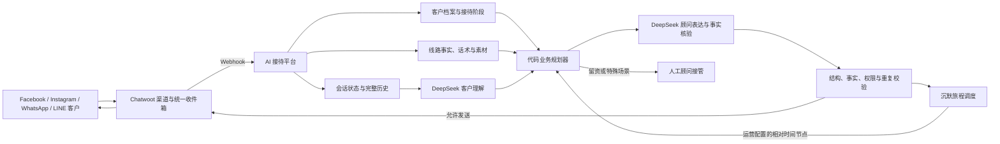

# 线路与 AI 接待配置页设计背景与产品架构

| 项目 | 内容 |
|---|---|
| 文档用途 | 产品设计、UI/UX 原型、前后端评审 |
| 适用页面 | `线路与 AI 接待配置` |
| 当前业务 | China2Go 旅游线路咨询 |
| 当前渠道 | Facebook Messenger，经 Chatwoot Cloud 接入 |
| 当前模型 | DeepSeek，分层演练链路 `split-realtime-reply-v33` / `split-silence-touch-v10` |
| 更新时间 | 2026-09-08 |

## 1. 一句话说明这个系统

这是一个位于 Chatwoot 和企业 AI 之间的旅游客服接待系统：运营录入线路、事实、素材和接待规则后，AI 负责回答客户、建立客户档案；客户沉默时系统继续跟进，最终取得一种有效联系方式并转交人工顾问。

配置页不是一个技术控制台，也不是聊天测试页。它只解决一个问题：

> 一条旅游线路上线后，运营如何用最少的配置，决定 AI 能说什么、如何接待、何时跟进、何时留资、何时转人工。

## 2. 项目背景

客户主要从 Facebook、Instagram、WhatsApp、LINE 等渠道进入。过去依赖人工接待时，存在以下问题：

- 首次回复速度不稳定。
- 客服需要重复发送线路、住宿、车辆、价格等资料。
- 客户沉默后，是否继续跟进完全依赖客服记忆。
- 不同客服的话术、节奏和事实口径不一致。
- 图片可能重复发送、一次发送过多或缺少说明。
- 客户已经说过人数、日期，后续仍可能被重复询问。
- 有意向的客户未被及时引导留下 LINE、微信、电话或 Email。
- 投诉、大团、附件等应人工处理的场景缺少统一边界。

Chatwoot 已经解决渠道授权、统一收件箱、联系人、会话和人工回复。本项目不重做 Chatwoot，而是在它之外补充 AI 接待、客户画像、沉默推进、留资转人工和运营配置能力。

## 3. 产品最终目标

系统不是为了“尽量多发消息”，而是为了完成一条连续、可控的客户接待旅程：

1. 客户进入后得到及时、自然的回复。
2. AI 先回答客户当前问题，不回避价格、住宿、证件等实质问题。
3. AI 从聊天中逐步建立客户档案，不重复询问已知信息。
4. 客户低意向或暂时沉默时，继续提供新的相关价值，而不是机械催问。
5. 信息和价值充分后，自然索取一种联系方式。
6. 获得有效联系方式后停止自动营销，交给人工顾问。
7. 投诉、退款、大团定制、必须查看附件等特殊场景及时转人工。
8. 所有事实、图片、发送资格和重复控制可追踪、可审计。

理想效果示例：

```text
客户：我想了解西藏桃花线路
AI：简要介绍两条线路差异，并提供 9 日 / 11 日选择
客户：我们 2 位，明年 3 月底，想看珠峰
系统：记录人数和日期，切换到 11 日线路，并按运营勾选顺序立即发送完整首批主线
客户沉默 1 分钟
AI：结合“2 位、3 月底、珠峰”补充一项尚未介绍的价值
客户继续沉默
AI：按阶段继续处理顾虑、给可转发摘要或询问一个关键问题
客户询问价格
AI：先回答有依据的价格，再自然询问 LINE
客户：我的 LINE 是 abc123
AI：确认收到，结束自动旅程并转交人工顾问
```

## 4. 整体系统架构



### 4.1 Chatwoot 负责

- Facebook 等渠道授权和消息收发。
- 联系人、会话和消息历史。
- 人工客服工作台。
- 会话标签、状态、坐席和团队。
- Webhook 和消息发送 API。

### 4.2 AI 接待平台负责

- 判断当前消息是否允许触发 AI。
- 读取完整公开聊天历史。
- 管理客户档案、线路和接待阶段。
- 调用 DeepSeek 生成回复与沉默跟进。
- 管理事实、内容组和图片素材。
- 执行沉默计时、取消、重试和防重复。
- 取得联系方式后创建人工接管任务。
- 保存模型决策、发送结果、失败原因和审计记录。

### 4.3 DeepSeek 负责

- 理解客户问题和上下文。
- 提取线路候选、人数、日期、预算、目的地、顾虑、联系方式候选和逐字证据。
- 在代码已经确定动作、事实、素材和唯一追问后，生成自然客户回复。
- 独立核验客户可见文案是否被允许事实和素材叙事真正支持。

### 4.4 代码必须负责

以下能力不能交给模型，也不应设计成普通运营可以随意修改的配置：

- 全局发送总开关。
- Chatwoot `can_reply` 和渠道消息窗口。
- 人工已接管、拒绝联系、黑名单等停止状态。
- Webhook 幂等、发送幂等和并发控制。
- 客户新消息到达后取消旧沉默任务。
- 防止重复文字、重复图片和集中释放多条消息。
- 发送状态未知时停止重发。
- 事实引用和素材文件是否真实存在。
- 联系方式是否逐字存在于客户原文。
- 最终线路、阶段、留资时机、唯一追问、业务规则执行、大团阈值和转人工动作。
- 当前是否应执行沉默触达，以及本轮允许使用的事实、内容组和素材。

## 5. AI 回复与 SOP 的关系

AI 回复和 SOP 不是两个独立功能，而是同一条“线路接待旅程”的两种触发方式。

| 触发方式 | 谁决定时间 | 谁决定内容 |
|---|---|---|
| 客户主动发言 | 客户 | 模型理解语义，代码决定动作与内容范围，模型生成文案 |
| 客户持续沉默 | 调度器按配置触发 | 代码决定是否触达及目标，模型只生成文案 |

客户确认线路后，系统先按 `content_sequence` 发送所有勾选“确认线路后立即发送”的主线内容；未勾选内容留给后续对话和沉默节点。沉默 SOP 不绑定固定话术。每个节点到期时，代码重新读取最新历史、客户档案、接待阶段、已发送内容和可用素材；没有新的相关价值时返回 `no_action`，需要触达时才让模型生成一条与当前客户相关的跟进。

当前相对间隔为：

```text
客户或 AI 最近一次有效消息后 +1 分钟
上一条沉默触达成功后 +3 分钟
再 +5 分钟
再 +10 分钟
再 +30 分钟
再 +60 分钟
```

累计约在第 1、4、9、19、49、109 分钟发生，不是六个计时器同时启动。

客户只要回复，当前沉默轮次立即取消。AI 回答完成后，再根据最新阶段建立新轮次。

## 6. 客户档案与接待阶段

### 6.1 客户档案

AI 从自然聊天中更新以下信息：

- 咨询线路。
- 人数。
- 出发时间。
- 预算。
- 目的地。
- 是否第一次进藏。
- 对证件、入藏手续的了解程度。
- 已表达顾虑：高反、证件、请假、家人意见、价格等。
- 决策状态：了解、比较、与家人讨论、准备报名。
- 意向等级。
- 最近未解决问题。
- 联系方式状态。

客户明确说过的事实必须保留原文证据和消息 ID。意向等级、阶段等推断字段需要保留模型判断与置信度，不能伪装成客户原话。

### 6.2 接待阶段

| 阶段 | 含义 | 沉默时的主要目标 |
|---|---|---|
| `route_selection` | 尚未确定支持线路 | 说明线路差异，引导选择 |
| `needs_discovery` | 已有兴趣但缺人数、时间等条件 | 先给价值，再只问一个条件 |
| `value_building` | 需求逐渐明确 | 提供相关价格、住宿、车辆、行程或图片 |
| `objection_handling` | 客户表达顾虑 | 回应已出现的真实顾虑，不凭空制造问题 |
| `considering` | 客户比较或与家人讨论 | 给便于转发的总结，低压力培育 |
| `contact_ready` | 信息和价值充分 | 先回答问题，再说明留下联系方式能获得什么 |
| `contact_requested` | 已索取但尚未提供 | 轻提醒一次，不重复强推 |
| `captured` | 已获得有效联系方式 | 停止自动营销，转人工 |
| `handoff` | 已进入人工处理 | AI 不再发送 |

## 7. 真实人工聊天带来的话术原则

目前已分析 316 组人工沉默跟进：

| 跟进方式 | 历史观察回复率 |
|---|---:|
| 纯催问或确认收到 | 9.1% |
| 补充具体价值 | 17.2% |
| 只询问一个人数/日期条件 | 23.8% |
| 低压力表达 | 27.6% |

这些数据是相关性，不等于因果，但足以指导默认话术结构：

```text
自然承接客户已知信息
→ 补充一个尚未提供且与客户相关的价值
→ 最多问一个容易回答的问题
```

默认避免：

- “行程看了吗？”
- “行程还满意吗？”
- “有需要吗？”
- “看到您一直没有回复。”
- 每轮重新介绍品牌和客服身份。
- 客户尚未选择线路时发送两条线路的详情图片。
- 未经运营勾选就一次发送全部内容。
- 没有说明用途就连续发图片。
- 未回答客户问题就要求联系方式。

## 8. 配置页面的产品定位

配置页是“线路接待的发布中心”，不是模型参数页、日志页或 AI 演练页。

页面需要让运营在一个地方完成：

- 查看和切换线路。
- 导入、启用或停用线路。
- 设置 AI 的接待目标与表达风格。
- 新增、修改和停用业务规则。
- 设置沉默跟进节奏。
- 编辑线路事实和参考内容。
- 独立预览、说明和替换图片素材。
- 看清线路是否具备真实接待条件。
- 保存并发布新的配置版本。

页面明确不包含：

- AI 效果测试和聊天演练；统一放在独立 `AI 演练场`。
- 真实客户会话处理；统一在 Chatwoot 或会话控制台。
- 运行日志和技术错误堆栈。
- DeepSeek temperature、token、JSON Schema 等工程参数。
- Webhook、Token、数据库等系统连接参数。

## 9. 页面设计原则

### 9.1 简单优先

默认页面只展示运营真正会调整的内容。复杂的系统字段、模型合同和安全机制只显示结果，不提供随意编辑入口。

### 9.2 一屏知道线路能不能用

进入线路后，首屏必须立即看到：

- 线路名称和状态。
- 是否允许 AI 接待。
- 事实、内容和素材是否完整。
- 沉默跟进是否开启。
- 是否存在未保存修改。
- 全局当前处于“允许发送”还是“全局停发”。

### 9.3 业务规则可以扩展，安全规则保持锁定

运营可以新增“满足条件 → 执行动作”的业务规则；渠道窗口、幂等、人工接管阻断等系统安全规则只能查看，不能被普通配置绕过。

### 9.4 内容和素材分开管理

- “内容与事实”负责 AI 可以引用的文字和依据。
- “素材库”负责图片文件、名称、用途和替换。
- 素材可以被一个或多个内容组引用。
- 替换共用素材时必须提示会影响哪些线路。

### 9.5 保存不是静默覆盖

保存后应产生新版本、记录操作者和时间。新配置只影响后续 AI 决策和新建立的沉默轮次；已经运行的旧轮次保持原版本，避免中途改变客户正在经历的流程。

## 10. 推荐页面信息架构

```text
┌───────────────────────────────────────────────────────────────┐
│ 线路与 AI 接待配置                    全局停发   保存并发布 │
├────────────────┬──────────────────────────────────────────────┤
│ 线路列表       │ 线路概览：名称 / 版本 / 就绪状态 / 启停   │
│                ├──────────────────────────────────────────────┤
│ 桃花 9 日      │ AI 接待                                     │
│ 桃花+珠峰11日  │ 目标 / 语气 / 回复长度 / 图片数 / 补充要求 │
│ + 导入线路     ├──────────────────────────────────────────────┤
│                │ 业务规则                                     │
│ 本页目录       │ 可新增规则 + 锁定的安全规则说明             │
│ · 线路         ├──────────────────────────────────────────────┤
│ · AI 接待      │ 沉默推进                                     │
│ · 业务规则     │ 开关 + 1/3/5/10/30/60 + 允许时段           │
│ · 沉默推进     ├──────────────────────────────────────────────┤
│ · 内容与事实   │ 内容与事实                                   │
│ · 素材库       │ 默认开场 / 事实 / 内容组                     │
│                ├──────────────────────────────────────────────┤
│                │ 素材库：预览 / 用途 / 重新上传              │
└────────────────┴──────────────────────────────────────────────┘
```

桌面端采用左侧线路栏、右侧纵向配置区。移动端线路列表改为顶部下拉选择，各配置区按卡片纵向排列，不允许横向滚动。

## 11. 页面区块详细设计

### 11.1 页面顶栏

展示：

- 页面标题：线路与 AI 接待配置。
- 一句话说明：配置线路资料、AI 接待、业务规则和沉默推进。
- 全局发送状态：`消息发送已开启` / `全局停发`。
- `导入线路`。
- `保存并发布`。

交互：

- 有修改时按钮显示“保存并发布”。
- 无修改时显示“已保存”。
- 开启全局发送必须二次确认；关闭立即生效。
- 全局停发时不禁用编辑，但需要持续显示“配置可编辑，真实消息不会发送”。

### 11.2 线路列表与导入

每条线路显示：

- 线路名称。
- 资料版本。
- 素材就绪数量，例如 `11/11`。
- 状态：可接待 / 素材缺失 / SOP 未发布 / 已停用。

导入第一阶段继续支持版本化 JSON 线路包，不在本次设计 Excel 或网页抓取器。

导入流程：

1. 选择 JSON 文件。
2. 系统校验线路 ID、事实、内容组、SOP 和素材引用。
3. 有错误时显示可理解的问题列表。
4. 校验成功后发布并加入线路列表。
5. 不允许“文件上传成功但线路半可用”的中间状态。

### 11.3 线路概览

展示：

- 线路名称。
- `route_variant`，作为辅助信息弱化展示。
- 资料版本。
- 可接待状态。
- 事实数量、内容组数量、素材就绪数量、沉默节点数量。
- 原始资料入口。
- `允许 AI 接待此线路` 开关。

关闭线路后的含义：模型不再推荐、识别或推进该线路；历史档案仍保留，不删除数据。

### 11.4 AI 接待

默认只保留以下设置：

| 字段 | 说明 | 建议控件 |
|---|---|---|
| 最终目标 | 例如“先回答客户，再自然取得一种有效联系方式” | 短文本域 |
| 回复语气 | 亲切专业 / 温暖陪伴 / 简洁直接 | 单选或下拉 |
| 最多字数 | 当前 80–200 字 | 数字输入 |
| 最多图片 | 当前 0–2 张 | 步进器 |
| 补充要求 | 运营给 AI 的特殊要求 | 多行文本 |

不建议让运营编辑：阶段枚举、模型重试次数、输出 Schema、提示词全文。它们属于系统合同，开放后会增加配置冲突和故障风险。

### 11.5 业务规则

规则卡片采用统一结构：

```text
规则名称
启用开关
当……（自然语言触发条件）
执行……（动作下拉）
命中后如何回复（指导说明）
```

可选动作：

- 转人工。
- 索取联系方式。
- 推荐已上线线路。
- 继续 AI 接待。
- 停止 AI。

运营可新增的规则示例：

- 人数达到页面配置的大团阈值（当前为 8 人）→ 转人工。
- 客户咨询资料外线路 → 推荐当前已上线线路。
- 客户明确预算很高且需要定制 → 转人工。
- 客户说在与家人讨论 → 继续 AI，采用低压力跟进。
- 客户要求某种未支持服务 → 说明边界并推荐最接近线路。

系统规则单独放在“始终生效的安全规则”折叠区，只读展示：

- 已取得有效联系方式后转人工。
- 客户明确要求真人时转人工。
- 投诉、退款或合同争议转人工。
- 必须理解附件内容但当前无法识别时转人工。
- 人工接管、拒绝联系、黑名单时停止发送。
- 渠道窗口关闭时禁止发送。
- 发送状态未知时暂停整轮。

说明：安全规则不应伪装成普通规则卡片让用户以为可以删除。大团人数等业务阈值可以配置；幂等和渠道安全不能配置。

### 11.6 沉默推进

该区块只配置“客户沉默多久后触发”，不把时间和固定内容绑定。

字段：

- 开启/关闭客户沉默跟进。
- 可增删的相对间隔列表；默认 1 / 3 / 5 / 10 / 30 / 60 分钟，至少 1 个、最多 20 个节点。
- 每日最多主动消息数，不得超过当前节点数量。
- 允许发送时间，例如 09:00–21:00，Asia/Shanghai。

需要始终显示的解释：

> 每次到期都根据最新聊天、客户档案和已发送内容重新生成；客户一回复，立即停止旧计时。时间是相对上一条成功触达，不是绑定某段固定话术。

新增或删除时间节点后，后端会为新客户旅程动态编译对应数量的调度任务；已经开始执行的旧旅程继续使用其建立时的不可变节点快照。

不在该区块逐节点编辑固定话术。阶段目标由代码根据客户情况与未完成主线决定，普通话术由模型生成；明确命中线路级固定问答时逐字发送已审核内容。

### 11.7 内容与事实

分为三个层次：

#### 默认开场

用于新客户进入且尚未明确线路时的默认接待方向。模型可以根据客户第一句话调整表达，不要求逐字发送。

#### 事实依据

每条事实包含：

- 事实名称或 ID。
- 事实正文。
- 来源说明或来源链接。
- 正在被哪些内容组引用。

典型事实：价格、天数、住宿、车辆、景点、证件、包含项目、不含项目、出发区间。

约束：

- 被内容组引用的事实不能直接删除；需要先解除引用。
- 修改价格等关键事实时显示影响提示。
- 事实必须保存版本和操作者。

#### 线路资料内容组

“线路内容”和旧版“AI 可用资料”已合并为同一份线路资料内容组。内容组是模型可引用的审核内容和目标，也可以加入该线路主线并勾选为确认线路后立即发送。

常见内容组：

- 行程总览。
- 线路亮点。
- 住宿。
- 车辆。
- 价格。
- 出发安排。
- 询问人数。
- 询问日期。
- 索取联系方式。
- 顾虑处理。

每组显示：

- 中文名称。
- 使用目的。
- 审核参考内容。
- 引用事实。
- 关联素材。
- 主线顺序及是否确认线路后立即发送。

保存后立即形成新线路版本，但不改写正在执行的旧旅程快照。

#### 线路级标准问答

标准问答用于保存网站原话或运营审核后的精确回答。运营只维护单一生效状态、正向例句、排除例句、客户实际收到的逐字正文、对应线路资料和图片；识别主题、事实 ID 与匹配优先级由系统维护。官网导入项只有一份正文，该正文就是实际发送的官网原话，不再并列展示“固定发送内容”和“官网原始话术”。只有状态为“已启用”且当前客户原文明确命中正向例句时才使用；模糊问题回到受控生成。

### 11.8 素材库

素材必须从“内容与事实”中独立出来管理。

每张素材卡显示：

- 大图预览，点击查看原图。
- 素材名称。
- 素材用途说明。
- 关联内容组。
- 被哪些线路使用。
- 清晰度/可用状态。
- `保存说明`。
- `重新上传`。

替换流程：

1. 选择新图片。
2. 前端显示预览、尺寸和文件大小。
3. 如果素材被多条线路共用，明确提示影响范围。
4. 用户确认后替换。
5. 替换成功后保留旧版本审计信息。

一期只支持图片；视频、PDF 和复杂附件可后续扩展。

## 12. 保存、发布和状态反馈

建议页面状态：

| 状态 | 页面表现 |
|---|---|
| 已保存 | 保存按钮弱化，显示最近发布时间 |
| 有未保存修改 | 顶栏固定显示提示，按钮高亮 |
| 保存中 | 禁止重复提交，显示进度 |
| 发布成功 | 显示新版本号和生效范围 |
| 校验失败 | 定位到具体区块和字段，不只显示错误码 |
| 素材缺失 | 线路标记“资料不完整”，不可显示为可接待 |
| 全局停发 | 顶栏持续显示，允许继续编辑配置 |

离开页面时若存在未保存修改，需要浏览器内确认。

## 13. 权限设计

| 角色 | 查看 | 编辑配置 | 发布 | 控制全局发送 |
|---|---:|---:|---:|---:|
| Admin | 是 | 是 | 是 | 是 |
| Supervisor | 是 | 建议可编辑草稿 | 由业务决定 | 否 |
| Agent | 否或只读 | 否 | 否 | 否 |

所有修改记录操作者、时间、修改前后内容和线路版本。

## 14. 与当前后端接口的对应关系

| 页面能力 | 当前接口 |
|---|---|
| 获取线路及就绪状态 | `GET /v1/automation/route-products` |
| 获取统一接待配置 | `GET /v1/automation/reception-config` |
| 保存统一接待配置 | `PUT /v1/automation/reception-config` |
| 导入并发布线路 | `POST /v1/automation/route-products/import` |
| 保存线路事实与内容 | `PUT /v1/automation/route-products/{route_variant}/content` |
| 修改素材名称与用途 | `PUT /v1/automation/route-products/{route_variant}/assets/{asset_key}` |
| 重新上传素材 | `POST /v1/automation/route-products/{route_variant}/assets/{asset_key}/replace` |
| 获取全局发送状态 | `GET /v1/settings/global-message-sending` |
| 修改全局发送状态 | `PATCH /v1/settings/global-message-sending` |

效果测试接口已经存在，但不放在本配置页；AI 演练场独立调用。

## 15. 当前线上运行状态

截至 2026-09-04：

- 全局消息发送总开关为关闭。
- 真实出站不会发生，但仍可编辑和发布配置。
- 实时 Worker 保持在线，只同步和观察事件。
- 生产仍保留会话 `#26` 的 allowlist 范围配置；由于全局停发，allowlist 也不能绕过总开关。
- 当前已上线两条线路：桃花 9 日、桃花加珠峰 11 日。
- 当前沉默节奏：1 / 3 / 5 / 10 / 30 / 60 分钟。
- 当前话术策略已基于 316 组真实人工沉默跟进优化。

该运行状态属于运营信息，不应影响配置页的结构设计。设计稿只需保证“全局停发”状态足够醒目且不会被线路开关误解为真实可发送。

## 16. 页面验收标准

### 16.1 业务理解

- 用户进入页面后 10 秒内能判断当前线路是否可接待。
- 用户能清楚区分线路启停和全局停发。
- 用户理解沉默时间是相对客户沉默，不是绑定固定话术。
- 用户理解 AI 演练不在本页。

### 16.2 配置能力

- 能导入、选择、启用和停用线路。
- 能修改 AI 目标、语气、长度、图片数和补充要求。
- 能新增、编辑、停用和删除普通业务规则。
- 安全规则明确只读，不能被业务规则绕过。
- 能编辑事实和内容组，并看到引用关系。
- 能独立预览、改名、修改用途和重新上传每张图片。
- 能修改沉默间隔和允许发送时间。

### 16.3 状态与安全

- 全局停发状态在任何滚动位置都可识别。
- 未保存、保存中、成功、失败状态明确。
- 素材缺失或事实引用错误时不能显示“可接待”。
- 替换共用素材前明确提示受影响线路。
- 保存配置不会修改已经运行的旧旅程版本。

### 16.4 响应式

- 桌面端适配 1440px 和 1920px。
- 移动端 390px 不产生横向溢出。
- 时间轴、规则卡片和素材卡在移动端改为纵向布局。
- 主要保存操作在长页面中始终容易找到。

## 17. 本次设计不应扩大的范围

- 不在配置页重做 AI 聊天演练。
- 不做复杂低代码流程画布。
- 不允许运营直接编辑完整系统提示词。
- 不把每一个后端字段都做成表单。
- 不做 Excel、网页抓取和自动生成线路包。
- 不在此页处理真实客户会话。
- 不在此页展示开发日志和数据库状态。

配置页成功的标准不是配置项多，而是运营能用少量明确设置发布一条真正可接待、可跟进、可留资、可转人工的线路。

